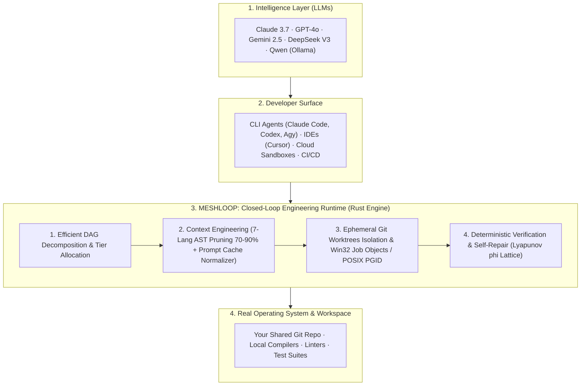

<p>
  
</p>

# Meshloop

**The State-of-the-Art Closed-Loop Engineering Environment for AI Agents.**  
Execute, isolate, and auto-repair complex software tasks deterministically across polyglot codebases — locally, in CI/CD, or inside cloud sandboxes — with zero daemons, zero credential storage, and up to 90% token reduction.

[](LICENSE)
[](https://crates.io/crates/meshloop-cli)
[](Cargo.toml)
[](rust-toolchain.toml)
[](#status)
[](#status)
[](#status)
[](Cargo.toml)

---

## Where Meshloop Fits in the AI Stack

Meshloop is neither a language model nor a simple chat interface. It is the **foundational Closed-Loop Engineering Runtime** that provides the physics, isolation, context efficiency, and deterministic verification needed for AI agents to reliably produce production software:



---

## 4 Concrete Scenarios: Where & How to Use

| Your Environment | How Meshloop Empowers You | Key Value |
| :--- | :--- | :--- |
| **1. Solo Developer at Terminal (Flat-Rate CLI Subscriptions)** | You already pay for Claude Code, Codex, Agy, or Grok. Meshloop coordinates them from inside your current session without API token costs. Workers run in background worktrees; your branch stays 100% clean. | **Zero extra cost + Zero branch pollution** |
| **2. Professional Teams using Commercial APIs (Pay-As-You-Go)** | Direct API calls (Gemini, Anthropic, DeepSeek). Meshloop's AST pruning across 7 languages discards function bodies, slashing input tokens by 70–90%. Static prefix normalization delivers >80% prompt cache hits. | **Dramatically reduced API bills + Speed** |
| **3. Enterprise & Air-Gapped Systems (Local Models via Ollama)** | Proprietary codebases that cannot leave your infrastructure. Meshloop falls back natively to local models (`qwen2.5-coder`). Sub-millisecond quantized signature retrieval fits large codebases into limited local context. | **100% Offline + Zero code leaks** |
| **4. Cloud Sandboxes, Web Platforms & Autonomous CI/CD (E2B, GitHub Actions)** | Autonomous agent platforms (Devin/Bolt-style) or automated PR repair bots. Single Rust binary (<20MB RAM, millisecond startup), headless execution (`--accept-plan`), and stdio MCP server support. | **Headless automation + Verified PRs** |

---

## The 4 Pillars of Loop Efficiency

1. **Decomposition Efficiency:** Goals are decomposed into a strict Directed Acyclic Graph (DAG) with tier classification, eliminating bloated scopes and model hallucinations.
2. **Context Efficiency:** Multi-language AST pruning for **Rust, TS/JS, Python, Go, C#, PHP, and C++** discards internal bodies while preserving signatures, interfaces, and docstrings.
3. **Host & Workspace Efficiency:** Each attempt executes in an isolated Git worktree (`.meshloop-worktrees/<task-id>`). The `GitAdminMutex` with exponential backoff prevents `.git/index.lock` contention, while Win32 Job Objects eradicate orphan compiler processes.
4. **Deterministic Verification & Self-Repair:** Local linters and compilers serve as the sole source of truth via `CheckRunner`. If compilation fails, the diagnostic lattice evaluates Lyapunov energy ($\phi$): if error energy decreases, the agent repairs its code; if regression occurs, an instant `git reset --hard` rolls back the change.

---

## Quickstart

Native Windows & Linux. Full setup: **[Install and Setup](docs/install.md)**.

```bash
cargo install meshloop-cli --locked
meshloop --version
```

### The Engineering Loop (Operator Surface)

1. `/meshloop:doctor` — Verify CLI harnesses, Git worktrees, and daemonless mode.
2. `/meshloop:plan` — Generate task decomposition graph (`meshloop-plan.json`).
3. `/meshloop:review-plan` — **Accept / Decline / Adjust** the architectural plan.
4. `/meshloop:run` — Dispatch workers in ephemeral worktrees (**your branch remains untouched**).
5. `/meshloop:accept` — Review deterministic test evidence and approve node diff.
6. `/meshloop:integrate` — The **only** step that merges verified code onto your target branch.

Detailed walkthrough: **[Getting Started Guide](docs/start.md)**.

---

## Safety & Invariants

- **No Daemons, No Background Services:** Runs when invoked and terminates cleanly.
- **No Stored Credentials:** Uses your existing CLI logins, environment variables, or local Ollama.
- **Fail-Closed Isolation:** Subprocesses operate inside ephemeral Git worktrees. Your working branch is untouched until explicit integration.
- **Deterministic Truth:** LLMs never judge their own success; real compiler exit codes drive acceptance.
- **Pure Rust Engine:** `#![forbid(unsafe_code)]` across all domain, context, and engine crates.

---

## Documentation

- **[Documentation Hub](docs/README.md)** — Complete index and reading paths
- **[Product Brief & Scenarios](docs/product/brief.md)** — In-depth vision and use cases
- **[Architecture Overview](docs/architecture/overview.md)** — Hexagonal boundaries, state machine, and tech dictionary
- **[Modular Architecture & Concurrency](docs/architecture/modern-modular-architecture.md)** — Bounded concurrency ($N \in 1..=16$) and self-repair
- **[Contributing Guide](CONTRIBUTING.md)** — How to extend languages, harnesses, and checks
- **[Skills Catalog](skills/README.md)** — Operator slash commands and prompt bundles

---

## Development

```bash
cargo build -p meshloop-cli
cargo run -p xtask -- check    # Format, clippy -D warnings, workspace tests
cargo run -p xtask -- bench    # SPEC-ML-BENCH-001 scorecard & metrics
cargo run -p xtask -- live     # Launch gate: verifies doctor daemonless and worktree isolation
```

---

## License

Code is licensed under [Apache-2.0](LICENSE). See [NOTICE](NOTICE) and [TRADEMARKS.md](TRADEMARKS.md).  
Created and maintained by Samuel ([@smota](https://github.com/smota)). Meshloop is fully AI-coded under human product governance.
