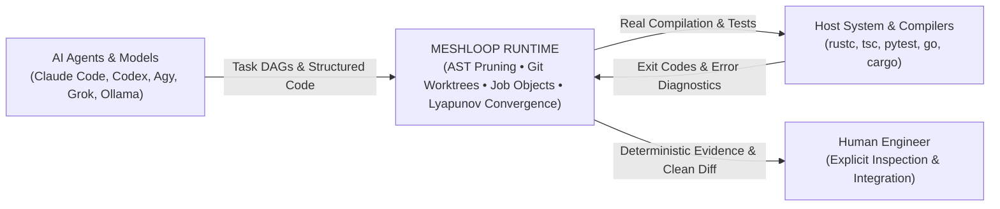
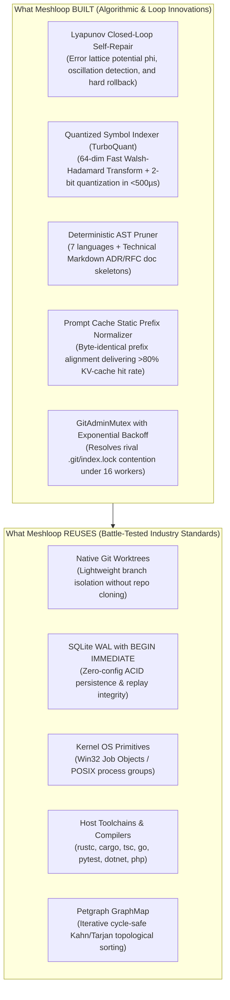

<p align="center">
  
</p>

# Meshloop

**The Loop Engineering Runtime for Multi-Agent Software Development.**  
*Daemonless standalone execution, multi-language AST context reduction, strict OS process-tree ownership, and compiler-driven self-repair with Lyapunov convergence.*

[](LICENSE)
[](https://crates.io/crates/meshloop-cli)
[](Cargo.toml)
[](rust-toolchain.toml)
[](benches/thresholds.toml)
[](#quickstart-up-and-running-in-2-minutes)
[](#3-architecture-what-we-reused-vs-what-we-built-from-scratch)
[](Cargo.toml)

---

## 1. What is Meshloop?

Meshloop solves the primary breakdown point in multi-agent software engineering: **the non-deterministic, destructive, and token-wasteful chaos of ungoverned agents operating directly on the host repository**.

Rather than allowing language models to mutate your active development branch, exhaust context windows with irrelevant function bodies, leave orphan background compiler processes in the OS, or hallucinate that broken code is working, Meshloop acts as the **deterministic execution runtime and closed-loop arbiter** between AI agents and the operating system.



---

## 2. Why Meshloop? (The Engineering Decision)

Most agent frameworks prioritize demo-level autonomy over host safety and engineering invariants. Meshloop was engineered from first principles around deterministic boundaries, empirical performance, and host hygiene:

| Development Hazard | Ungoverned Agent Anti-Pattern | Meshloop Deterministic Solution |
| :--- | :--- | :--- |
| **Workspace Contamination** | The agent modifies files directly on your working branch. Failures leave half-baked diffs or uncommitted index locks. | **Ephemeral Git Worktrees.** Every task executes inside an isolated worktree (`.meshloop-worktrees/<task-id>`). Your active branch is never touched until explicit human integration (`meshloop integrate`). |
| **Context Bloat & Token Waste** | Feeding full source files causes prompt bloat, high API bills, and "lost-in-the-middle" reasoning degradation. | **Deterministic AST Skeleton Pruning (7 Languages + Technical Markdown).** Strips internal function/method bodies while preserving signatures, types, and docs, eliminating **70% to 90% of tokens**. |
| **Orphan & Zombie Processes** | Subprocesses spawned by agents (`rustc`, `node`, `pytest`) outlive their parents on timeout, cancellation, or crash. | **Kernel-Enforced Process-Tree Ownership.** Windows Job Objects (`KILL_ON_JOB_CLOSE`) and POSIX process groups (`setpgid`) eradicate orphan compilers (`conc.orphan_process_count = 0`). |
| **Oscillating Repair Loops** | The agent attempts to fix a compiler error, introduces a worse syntax bug, and burns budget in an infinite loop. | **Lyapunov Error Descent ($\Delta\Phi < 0$).** Diagnostics form a partially ordered lattice. Regressions trigger an instant `git reset --hard`; cyclic error states terminate immediately. |
| **Verification Authority** | The LLM inspects its own generated code or mock output and claims "all tests passed". | **Ground Truth via Real Exit Codes.** Compiler and test exit codes from the host operating system dictate verification. LLMs never judge their own success. |
| **System Footprint & Overhead** | Requires persistent background daemons, bloated microservices, Docker desktop dependencies, or heavy vector databases. | **Zero-Daemon Standalone Binary (<20MB RAM).** Starts on demand, executes deterministically, and exits cleanly (`exit 0`) without background socket residue. |

### Strict Non-Goals & Architectural Invariants ("What Does NOT Enter Meshloop")
- ❌ **No Background Services or Daemons:** Meshloop is a direct, on-demand CLI and MCP server. It leaves no background daemon lingering in your OS ([ADR 0022](docs/architecture/adr/0022-daemonless-context-engineering.md)).
- ❌ **No Heavy External Vector DBs:** Symbol retrieval uses an in-memory 64-dimensional Fast Walsh-Hadamard Transform (FWHT) with 2-bit quantization in pure Rust, running in **<500µs** with zero Python, PyTorch, or neural network dependencies ([ADR 0029](docs/architecture/adr/0029-deterministic-loop-algorithms.md)).
- ❌ **No Stored Credentials:** Relies on existing authenticated CLI harnesses or local environment variables. Zero sensitive credentials are ever written to disk.
- ❌ **No Async Bloat in Core Engine:** Orchestration uses synchronous, non-blocking polling without Tokio runtime pollution in the engine crate ([ADR 0024](docs/architecture/adr/0024-bounded-concurrency.md)).
- ❌ **No Crossing Windows/WSL2 File Boundaries:** Never crosses the high-latency `\\wsl$` / `/mnt/c` boundary. Native Windows runs on native NTFS; native Linux runs in Linux root.

---

## 3. Architecture: What We Reused vs. What We Built from Scratch

Meshloop follows strict **Hexagonal Boundaries** enforced by `#![forbid(unsafe_code)]` across core crates. We deliberately avoid reinventing battle-tested industry foundations, focusing engineering effort strictly on missing loop control algorithms:



### Modular Crate Workspace Layout
- [`crates/meshloop-domain`](crates/meshloop-domain): `#![forbid(unsafe_code)]`. Pure domain abstractions: `Task`, `TaskGraph`, `TaskState`, `RunRecord`, `Diagnostic` lattice, and policy bounds. Zero I/O, process, or network dependencies.
- [`crates/meshloop-context`](crates/meshloop-context): `#![forbid(unsafe_code)]`. AST skeleton extraction across 7 languages + Markdown doc skeletons ([ADR 0031](docs/architecture/adr/0031-markdown-doc-ast-context-engineering.md)), content-addressed `SkeletonCache` with source length/prefix revalidation, and zero-allocation FWHT quantized symbol ranking.
- [`crates/meshloop-engine`](crates/meshloop-engine): `#![forbid(unsafe_code)]`. Loop orchestration: dynamic graph mutation ([ADR 0028](docs/architecture/adr/0028-upstream-graph-mutation.md)), bounded concurrent polling without Tokio ([ADR 0024](docs/architecture/adr/0024-bounded-concurrency.md)), and Lyapunov convergence self-repair ([ADR 0026](docs/architecture/adr/0026-inner-loop-repair-connection.md)).
- [`crates/meshloop-adapters`](crates/meshloop-adapters): Concrete infrastructure ports: `GitWorktreeAdapter`, transactional SQLite WAL store, Windows Job Object process tree ownership ([ADR 0025](docs/architecture/adr/0025-process-tree-ownership.md)), concurrent pipe draining check runners, and CLI harness dispatch.
- [`crates/meshloop-cli`](crates/meshloop-cli): Human operator interface, bundled session export (`meshloop bundle`), and stdio Model Context Protocol ([MCP](docs/architecture/adr/0027-mcp-modular-server.md)) server.

---

## 4. Empirical Engineering Rigor & Verified Benchmarks

Meshloop rejects vanity claims. Every capability, lock resolution mechanism, and convergence algorithm is validated through iterative hardening cycles with continuous peer review and verified against the **[`SPEC-ML-BENCH-001`](docs/architecture/measurement-and-benchmark-spec.md)** specification.

### Development History: Hardening Cycles & Real Fault Injection
- **Cycle 1 (Bootstrap & Concurrency):** Established multi-worker baseline ($N=2$), polyglot AST pruning, and SQLite fsync baselines.
- **Cycle 2 (Fault Injection & Resilience):** Injected WAL uncommitted transaction aborts, active `PRAGMA integrity_check`, and rival `.git/index.lock` contention under load.
- **Cycle 3 (Enterprise Regression Gate — World D):** Eliminated mocks, added content-addressed cache revalidation, implemented strict $P_{95}$ percentiles with `hdrhistogram`, and formalized schema contracts.
- **Round 1 (E2E Multi-Stage Wave DAG):** Upgraded smoke tests to multi-stage DAGs, proving ancestor commit tree propagation and sibling worktree isolation.
- **Round 2 (Dynamic Graph Mutation & Rollback):** Unified state transitions into atomic `BEGIN IMMEDIATE` transactions, verifying 100% rollback fidelity across 7 negative control injections.
- **Round 3 (Lyapunov Self-Repair & Pipe Deadlock Elimination):** Resolved Windows 4KiB pipe deadlocks via concurrent stderr/stdout drain threads, verified error lattice potential descent ($\Delta\Phi < 0$), and eliminated diagnostic drift on `git reset --hard` rollback.

*Full empirical progression and test narratives: **[Product & Engineering Log](docs/product/product-log.md)** and **[Architectural Rounds & Peer Sparring History](docs/engineering/architectural-rounds-and-decisions.md)**.*

### Benchmark Scorecard: 28/28 Active Metrics Passing

The regression gate is enforced by `cargo run --release -p xtask -- bench` against [`benches/thresholds.toml`](benches/thresholds.toml):

| Category | Invariant / Target Metric | Target Threshold | Observed Value | Gate Status | Verification Methodology |
| :--- | :--- | :--- | :--- | :--- | :--- |
| **Isolation** | `iso.worktree.leak_count` | `= 0` | **0** | **PASS** | Full worktree inventory audit post-execution |
| **Isolation** | `conc.orphan_process_count` | `= 0` | **0** | **PASS** | OS kernel process tree inspection |
| **Isolation** | `iso.redact.pass_rate_pct` | `= 100.0%` | **100.0%** | **PASS** | Automated credential & secret masking |
| **Isolation** | `iso.crash.recovery_fidelity` | `= 1.0` | **1.0** | **PASS** | SQLite cold reopen & replay task fold |
| **Isolation** | `iso.repair_rollback.fidelity` | `= 1.0` | **1.0** | **PASS** | `git reset --hard` fidelity after syntax regression |
| **Isolation** | `iso.mutation_rollback.fidelity`| `= 1.0` | **1.0** | **PASS** | Exact state equality across 7 negative control injections |
| **Isolation** | `iso.ancestor_propagation.pass_rate_pct`| `= 100.0%` | **100.0%** | **PASS** | Dependent wave verification on ancestor commit tree |
| **Convergence** | `conv.lyapunov.monotonic_reduction_pct`| `= 100.0%`| **100.0%** | **PASS** | Non-rollback repair rounds satisfying $\Delta\Phi < 0$ |
| **Convergence** | `conv.self_repair.success_rate` | $\ge 80.0\%$ | **100.0%** | **PASS** | Monotonic compiler error resolution to clean build |
| **Context** | `ctx.tokens.reduction_pct` | $\ge 65.0\%$ | **67.7%** | **PASS** | Polyglot AST skeleton pruning across 7 languages |
| **Context** | `quant.search.latency_us.p95` | $\le 500.0\ \mu\text{s}$ | **324.0 $\mu$s** | **PASS** | True $P_{95}$ zero-copy FWHT vector ranking |
| **Context** | `quant.index.compression_ratio` | $\ge 4.0\times$ | **5.5x** | **PASS** | Raw characters vs 2-bit quantized vectors |
| **Orchestration**| `orch.schedule.overhead_ms.p95` | $\le 25.0\text{ ms}$ | **0.053 ms** | **PASS** | Iterative `petgraph` scheduling across 7 manifests |
| **Orchestration**| `orch.mutation.overhead_ms.p95` | $\le 15.0\text{ ms}$ | **1.75 ms** | **PASS** | Dynamic graph mutation overhead across 6 manifests |
| **Orchestration**| `orch.txn.wal_commit_ms.p95` | $\le 10.0\text{ ms}$ | **1.24 ms** | **PASS** | SQLite WAL fsync latency under dual-worker write |
| **Contention** | `conc.git_admin.lock_contention_ms` | $\le 200.0\text{ ms}$ | **71.39 ms** | **PASS** | `GitAdminMutex` backoff under rival `.git/index.lock` |
| **Smoke** | `smoke.wall_clock_s` | $\le 5.0\text{ s}$ | **1.48 s** | **PASS** | Full product E2E lifecycle wall-clock duration |

---

## 5. Quickstart: Up and Running in 2 Minutes

Meshloop runs as a single, standalone native Rust binary on Windows 10/11 and Linux.

### Step 1: Install the Standalone CLI
```bash
cargo install meshloop-cli --locked
meshloop --version
```

### Step 2: Bundle Skills & MCP Catalog into Your Repository
Run this command from your target Git repository root to extract the version-locked operator pack:
```bash
meshloop bundle --dest .
```
This writes:
- `skills/meshloop-*/SKILL.md` (Native slash commands for Claude Code, Codex, Agy, Grok, Pi)
- `meshloop-mcp-tools.json` (Tool definitions for MCP clients like Cursor or Claude Desktop)

### Step 3: Create a Minimal `meshloop.toml`
Create `meshloop.toml` in your repository root (or copy [`config/meshloop.example.toml`](config/meshloop.example.toml)):
```toml
selected_harnesses = ["codex"]

[limits]
max_concurrent_workers = 2
max_retries = 3
task_timeout_seconds = 300

[verify]
verify_command = ["cargo", "check"]

[harnesses.codex]
kind = "codex"
executable = "codex"
model_ref = "codex"
model_tier = "top"
```

### Step 4: Validate and Run Your First Closed Loop
```bash
# 1. Validate environment, Git worktrees, and configured CLI harnesses
meshloop doctor

# 2. Decompose a high-level objective into an iterative DAG
meshloop plan "Implement strict email format validation"

# 3. Interactively review the plan: Accept, Decline, or Adjust
meshloop review-plan

# 4. Execute workers in isolated worktrees with compiler-driven self-repair
meshloop run
```

---

## 6. Unified Operator Surface (Parity across CLI, Slash, MCP)

Every capability is universally accessible across terminal CLI verbs, in-agent slash commands, and Model Context Protocol stdio tools:

| Canonical ID | Slash Command | MCP Tool | CLI Equivalent | Stage & Function |
| :--- | :--- | :--- | :--- | :--- |
| `meshloop:doctor` | `/meshloop:doctor` | `meshloop_doctor` | `meshloop doctor` | **Diagnostics:** Validates environment, worktree isolation, and configured harnesses. |
| `meshloop:plan` | `/meshloop:plan` | `meshloop_plan` | `meshloop plan` | **Planning:** Decomposes objective into a validated task DAG (`meshloop-plan.json`). |
| `meshloop:review-plan` | `/meshloop:review-plan` | `meshloop_review_plan` | `meshloop review-plan` | **Human Gate:** Interactively review plan: Accept, Decline, or Adjust. |
| `meshloop:run` | `/meshloop:run` | `meshloop_run` | `meshloop run` | **Execution:** Spawns workers in ephemeral Git worktrees with Job Object ownership. |
| `meshloop:status` | `/meshloop:status` | `meshloop_status` | `meshloop status` | **Inspection:** Reports task states, active attempts, and execution history. |
| `meshloop:accept` | `/meshloop:accept` | `meshloop_accept` | `meshloop accept` | **Verification:** Approves deterministic compiler evidence and diff for a completed task. |
| `meshloop:resume` | — | `meshloop_resume` | `meshloop resume` | **Continuation:** Resumes execution or restarts failed tasks without replanning. |
| `meshloop:integrate` | — | `meshloop_integrate` | `meshloop integrate` | **Integration:** Safely merges verified worktree changes into the target branch. |
| `meshloop:orchestrate` | `/meshloop:orchestrate` | `meshloop_orchestrate` | `meshloop orchestrate` | **Review:** Synthesizes cross-model feedback between two distinct agent harnesses. |
| `meshloop:mcp` | — | — | `meshloop mcp` | **Server:** Starts the local stdio JSON-RPC Model Context Protocol server. |
| `meshloop:bundle` | — | — | `meshloop bundle` | **Packager:** Exports bundled skills and MCP catalog to target repository. |

*Full workflow walkthrough: **[Getting Started Guide](docs/start.md)**.*

---

## 7. Knowledge Base Navigation Compass

You do not need to read dozens of technical files to find what you need. Use this compass to navigate directly to the authoritative reference for your role:

```
[README.md — You Are Here]
  │
  ├── 🚀 Getting Started & Configuration
  │     ├── Installation & Toolchain Setup ────> docs/install.md
  │     ├── Guided Operator Workflow Loop ─────> docs/start.md
  │     └── Bundled Agent Skills Catalog ──────> skills/README.md
  │
  ├── 📊 Empirical Evidence & Benchmarks
  │     ├── Product & Engineering Log ─────────> docs/product/product-log.md
  │     ├── Architectural Rounds & Decisions ──> docs/engineering/architectural-rounds-and-decisions.md
  │     ├── Benchmark Specification ───────────> docs/architecture/measurement-and-benchmark-spec.md
  │     └── Scorecard Thresholds Definition ───> benches/thresholds.toml
  │
  ├── 🏛️ System Architecture & Invariants
  │     ├── Hexagonal Architecture Overview ───> docs/architecture/overview.md
  │     ├── Modular Concurrency & Self-Repair ─> docs/architecture/modern-modular-architecture.md
  │     ├── Formal Execution Lifecycle ────────> docs/architecture/execution-lifecycle.md
  │     ├── Threat Model & Boundary Posture ───> docs/architecture/threat-model.md
  │     └── Architecture Decision Index (ADRs) ─> docs/architecture/adr/README.md
  │
  └── 🛠️ Contributing & Governance
        ├── Developer Contributing Guide ──────> CONTRIBUTING.md
        ├── Testing Strategy & CI Recipes ─────> docs/engineering/testing.md
        └── Canonical Harness Governance Rules ─> AGENTS.md
```

---

## Development & Test Commands

```bash
# Workspace format, clippy -D warnings, and 142+ unit/integration tests
cargo run -p xtask -- check

# Execute the full SPEC-ML-BENCH-001 regression gate (28 metrics)
cargo run --release -p xtask -- bench

# Benchmark petgraph topological scheduling across 7 canonical manifests
cargo run -p xtask -- bench-dag

# Opt-in polyglot evaluation suite with Wilson 95% CI First-Pass Acceptance Rate
cargo run -p xtask -- bench-world-s

# Smoke test full product E2E lifecycle with ancestor artifact propagation
cargo run -p xtask -- smoke
```

---

## License & Governance

Meshloop code is licensed under [Apache-2.0](LICENSE). See [NOTICE](NOTICE) and [TRADEMARKS.md](TRADEMARKS.md).  
Created and maintained by Samuel ([@smota](https://github.com/smota)).
