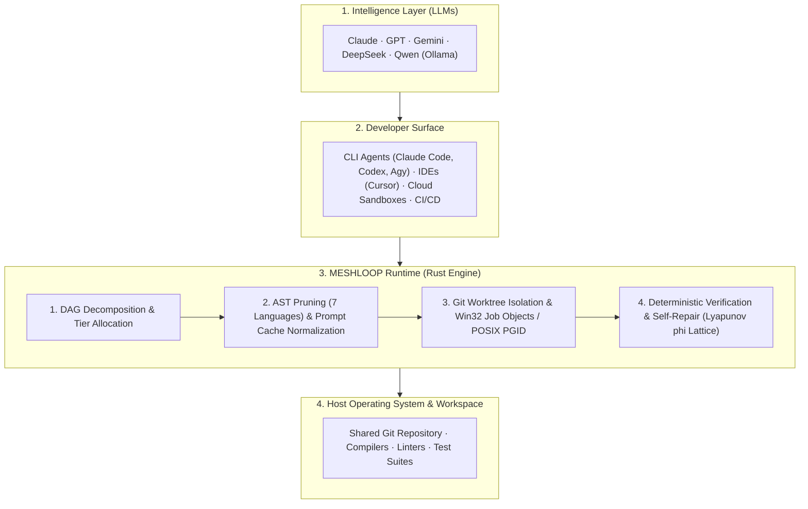

<p>
  
</p>

# Meshloop

**Deterministic local orchestration runtime for AI coding agents.**  
Executes agent tasks in isolated Git worktrees with multi-language AST context reduction, compiler-driven verification, and zero background daemons.

[](LICENSE)
[](https://crates.io/crates/meshloop-cli)
[](Cargo.toml)
[](rust-toolchain.toml)
[](#status)
[](#status)
[](#status)
[](Cargo.toml)

---

## Quickstart & Installation

Meshloop runs on native Windows and Linux as a single standalone Rust binary.

### 1. Install the CLI
```bash
cargo install meshloop-cli --locked
meshloop --version
```

### 2. Export Skills and MCP Catalog in Your Project
Run this from your target Git repository root to extract the version-locked operator pack:
```bash
meshloop bundle --dest .
```
This writes:
- `skills/meshloop-*/SKILL.md` (for CLI agents: Claude Code, Codex, Agy, Pi, Grok)
- `meshloop-mcp-tools.json` (for Model Context Protocol clients: Cursor, Claude Desktop)

### 3. Add Project Configuration (`meshloop.toml`)
Create a minimal `meshloop.toml` in your repository root (or copy [`config/meshloop.example.toml`](config/meshloop.example.toml)):
```toml
selected_harnesses = ["codex"]

[limits]
max_concurrent_workers = 2
max_retries = 3
task_timeout_seconds = 300

[verify]
verify_command = ["cargo", "check"]
```

### 4. Verify the Environment
```bash
meshloop doctor
```

### 5. (Optional) Connect MCP Clients
For Cursor, Claude Desktop, or other MCP clients, configure `meshloop mcp` via stdio:
```json
{
  "mcpServers": {
    "meshloop": {
      "command": "meshloop",
      "args": ["mcp"]
    }
  }
}
```

Detailed setup guide: **[Installation and Setup Guide](docs/install.md)**.

---

## Operator Surface Reference

Meshloop commands can be invoked through CLI verbs, slash commands inside terminal agents, or MCP tools from IDEs. All surfaces map to the same deterministic engine operations:

| Canonical ID | Slash Command | MCP Tool | CLI Equivalent | Stage & Function |
| :--- | :--- | :--- | :--- | :--- |
| `meshloop:doctor` | `/meshloop:doctor` | `meshloop_doctor` | `meshloop doctor` | **Diagnostics:** Verifies daemonless mode, git worktree isolation, and harnesses. |
| `meshloop:plan` | `/meshloop:plan` | `meshloop_plan` | `meshloop plan` | **Planning:** Decomposes user intent into a validated DAG (`meshloop-plan.json`). |
| `meshloop:review-plan` | `/meshloop:review-plan` | `meshloop_review_plan` | `meshloop review-plan` | **Human Gate:** Interactive review — Accept, Decline, or Adjust the plan. |
| `meshloop:run` | `/meshloop:run` | `meshloop_run` | `meshloop run` | **Execution:** Runs workers in isolated ephemeral Git worktrees (`.meshloop-worktrees/`). |
| `meshloop:status` | `/meshloop:status` | `meshloop_status` | `meshloop status` | **Inspection:** Displays active task states and run history. |
| `meshloop:accept` | `/meshloop:accept` | `meshloop_accept` | `meshloop accept` | **Verification:** Approves deterministic test evidence and git diff for a completed task. |
| `meshloop:resume` | — | `meshloop_resume` | `meshloop resume` | **Continuation:** Resumes graph execution or retries failed tasks. |
| `meshloop:integrate` | — | `meshloop_integrate` | `meshloop integrate` | **Integration:** Merges verified changes into target branch (the only command that modifies your branch). |
| `meshloop:orchestrate` | `/meshloop:orchestrate` | `meshloop_orchestrate` | `meshloop orchestrate` | **Review:** Synthesizes cross-model feedback between two distinct agents. |
| `meshloop:roles` | `/meshloop:roles` | `meshloop_roles` | `meshloop roles` | **Catalog:** Lists bundled agent roles and capabilities. |
| `meshloop:mcp` | — | — | `meshloop mcp` | **Server:** Runs the stdio JSON-RPC Model Context Protocol server. |
| `meshloop:bundle` | — | — | `meshloop bundle` | **Packager:** Exports bundled skills and MCP tool definitions to disk. |

Walkthrough of the full operator workflow: **[Getting Started Guide](docs/start.md)**.

---

## Where Meshloop Fits in the AI Stack

Meshloop operates as an execution and orchestration runtime between developer-facing interfaces and real operating system toolchains:



---

## Use Cases

| Environment | How Meshloop Operates | Benefit |
| :--- | :--- | :--- |
| **1. Solo Developer at Terminal (Flat-Rate CLI Subscriptions)** | Coordinates installed CLI agents (Claude Code, Codex, Agy, Grok) directly without requiring additional API token keys. Tasks execute in background worktrees while your working branch remains untouched. | Isolated execution + No extra token costs |
| **2. Teams using Commercial APIs (Pay-As-You-Go)** | AST pruning across 7 languages removes function bodies while preserving signatures, reducing context size by 70–90%. Static prefix normalization increases prompt cache reuse. | Reduced input token usage + Faster response times |
| **3. Offline & Air-Gapped Environments (Local Models via Ollama)** | Connects to local models (e.g., `qwen2.5-coder`). Sub-millisecond quantized signature retrieval fits large repository structures into limited local context windows. | Completely offline + No remote data transfer |
| **4. Cloud Sandboxes & Autonomous CI/CD** | Runs as a single standalone Rust binary (<20MB RAM, millisecond startup) with headless execution (`--accept-plan`) and stdio MCP server support. | Headless automation + Compiler-verified PR checks |

---

## Core Mechanisms

1. **Decomposition & Routing:** Objectives are decomposed into a Directed Acyclic Graph (DAG) with dependency tiers. Tasks are scheduled based on model capability and quotas.
2. **Context Reduction:** Multi-language AST pruning for **Rust, TypeScript/JavaScript, Python, Go, C#, PHP, and C++** discards function bodies while retaining signatures, interfaces, and docstrings.
3. **Workspace Isolation:** Every task attempt runs in an isolated Git worktree (`.meshloop-worktrees/<task-id>`). A serialized `GitAdminMutex` with exponential backoff prevents `.git/index.lock` contention. Win32 Job Objects on Windows and process groups on Linux prevent orphan processes.
4. **Deterministic Verification:** Local linters and compilers serve as the evaluation standard through `CheckRunner`. When compilation fails, diagnostic lattice energy ($\phi$) determines whether self-repair continues (if error energy decreases) or rolls back via `git reset --hard` (if regression occurs).

---

## Safety & Invariants

- **No Daemons, No Background Services:** Starts on command and exits cleanly.
- **No Stored Credentials:** Relies on existing CLI authentications, environment variables, or local Ollama endpoints.
- **Fail-Closed Isolation:** Subprocesses run inside isolated Git worktrees. Your active working branch is never modified until explicit integration (`meshloop integrate --into`).
- **Deterministic Truth:** Real compiler and linter exit codes determine success, not unverified model self-reports.
- **Pure Safe Rust:** `#![forbid(unsafe_code)]` across all domain, context, and engine crates.

---

## Documentation

- **[Documentation Hub](docs/README.md)** — Complete index and reading paths
- **[Installation and Setup](docs/install.md)** — Complete setup and MCP configuration
- **[Getting Started Guide](docs/start.md)** — In-session engineering loop walkthrough
- **[Product Brief & Scenarios](docs/product/brief.md)** — Design goals and use cases
- **[Architecture Overview](docs/architecture/overview.md)** — Hexagonal boundaries, state machine, and glossary
- **[Modular Architecture & Concurrency](docs/architecture/modern-modular-architecture.md)** — RunLoop concurrency and self-repair
- **[Contributing Guide](CONTRIBUTING.md)** — How to extend languages, harnesses, and checks
- **[Skills Catalog](skills/README.md)** — Operator slash commands and prompt bundles

---

## Development

```bash
cargo build -p meshloop-cli
cargo run -p xtask -- check    # Format, clippy -D warnings, workspace tests
cargo run -p xtask -- bench    # SPEC-ML-BENCH-001 scorecard & metrics
cargo run -p xtask -- live     # Launch gate: verifies doctor daemonless and worktree isolation
```

---

## License

Code is licensed under [Apache-2.0](LICENSE). See [NOTICE](NOTICE) and [TRADEMARKS.md](TRADEMARKS.md).  
Created and maintained by Samuel ([@smota](https://github.com/smota)). Meshloop is fully AI-coded under human product governance.
