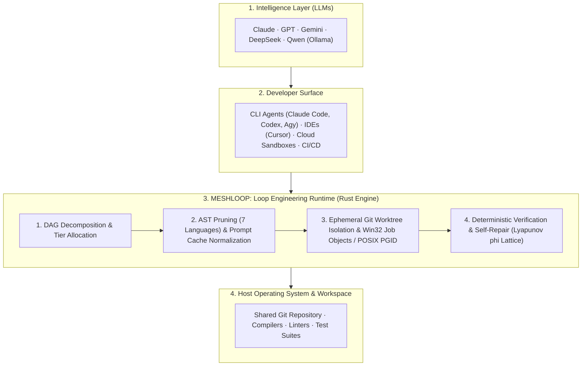

<p>
  
</p>

# Meshloop

**Multi-Agent Development Optimization & Loop Engineering Runtime.**  
Meshloop optimizes the closed engineering loop for AI coding agents: task decomposition, multi-language AST context reduction, ephemeral Git worktree isolation, and compiler-driven self-repair with zero background daemons.

[](LICENSE)
[](https://crates.io/crates/meshloop-cli)
[](Cargo.toml)
[](rust-toolchain.toml)
[](#status)
[](#status)
[](#status)
[](Cargo.toml)

---

## Core Values & Capabilities

Meshloop is designed from first principles around three pillars of engineering value:

### 1. Loop Engineering & Optimization
- **70% to 90% Context Token Reduction:** Multi-language AST pruning discards function and method bodies while preserving type definitions, public signatures, interfaces, and docstrings across 7 programming languages.
- **Deterministic Prompt Cache Alignment:** Byte-identical static prefix normalization (repository skeletons, system policies, and task contracts) delivers **>80% KV-cache hit rates** with language model providers.
- **Closed-Loop Self-Repair with Lyapunov Convergence ($\phi$):** Compiler and linter diagnostics form a partially ordered lattice. Inner-loop repair continues only if error energy strictly decreases ($\Delta \phi < 0$). Regressions trigger an instant `git reset --hard` rollback; oscillations are terminated immediately.
- **Fail-Closed Workspace Isolation:** Every agent attempt executes inside an ephemeral Git worktree (`.meshloop-worktrees/<task-id>`). Your active development branch remains completely untouched until explicit human integration (`meshloop integrate --into`).

### 2. High-Performance Architecture
- **Sub-Millisecond Symbol Indexing (<500µs):** Fast Walsh-Hadamard Transform (64-dim FWHT) with 1-bit/2-bit quantization achieves **8x memory compression** and sub-500µs symbol search and ranking without external vector databases or neural network dependencies.
- **Zero-Daemon Lightweight Footprint (<20MB RAM):** Starts on demand and terminates cleanly. No persistent OS background services, no hidden multiplexers, and millisecond cold-start latency.
- **Bounded Multiplexed Concurrency ($N \in [1, 16]$):** Executes non-dependent tasks across multiple concurrent agent workers simultaneously using a synchronous, non-blocking polling cycle without async runtime (Tokio) bloat.
- **Fast Transaction Persistence:** SQLite WAL engine with `BEGIN IMMEDIATE` and serialized `GitAdminMutex` with exponential backoff prevents `.git/index.lock` contention and guarantees sub-10ms transactional writes.

### 3. Universal Extensibility & Surface Parity
- **Polyglot AST Support (7 Languages):** Out-of-the-box skeleton extraction for **Rust, TypeScript, JavaScript, Python, Go, C#, PHP, and C++**. Clean module boundaries make adding new languages trivial.
- **Universal Agent Harness Compatibility:** Coordinates installed CLI coding tools (Claude Code, Codex, Agy, Grok, Pi), direct commercial APIs (Gemini, Anthropic, DeepSeek), or private local models (Ollama / `qwen2.5-coder`).
- **Complete Surface Parity (Slash, MCP, CLI):** Every operation is universally accessible via terminal slash commands (`/meshloop:*`), Model Context Protocol stdio tools (`meshloop_*`), or standard CLI verbs (`meshloop <verb>`).
- **Strict Hexagonal Boundaries:** `#![forbid(unsafe_code)]` across all domain, context, and engine crates. Domain logic is completely independent of process execution, storage, or external networks.

---

## Quickstart & Installation

Meshloop runs natively on Windows 10/11 and Linux as a single standalone Rust binary.

### 1. Install the CLI
```bash
cargo install meshloop-cli --locked
meshloop --version
```

### 2. Export Skills and MCP Catalog into Your Project
Run this from your project Git repository root to extract the version-locked operator pack:
```bash
meshloop bundle --dest .
```
This automatically writes:
- `skills/meshloop-*/SKILL.md` (for CLI agents: Claude Code, Codex, Agy, Pi, Grok)
- `meshloop-mcp-tools.json` (for Model Context Protocol clients: Cursor, Claude Desktop)

### 3. Configure `meshloop.toml`
Create a `meshloop.toml` in your repository root (or copy [`config/meshloop.example.toml`](config/meshloop.example.toml)):
```toml
selected_harnesses = ["codex"]

[limits]
max_concurrent_workers = 2
max_retries = 3
task_timeout_seconds = 300

[verify]
verify_command = ["cargo", "check"]

[harnesses.codex]
kind = "codex"
executable = "codex"
model_ref = "codex"
model_tier = "top"
```

### 4. Verify the Environment
```bash
meshloop doctor
```

### 5. (Optional) Connect MCP Clients
For Cursor, Claude Desktop, or other MCP clients, configure `meshloop mcp` via stdio:
```json
{
  "mcpServers": {
    "meshloop": {
      "command": "meshloop",
      "args": ["mcp"]
    }
  }
}
```

Full setup guide: **[Installation and Setup Guide](docs/install.md)**.

---

## Operator Surface Reference

Meshloop commands map across CLI verbs, slash commands inside terminal agents, and MCP tools:

| Canonical ID | Slash Command | MCP Tool | CLI Equivalent | Stage & Function |
| :--- | :--- | :--- | :--- | :--- |
| `meshloop:doctor` | `/meshloop:doctor` | `meshloop_doctor` | `meshloop doctor` | **Diagnostics:** Validates environment, worktree isolation, and configured harnesses. |
| `meshloop:plan` | `/meshloop:plan` | `meshloop_plan` | `meshloop plan` | **Planning:** Decomposes objective into a validated DAG (`meshloop-plan.json`). |
| `meshloop:review-plan` | `/meshloop:review-plan` | `meshloop_review_plan` | `meshloop review-plan` | **Human Gate:** Interactively review plan: Accept, Decline, or Adjust. |
| `meshloop:run` | `/meshloop:run` | `meshloop_run` | `meshloop run` | **Execution:** Runs workers in ephemeral Git worktrees (`.meshloop-worktrees/<task-id>`). |
| `meshloop:status` | `/meshloop:status` | `meshloop_status` | `meshloop status` | **Inspection:** Reports task states, active attempts, and execution history. |
| `meshloop:accept` | `/meshloop:accept` | `meshloop_accept` | `meshloop accept` | **Verification:** Approves deterministic test evidence and git diff for a completed task. |
| `meshloop:resume` | — | `meshloop_resume` | `meshloop resume` | **Continuation:** Resumes execution or restarts failed tasks without replanning. |
| `meshloop:integrate` | — | `meshloop_integrate` | `meshloop integrate` | **Integration:** Merges verified worktree changes into the target branch. |
| `meshloop:orchestrate` | `/meshloop:orchestrate` | `meshloop_orchestrate` | `meshloop orchestrate` | **Review:** Synthesizes cross-model feedback between two distinct agents. |
| `meshloop:roles` | `/meshloop:roles` | `meshloop_roles` | `meshloop roles` | **Catalog:** Lists bundled agent roles and capabilities. |
| `meshloop:mcp` | — | — | `meshloop mcp` | **Server:** Starts the local stdio JSON-RPC Model Context Protocol server. |
| `meshloop:bundle` | — | — | `meshloop bundle` | **Packager:** Exports bundled skills and MCP catalog to target repository. |

Walkthrough of the full operator workflow: **[Getting Started Guide](docs/start.md)**.

---

## Where Meshloop Fits in Multi-Agent Development

Meshloop sits between developer-facing surfaces and host operating system toolchains, optimizing the multi-agent software engineering loop:



---

## 4 Concrete Scenarios

| Environment | How Meshloop Optimizes the Loop | Key Benefit |
| :--- | :--- | :--- |
| **1. Solo Developer at Terminal (Flat-Rate CLI Subscriptions)** | Coordinates installed CLI agents (Claude Code, Codex, Agy, Grok) directly without requiring additional API tokens. Tasks execute in background worktrees while your working branch remains untouched. | Isolated execution + Zero extra token costs |
| **2. Professional Teams using Commercial APIs (Pay-As-You-Go)** | AST pruning across 7 languages discards function bodies while preserving signatures, reducing context size by 70–90%. Static prefix normalization delivers >80% prompt cache reuse. | Reduced token consumption + Lower latency |
| **3. Offline & Air-Gapped Environments (Local Models via Ollama)** | Connects to local models (e.g., `qwen2.5-coder`). Sub-millisecond quantized signature retrieval fits large repository structures into limited local context windows. | 100% offline + Zero external data leakage |
| **4. Cloud Sandboxes & Autonomous CI/CD** | Runs as a single standalone Rust binary (<20MB RAM, millisecond startup) with headless execution (`--accept-plan`) and stdio MCP server support. | Headless automation + Compiler-verified PR checks |

---

## Safety & Invariants

- **No Daemons, No Background Services:** Runs on demand and terminates cleanly.
- **No Stored Credentials:** Relies on existing CLI logins, environment variables, or local Ollama endpoints.
- **Fail-Closed Isolation:** Subprocesses operate inside ephemeral Git worktrees. Your active working branch is untouched until explicit human integration (`meshloop integrate --into`).
- **Deterministic Truth:** Real compiler exit codes drive acceptance; language models never judge their own success.
- **Pure Safe Rust:** `#![forbid(unsafe_code)]` across all domain, context, and engine crates.

---

## Documentation

- **[Documentation Hub](docs/README.md)** — Complete index and reading paths
- **[Installation and Setup](docs/install.md)** — Complete setup and MCP configuration
- **[Getting Started Guide](docs/start.md)** — In-session engineering loop walkthrough
- **[Product & Engineering Log](docs/product/product-log.md)** — Empirical release log, verified benchmarks, and roadmap
- **[Product Brief & Scenarios](docs/product/brief.md)** — Design goals and use cases
- **[Architecture Overview](docs/architecture/overview.md)** — Hexagonal boundaries, state machine, and glossary
- **[Modular Architecture & Concurrency](docs/architecture/modern-modular-architecture.md)** — RunLoop concurrency and self-repair
- **[Contributing Guide](CONTRIBUTING.md)** — How to extend languages, harnesses, and checks
- **[Skills Catalog](skills/README.md)** — Operator slash commands and prompt bundles

---

## Development

```bash
cargo build -p meshloop-cli
cargo run -p xtask -- check    # Format, clippy -D warnings, workspace tests
cargo run -p xtask -- bench    # SPEC-ML-BENCH-001 scorecard & metrics
cargo run -p xtask -- live     # Launch gate: verifies doctor daemonless and worktree isolation
```

---

## License

Code is licensed under [Apache-2.0](LICENSE). See [NOTICE](NOTICE) and [TRADEMARKS.md](TRADEMARKS.md).  
Created and maintained by Samuel ([@smota](https://github.com/smota)).
