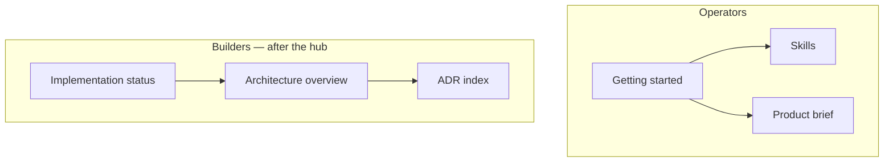

# Meshloop docs

Meshloop is a local orchestration engine for authenticated CLI agents and Herdr.
You operate **from inside** Claude Code, Codex, Pi, Grok, or Agy. It plans one
objective, farms live workers, verifies diffs, and will not merge until you
accept. It does not store credentials.

**Release 1** — native Windows, Herdr 0.8 live workers, concurrency 1. Fixture
subprocess is the CI double (`--fixture-only`). Tests may split **non-origin**
panes; they must never split the supervisor pane. WSL2 and prebuilt binaries
are unverified. crates.io source-install is enabled; no registry upload yet.

## Who are you?

| You | Open |
|---|---|
| Operator in a Herdr agent session | [Getting started](start.md) (install [skills](../skills/README.md) as step 0) |
| Wanting the problem statement | [Product brief](product/brief.md) |
| Changing code or reviewing a diff | [Implementation status](engineering/implementation-status.md), then [AGENTS.md](../AGENTS.md) |

## Operator loop

`plan` · `review-plan` · `run` · `status` · `resume` · `cancel` · `inspect` ·
`accept` · `integrate` · `roles` · `doctor` · `orchestrate` · `mcp`

Live workers are the default. `run` does not merge onto your current branch.

1. [Getting started](start.md)
2. Example config: [`config/meshloop.example.toml`](../config/meshloop.example.toml)
3. [Skills](../skills/README.md)

## Product and decisions

Runtime ADRs **0001 / 0003 / 0005 / 0007 / 0009 / 0016 / 0017 / 0018** are Accepted.

1. [Product brief](product/brief.md)
2. [Requirements](product/requirements.md) — ML-001–014 are targets; R1 does not claim all of them
3. [ADR 0016](architecture/adr/0016-r1-closed-loop.md) — live workers, fixture as CI
4. [ADR 0017](architecture/adr/0017-session-control-plane.md) — `meshloop:` prefix, supervisor-only origin
5. [ADR index](architecture/adr/README.md)

## Architecture (after the hub)

[Overview](architecture/overview.md) describes the v1 shape and names R1
residuals (WSL2, concurrency > 1, prebuilt binaries, crates.io upload, queried quota).

- [Component boundaries](architecture/boundaries.md)
- [Execution lifecycle](architecture/execution-lifecycle.md)
- [Threat model](architecture/threat-model.md) — design requirements, not a guarantee

## Engineering internals

Do not start here unless you are changing code.

- [Implementation status](engineering/implementation-status.md)
- [Testing](engineering/testing.md) — `xtask check` and `xtask live`
- [Rust conventions](engineering/rust.md)
- [Harness contract](engineering/harnesses.md) — developing Meshloop *with* the selected CLIs
- [Design patterns](engineering/design-patterns.md)
- [Contributing](../CONTRIBUTING.md)
- Historical R1 lab notes (superseded): [r1-closed-loop-design.md](architecture/r1-closed-loop-design.md)

## Help, security, legal

- [Support](../.github/SUPPORT.md) — no SLA
- [Security](../.github/SECURITY.md) — private reports only
- [License](../LICENSE) (Apache-2.0) · [NOTICE](../NOTICE) · [Trademarks](../TRADEMARKS.md)
