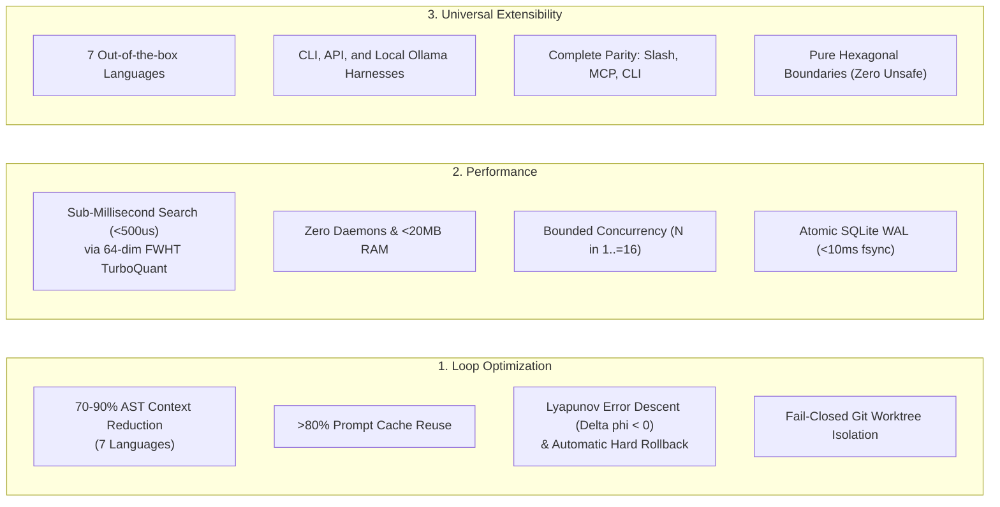
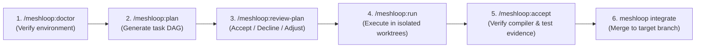
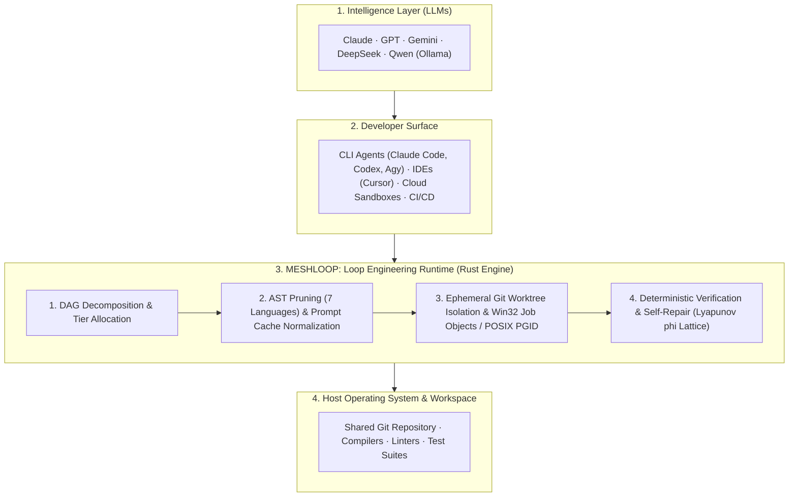

# Meshloop Documentation

**Meshloop is the Loop Engineering Runtime for Multi-Agent Software Development.**  
It optimizes the closed development loop across polyglot codebases: task DAG decomposition, multi-language AST context reduction (7 languages), ephemeral Git worktree isolation, and compiler-driven self-repair with zero background daemons.

---

## Core Values & Capabilities

### 1. Loop Engineering & Optimization
- **Context Reduction (70–90%):** Extracts AST skeletons by discarding internal function bodies while preserving type definitions, interfaces, signatures, and docstrings.
- **Prompt Cache Alignment:** Deterministic static prefix normalization delivers >80% KV-cache reuse with language model providers.
- **Lyapunov Convergence Self-Repair:** Compiler errors form a partially ordered lattice. Inner-loop repair continues only while error potential strictly decreases ($\Delta \phi < 0$); regressions trigger an immediate `git reset --hard`.
- **Worktree Isolation:** Every attempt runs in an isolated ephemeral worktree (`.meshloop-worktrees/<task-id>`), keeping the working branch pristine until explicit human integration (`meshloop integrate --into`).

### 2. High-Performance Architecture
- **Quantized Signature Indexing:** 64-dimensional Fast Walsh-Hadamard Transform (FWHT) with 1-bit/2-bit quantization achieves sub-500µs symbol search and 8x compression without external vector databases.
- **Zero-Daemon Overhead:** Standalone, single-process execution with sub-20MB memory footprint and millisecond startup.
- **Bounded Concurrency ($N \in [1, 16]$):** Non-blocking polling enables multiplexed worker execution without async runtime (Tokio) overhead.
- **Serialized Contention Management:** `GitAdminMutex` with exponential backoff prevents `.git/index.lock` collisions under parallel worktree creation.

### 3. Universal Extensibility & Surface Parity
- **Polyglot AST Support:** Native AST pruning for **Rust, TypeScript, JavaScript, Python, Go, C#, PHP, and C++**.
- **Universal Harness Compatibility:** Seamlessly integrates CLI agents (Claude Code, Codex, Agy, Grok, Pi), direct commercial APIs, or local offline Ollama models.
- **Complete Surface Parity:** Full functional access via CLI verbs, interactive terminal slash commands, or stdio Model Context Protocol (MCP) tools.

---

## Operator Surface Reference

Meshloop operations can be triggered through terminal slash commands, MCP tools, or direct CLI verbs:

| Canonical ID | Slash Command | MCP Tool | CLI Equivalent | Stage & Function |
| :--- | :--- | :--- | :--- | :--- |
| `meshloop:doctor` | `/meshloop:doctor` | `meshloop_doctor` | `meshloop doctor` | **Diagnostics:** Validates environment, worktree isolation, and configured harnesses. |
| `meshloop:plan` | `/meshloop:plan` | `meshloop_plan` | `meshloop plan` | **Planning:** Decomposes objective into a validated DAG (`meshloop-plan.json`). |
| `meshloop:review-plan` | `/meshloop:review-plan` | `meshloop_review_plan` | `meshloop review-plan` | **Human Gate:** Interactively review plan: Accept, Decline, or Adjust. |
| `meshloop:run` | `/meshloop:run` | `meshloop_run` | `meshloop run` | **Execution:** Runs workers in ephemeral Git worktrees (`.meshloop-worktrees/<task-id>`). |
| `meshloop:status` | `/meshloop:status` | `meshloop_status` | `meshloop status` | **Inspection:** Reports task states, active attempts, and execution history. |
| `meshloop:accept` | `/meshloop:accept` | `meshloop_accept` | `meshloop accept` | **Verification:** Approves deterministic test evidence and git diff for a completed task. |
| `meshloop:resume` | — | `meshloop_resume` | `meshloop resume` | **Continuation:** Resumes execution or restarts failed tasks without replanning. |
| `meshloop:integrate` | — | `meshloop_integrate` | `meshloop integrate` | **Integration:** Merges verified worktree changes into the target branch. |
| `meshloop:orchestrate` | `/meshloop:orchestrate` | `meshloop_orchestrate` | `meshloop orchestrate` | **Review:** Synthesizes cross-model feedback between two distinct agents. |
| `meshloop:roles` | `/meshloop:roles` | `meshloop_roles` | `meshloop roles` | **Catalog:** Lists bundled agent roles and capabilities. |
| `meshloop:mcp` | — | — | `meshloop mcp` | **Server:** Starts the local stdio JSON-RPC Model Context Protocol server. |
| `meshloop:bundle` | — | — | `meshloop bundle` | **Packager:** Exports bundled skills and MCP catalog to target repository. |

---

## Getting Started

1. **[Installation & Setup](install.md)** — Step-by-step setup, `meshloop.toml` configuration, and MCP server integration.
2. **[Getting Started Guide](start.md)** — Walkthrough of the in-session operator loop.
3. **[Product Brief & Use Cases](product/brief.md)** — Problem statement, stack positioning, and 4 concrete environments.
4. **[Skills Catalog](../skills/README.md)** — Reference for all operator skills and slash commands.

---

## System Overview

---

## Documentation Index

### Core Architecture
- **[Architecture Overview](architecture/overview.md)** — Hexagonal boundaries, crate responsibilities, state machine, and glossary.
- **[Modular Architecture & Concurrency](architecture/modern-modular-architecture.md)** — Multi-worker execution ($N \in [1, 16]$), Job Objects, and self-repair convergence.
- **[Component Boundaries](architecture/boundaries.md)** — Allowed dependencies and architectural invariants per crate.
- **[Execution Lifecycle](architecture/execution-lifecycle.md)** — Formal task lifecycle and attempt state machine.
- **[Threat Model & Security](architecture/threat-model.md)** — Fail-closed isolation, credentials, and network posture.
- **[Architecture Decision Records (ADRs)](architecture/adr/README.md)** — Historical decision index from ADR 0001 to ADR 0029.

### Engineering & Operations
- **[Contributing Guide](../CONTRIBUTING.md)** — Workspace layout, adding language support, and extending harnesses.
- **[Testing Strategy](engineering/testing.md)** — Running `xtask check`, `xtask bench`, and isolation tests.
- **[Measurement & Benchmarking](engineering/benchmarking.md)** — SPEC-ML-BENCH-001 metrics, thresholds, and scorecard validation.
