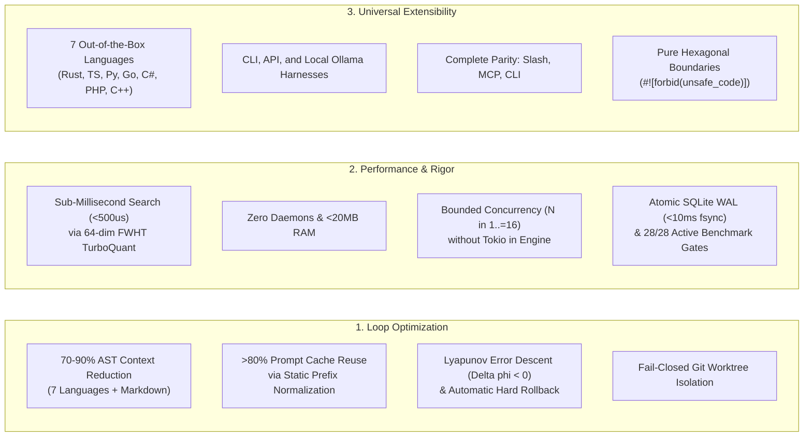

# Meshloop Documentation Hub

**Meshloop is the Loop Engineering Runtime for Multi-Agent Software Development.**  
Meshloop coordinates and optimizes the closed development loop across polyglot codebases: task DAG decomposition, multi-language AST context reduction (7 languages + technical Markdown), ephemeral Git worktree isolation, and compiler-driven self-repair with zero background daemons.

---

## 1. Information Architecture & Reading Paths

Meshloop documentation is organized across **four progressive disclosure layers** so you can find the exact level of detail you need without wading through low-level decision records:

```
Layer 1: Project Compass [README.md]
  └── High-level value proposition, problem/solution matrix, quickstart, and benchmark highlights.

Layer 2: Documentation Hub [docs/README.md — You Are Here]
  └── Role-based entry paths, architecture taxonomy, and topic navigation.

Layer 3: Guided Journeys & Operational Runbooks
  └── Installation, step-by-step loop execution, product logs, and contribution setup.

Layer 4: Deep Architecture, Invariants, & Specifications
  └── Hexagonal boundaries, SPEC-ML-BENCH-001, threat model, and 31 Architecture Decision Records (ADRs).
```

### Choose Your Reading Path

| Your Goal | 1st Click (Start Here) | 2nd Click (Deepen) | Where NOT to Start |
| :--- | :--- | :--- | :--- |
| **Try Meshloop in your repository** | [Installation Guide](install.md) | [Getting Started Walkthrough](start.md) | ADR index, testing internals |
| **Evaluate technical architecture & design** | [Architecture Overview](architecture/overview.md) | [Modular Architecture & Concurrency](architecture/modern-modular-architecture.md) | `initialization.md` (historical) |
| **Inspect empirical benchmarks & regression rigor** | [Product & Engineering Log](product/product-log.md) | [Benchmark Specification](architecture/measurement-and-benchmark-spec.md) | Marketing briefs |
| **Inspect peer sparring & architectural decisions** | [Architectural Rounds & Decisions](engineering/architectural-rounds-and-decisions.md) | [ADR Index](architecture/adr/README.md) | Unverified proposals |
| **Audit isolation, process ownership & security** | [Threat Model & Isolation Posture](architecture/threat-model.md) | [Process-Tree Ownership (ADR 0025)](architecture/adr/0025-process-tree-ownership.md) | Operator slash commands |
| **Contribute new languages, harnesses, or checks** | [Contributing Guide](../CONTRIBUTING.md) | [Testing & Verification Strategy](engineering/testing.md) | Pre-loop historical designs |

---

## 2. Core Architectural Pillars



---

## 3. Operator Surface Parity

All operations are universally accessible via terminal slash commands, stdio Model Context Protocol (MCP) tools, or native CLI verbs:

| Canonical ID | Slash Command | MCP Tool | CLI Equivalent | Stage & Function |
| :--- | :--- | :--- | :--- | :--- |
| `meshloop:doctor` | `/meshloop:doctor` | `meshloop_doctor` | `meshloop doctor` | **Diagnostics:** Validates environment, worktree isolation, and configured harnesses. |
| `meshloop:plan` | `/meshloop:plan` | `meshloop_plan` | `meshloop plan` | **Planning:** Decomposes objective into a validated task DAG (`meshloop-plan.json`). |
| `meshloop:review-plan` | `/meshloop:review-plan` | `meshloop_review_plan` | `meshloop review-plan` | **Human Gate:** Interactively review plan: Accept, Decline, or Adjust. |
| `meshloop:run` | `/meshloop:run` | `meshloop_run` | `meshloop run` | **Execution:** Runs workers in ephemeral Git worktrees (`.meshloop-worktrees/<task-id>`). |
| `meshloop:status` | `/meshloop:status` | `meshloop_status` | `meshloop status` | **Inspection:** Reports task states, active attempts, and execution history. |
| `meshloop:accept` | `/meshloop:accept` | `meshloop_accept` | `meshloop accept` | **Verification:** Approves deterministic compiler evidence and git diff for a completed task. |
| `meshloop:resume` | — | `meshloop_resume` | `meshloop resume` | **Continuation:** Resumes execution or restarts failed tasks without replanning. |
| `meshloop:integrate` | — | `meshloop_integrate` | `meshloop integrate` | **Integration:** Merges verified worktree changes into the target branch. |
| `meshloop:orchestrate` | `/meshloop:orchestrate` | `meshloop_orchestrate` | `meshloop orchestrate` | **Review:** Synthesizes cross-model feedback between two distinct agents. |
| `meshloop:roles` | `/meshloop:roles` | `meshloop_roles` | `meshloop roles` | **Catalog:** Lists bundled agent roles and capabilities. |
| `meshloop:mcp` | — | — | `meshloop mcp` | **Server:** Starts the local stdio JSON-RPC Model Context Protocol server. |
| `meshloop:bundle` | — | — | `meshloop bundle` | **Packager:** Exports bundled skills and MCP catalog to target repository. |

---

## 4. Complete Documentation Index

### Layer 3: Guided Journeys & Task Runbooks
- **[Installation and Setup](install.md)** — CLI installation, `meshloop.toml` configuration, and MCP setup.
- **[Getting Started Guide](start.md)** — Hands-on walkthrough of the in-session operator loop.
- **[Skills Catalog](../skills/README.md)** — Bundled slash commands and prompt packs for CLI coding agents.
- **[Developer Contributing Guide](../CONTRIBUTING.md)** — Workspace setup, crate boundaries, and contribution standards.

### Layer 4: Architecture, Specifications, & Decision Records
- **[Architecture Overview](architecture/overview.md)** — Hexagonal boundaries, crate responsibilities, and state machine.
- **[Modular Architecture & Concurrency](architecture/modern-modular-architecture.md)** — Multi-worker polling, Job Objects, and self-repair convergence.
- **[Component Boundaries](architecture/boundaries.md)** — Crate dependency rules, isolation guarantees, and `#![forbid(unsafe_code)]`.
- **[Execution Lifecycle](architecture/execution-lifecycle.md)** — Formal state machine for tasks and execution attempts.
- **[Threat Model & Security](architecture/threat-model.md)** — Fail-closed isolation, credentials, and network posture.
- **[Architecture Decision Records (ADRs)](architecture/adr/README.md)** — Authoritative decision index from **ADR 0001 through ADR 0031**.

### Empirical Benchmarks & Product Governance
- **[Product & Engineering Log](product/product-log.md)** — Verifiable record of hardening cycles, E2E refinement rounds, and roadmap milestones.
- **[Architectural Rounds & Peer Sparring](engineering/architectural-rounds-and-decisions.md)** — In-depth analysis of peer sparring between Agy, Grok, and Claude, technical rejections, and test cycles.
- **[Benchmark Specification (`SPEC-ML-BENCH-001`)](architecture/measurement-and-benchmark-spec.md)** — 28 active metrics, statistical definitions, and verification methodology.
- **[Testing Strategy](engineering/testing.md)** — Test tiers, fault injection, and running `xtask check` and `xtask bench`.
- **[Product Strategy Brief](product/brief.md)** — Target scenarios, problem statement, and stack positioning.
- **[Functional Requirements](product/requirements.md)** — Explicit functional requirements and non-functional constraints.
- **[Canonical Harness Governance (`AGENTS.md`)](../AGENTS.md)** — Canonical authority and execution rules for all AI harnesses.
