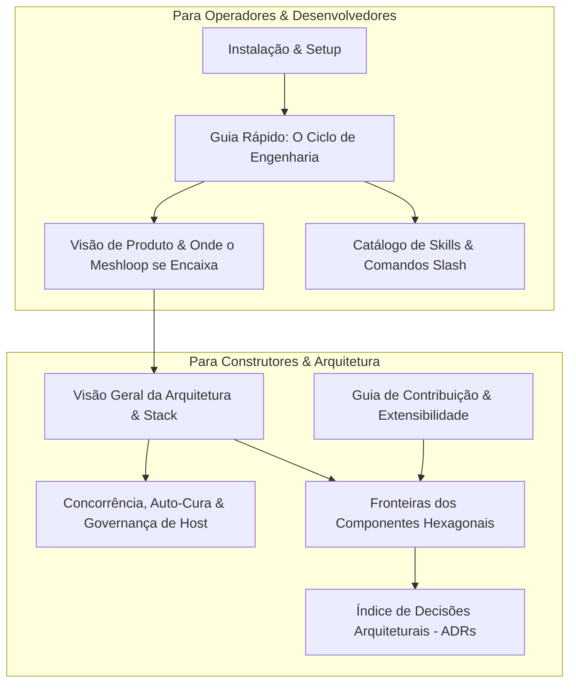

# Documentação do Meshloop

> **O Ambiente de Engenharia de Loop Fechado de Alta Eficiência para Agentes de IA**  
> Standalone, Daemonless, Multi-Linguagem, Isolado por Git Worktrees e Verificado de Forma Determinística.

O Meshloop é a camada de infraestrutura de tempo de execução que viabiliza a execução autônoma de tarefas complexas de software por agentes de IA (**Claude Code, Codex, Grok, Pi, Agy**, além de **APIs comerciais** e **modelos locais via Ollama**), garantindo isolamento estrito de código, economia de até 90% de tokens e auto-cura com validação determinística.

---



---

## 🧭 Onde Começar?

| Seu Perfil / Objetivo | O que ler primeiro |
| :--- | :--- |
| **Quero entender o valor e onde o Meshloop se encaixa** | 📖 [Visão do Produto & 4 Cenários de Uso](product/brief.md) |
| **Quero instalar e rodar na minha máquina agora** | 🚀 [Guia de Instalação](install.md) e [Primeiros Passos](start.md) |
| **Quero entender a engenharia de contexto, AST e concorrência** | 🏛️ [Visão Geral da Arquitetura](architecture/overview.md) e [Arquitetura Modular](architecture/modern-modular-architecture.md) |
| **Quero estender o Meshloop (adicionar linguagem ou harness)** | 🛠️ [Guia de Contribuição](../CONTRIBUTING.md) e [Fronteiras](architecture/boundaries.md) |
| **Quero consultar termos técnicos e decisões fundamentais** | 📚 [Dicionário de Tecnologia](architecture/overview.md#dicionário-de-tecnologia) e [Índice de ADRs](architecture/adr/README.md) |

---

## 🎯 Onde o Meshloop se Encontra no Ecossistema?

O Meshloop não compete com modelos ou interfaces. Ele é a fundação de engenharia que fica embaixo deles:

1. **Modelos de Inteligência (LLMs):** Claude 3.7, GPT-4o, Gemini 2.5, DeepSeek V3, Qwen.
2. **Superfície do Desenvolvedor:** CLIs de terminal (`claude`, `codex`, `agy`), IDEs, Web Sandboxes ou CI/CD.
3. **MESHLOOP (O Motor de Loop Fechado):** Decomposição em grafo (DAG), poda de AST em 7 linguagens, isolamento de Git Worktree, reticulado de diagnósticos e governança de SO via Win32 Job Objects.
4. **Ambiente Real:** Seus arquivos, linters, compiladores locais e testes reais.

---

## ⚡ Os 4 Cenários de Aplicação

1. **Desenvolvedores Solo (Assinaturas Planas):** Paraleliza tarefas de engenharia sem custo extra de tokens em APIs, operando de dentro da sua sessão de terminal sem sujar a branch atual.
2. **Equipes com APIs Comerciais (Pay-As-You-Go):** Corta entre 70% e 90% da fatura de tokens via poda de esqueletos AST e atinge >80% de cache hit de prompt.
3. **Empresas & Sigilo de Código (Modelos Locais Ollama):** Roda 100% offline e privado, permitindo que modelos locais processem repositórios grandes através de índices quantizados ultraleves.
4. **Nuvem, Sandboxes & CI/CD Autônomo (GitHub Actions / E2B):** Motor síncrono em Rust (<20MB de RAM, inicialização instantânea), servidor MCP stdio nativo e modo headless para correção automática de código antes de abrir Pull Requests.

---

## 🛡️ O Ciclo de Operação do Desenvolvedor

O fluxo de trabalho garante controle humano total e isolamento de ponta a ponta:

```text
/meshloop:doctor       Verifica o ambiente (modo daemonless, git, harnesses)
/meshloop:plan         Gera o grafo de decomposição de tarefas (meshloop-plan.json)
/meshloop:review-plan  Gate Humano: Aceitar (Accept), Recusar (Decline) ou Ajustar (Adjust)
/meshloop:run          Executa os agentes em Git Worktrees isolados (sua branch intocada)
/meshloop:accept       Gate de Revisão: valida a evidência dos testes determinísticos
/meshloop:integrate    Apenas este comando mescla as alterações aprovadas na sua branch
```

---

## 📚 Mapa da Documentação

### Produto e Visão
- [Visão do Produto & Cenários](product/brief.md) — O problema, os 4 perfis de uso e os pilares de eficiência.
- [Requisitos do Sistema](product/requirements.md) — Matriz de requisitos e conformidade.

### Arquitetura e Decisões Técnicas
- [Visão Geral da Arquitetura](architecture/overview.md) — Hexágono, camadas, dicionário de tecnologia e estados do motor.
- [Arquitetura Modular, Concorrência e Auto-Cura](architecture/modern-modular-architecture.md) — O detalhamento do RunLoop síncrono, Job Objects e reticulado de erros.
- [Fronteiras de Componentes](architecture/boundaries.md) — O que cada crate do workspace pode e não pode possuir.
- [Ciclo de Vida de Execução](architecture/execution-lifecycle.md) — Máquina de estados formal por tentativa de tarefa.
- [Modelo de Ameaças & Segurança](architecture/threat-model.md) — Postura fail-closed, isolamento e privacidade.
- [Índice de ADRs](architecture/adr/README.md) — Decisões arquiteturais registradas de 0001 a 0029.

### Engenharia e Contribuição
- [Guia de Contribuição](../CONTRIBUTING.md) — Regras de escopo por camada, como adicionar linguagens e harnesses.
- [Estratégia de Testes](engineering/testing.md) — Como rodar `xtask check`, `xtask bench` e testes de isolamento.
- [Framework de Benchmarking](engineering/benchmarking.md) — Métricas de contenção, orfandade de processos e redução de tokens.
- [Status de Implementação](engineering/implementation-status.md) — Registro vivo do que está implementado e verificado no código.
- [Contrato de Harnesses](engineering/harnesses.md) — Padrões para integração com agentes de terminal.

---

## ⚖️ Licença, Segurança e Governança

- **Código:** Licenciado sob [Apache-2.0](../LICENSE).
- **Segurança:** Relatórios confidenciais conforme [.github/SECURITY.md](../.github/SECURITY.md).
- **Trabalho 100% IA sob Governança Humana:** O código e testes são concebidos e implementados por agentes de IA com direcionamento e validação humana explícita.
