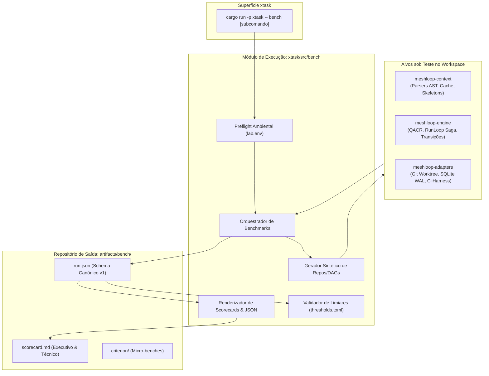

# Especificação Técnica: Framework de Medição, Benchmark e Validação Arquitetural

| Metadado | Detalhe |
|---|---|
| **Identificador** | `SPEC-ML-BENCH-001` |
| **Título** | Framework de Medição, Benchmark e Validação Contínua do Meshloop |
| **Status** | **Rascunho Ativo / Em Refinamento (Living Specification)** |
| **Versão** | `0.1.0-draft` |
| **Data de Criação** | 2026-09-15 |
| **Última Revisão** | 2026-09-15 |
| **Autores / Colaboradores** | Antigravity (AI Pair Programmer) & Grok (Harness Executor Parceiro via CLI local) |
| **Decisão / ADRs Relacionados** | ADR 0003, ADR 0005, ADR 0007, ADR 0009, ADR 0016, ADR 0017, ADR 0022 |
| **Crates Impactados** | `meshloop-context`, `meshloop-engine`, `meshloop-domain`, `meshloop-adapters`, `xtask` |

---

## 1. Contexto e Motivação

O Meshloop é um motor de orquestração local em Rust voltado a agentes CLI de código aberto e proprietários autenticados (Codex, Claude Code, Pi, Grok, Agy). O sistema combina:
1. Despacho e coordenação de agentes sequenciais/concorrentes guiados por políticas QACR (Quality, Capability, Risk).
2. Isolamento de mutações de código exclusivamente em **worktrees Git efêmeros**, protegendo o repositório principal de alterações não autorizadas.
3. Persistência transacional com durabilidade estrita via **SQLite WAL**.
4. Engenharia de contexto multi-linguagem (`meshloop-context`), realizando extração de esqueletos AST (Rust, TypeScript, Python, Go) e normalização de prefixos de prompt para obtenção de altas taxas de acerto de prompt caching (>80%).

À medida que o Meshloop evolui — com a introdução da execução standalone daemonless (ADR 0022), integração de múltiplos provedores de bulk reading (Tier 1) e pipelines poliglota de análise sintática —, faz-se imperativo dispor de um **framework de medição e benchmark formal**.

Este documento especifica a arquitetura, os contratos de interface, as estruturas de dados, os algoritmos de cálculo, o protocolo experimental e as ferramentas de CI necessárias para garantir a repetibilidade e a validação contínua da qualidade técnica do produto.

---

## 2. Objetivos e Requisitos do Sistema

### 2.1 Objetivos Centrais
- **O1 - Validação Arquitetural Contínua:** Impedir a regressão não-funcional de caminhos críticos (latência de parsing AST, overhead do scheduler de RunLoop, tempo de fsync no SQLite WAL) e validar de forma determinística as invariantes de isolamento e segurança em cada Pull Request.
- **O2 - Validação Evolutiva do Produto:** Medir numericamente o impacto de melhorias e trade-offs nas três frentes de inovação do produto:
  - Roteamento QACR (taxa de seleção por tier de risco, obediência a cooldowns, custo de misroute).
  - Poda de contexto AST (balanço entre compressão de tokens e preservação de sinal indispensável para a tarefa).
  - Caching de prompts e fingerprints (garantia de zero stale-hits e redução de latência).
- **O3 - Confiança Técnica e Auditabilidade:** Produzir relatórios e scorecards em formato unificado e canônico (JSON estruturado + Markdown executivo de 1 página), garantindo que todo dado seja auditável, reproduzível e com limites de incerteza estatística claramente explicitados.

### 2.2 Requisitos Funcionais e de Engenharia
- **REQ-BENCH-01 (Isolamento de Estado):** Os testes de benchmark nunca devem tocar, sujar ou deixar artefatos/locks no repositório de trabalho local. Toda execução deve usar diretórios efêmeros (`temp_dir()`) com limpeza garantida via padrão RAII (`Drop`).
- **REQ-BENCH-02 (Dualidade de Mundos):** O framework deve distinguir explicitamente o **Mundo D** (determinístico/mock/replay, relógio injetado, seeds fixos, foco no Meshloop) do **Mundo S** (estocástico/live, modelos de linguagem reais, amostragem estatística $N \ge 10$, intervalos de confiança de Wilson). É terminantemente proibido calcular médias conjuntas entre D e S.
- **REQ-BENCH-03 (Gates Fail-Closed):** Violações de invariantes de isolamento (`iso.*`) forçam o status geral para `FAIL` imediatamente no pipeline de CI, independentemente de métricas de performance.
- **REQ-BENCH-04 (Interface xtask Unificada):** Toda a operação de benchmarks deve ser executada exclusivamente pelo binário `xtask`, sem scripts ad-hoc ou ferramentas de terceiros despadronizadas.

---

## 3. Arquitetura do Framework e Limites de Módulos



### 3.1 Componentes e Responsabilidades

| Componente | Localização | Responsabilidade |
|---|---|---|
| **Runner de Benchmark** | `xtask/src/bench/mod.rs` | Agendamento, isolamento de diretórios temporários, disparo de suítes e agregação de dados. |
| **Monitor Ambiental (`LabEnv`)** | `xtask/src/bench/env.rs` | Amostragem de ruído de CPU/memória pré-execução, classificando o ambiente em `quiet` ou `loaded`. |
| **Gerador Sintético** | `xtask/src/bench/synthetic.rs` | Criação sob demanda de repositórios Git efêmeros e DAGs paramétricos baseados em manifestos TOML. |
| **Verificador de Invariantes** | `xtask/src/bench/invariants.rs` | Auditoria pós-run de vazamentos de worktree, escaneamento de segredos não redactados e integridade WAL. |
| **Formatador e Portão (`GateChecker`)** | `xtask/src/bench/gate.rs` | Aplicação de regras de corte de `benches/thresholds.toml` e geração de scorecards em Markdown. |

---

## 4. Taxonomia Formal de Métricas

### 4.1 Métricas de Engenharia de Contexto (`ctx.*`)

$$\text{Taxa de Redução de Tokens: } R = 100 \times \left(1 - \frac{T_{\text{pruned}}}{T_{\text{raw}}}\right)$$

$$\text{Razão Sinal-Ruído (NSR): } \text{NSR} = \frac{T_{\text{irrelevantes}}}{T_{\text{relevantes}}}$$

$$\text{Cobertura de Sinal: } C_{\text{sinal}} = 100 \times \left(\frac{|\text{Símbolos Relevantes Presentes}|}{|\text{Símbolos Gold Exigidos pela Tarefa}|}\right)$$

- `ctx.tokens.raw`: Total de tokens candidatos antes da poda (definido com tokenizer explícito: `cl100k_base`).
- `ctx.tokens.pruned`: Total de tokens no contexto final após esqueleto AST e restrição de orçamento.
- `ctx.tokens.reduction_pct`: Percentual de redução de volume de tokens. Alvo em código estruturado: 70% a 90%.
- `ctx.signal_coverage_pct`: Percentual de nós do grafo indispensáveis para a resolução da tarefa que foram mantidos no contexto.
- `ctx.noise_to_signal_ratio`: Proporção de tokens periféricos em relação a tokens essenciais. Direção: decrescente.
- `ctx.parse.latency_ms`: Latência de parsing puro via tree-sitter (p50, p95, p99) estratificada por linguagem (`rust`, `ts`, `py`, `go`).
- `ctx.cache.hit_rate_pct`: Taxa de acerto de cache de esqueletos de arquivos e cabeçalhos normalizados (>80%).
- `ctx.cache.stale_hit_rate_pct`: Taxa de leitura de cache contendo conteúdo desatualizado. **Invariante: 0.0%**.

### 4.2 Métricas de Orquestração e QACR (`orch.*`)
- `orch.route.accuracy_pct`: Percentual de nós de tarefa despachados exatamente para o harness/tier estipulado pelo oráculo de política.
- `orch.route.misroute_cost`: Matriz de confusão de decisões de roteamento:
  - *under-tiering* (alocação de agente barato/fraco para tarefa complexa, provocando falha posterior).
  - *over-tiering* (alocação de modelo topo de linha para tarefa trivial, gerando desperdício desnecessário).
- `orch.schedule.overhead_ms`: Latência interna do scheduler entre a elegibilidade de um nó no DAG e o início do processo worker.
- `orch.cooldown.violation_count`: Tentativas de despacho para harness em período de resfriamento. **Invariante: 0**.
- `orch.txn.wal_commit_ms`: Tempo de persistência de transações do RunLoop no SQLite WAL (isolado por SO: Windows vs POSIX).

### 4.3 Métricas de Isolamento, Segurança e Robustez (`iso.*`)
- `iso.worktree.leak_count`: Número de arquivos órfãos, modificações acidentais, locks (`index.lock`) ou refs não limpas no repositório pai. **Gate CI: 0**.
- `iso.crash.recovery_fidelity`: Taxa de sucesso na restauração do estado transacional após injeção de crash (SIGKILL/abort) em barreiras críticas de escrita no WAL. **Gate CI: 100% (1.0)**.
- `iso.redact.pass_rate_pct`: Eficácia do scrubber de dados sensíveis em logs, stdout, diffs e arquivos de telemetria. **Gate CI: 100%**.
- `iso.gate.obedience_rate_pct`: Taxa de interrupção e espera estrita em portões que exigem aprovação humana (`review-plan`, `accept --as`, `integrate`). **Gate CI: 100%**.

### 4.4 Métricas do Ciclo de Desenvolvimento (`dev.*`)

$$\text{Intervalo de Wilson para FPAR (95\% de confiança): } w = \frac{\hat{p} + \frac{z^2}{2n} \pm z \sqrt{\frac{\hat{p}(1-\hat{p})}{n} + \frac{z^2}{4n^2}}}{1 + \frac{z^2}{n}} \quad (z = 1.96)$$

- `dev.fpar`: *First-Pass Acceptance Rate* — Fração de tarefas aceitas no primeiro diff submetido, sem loops de retry.
- `dev.diff_valid_rate`: Percentual de patches gerados que compilam e aplicam de forma limpa via `git apply` no worktree.
- `dev.wall_clock_s`: Tempo total de execução do ciclo ponta a ponta, com decomposição obrigatória:
  $$t_{\text{total}} = t_{\text{parse}} + t_{\text{assemble}} + t_{\text{schedule}} + t_{\text{worktree}} + t_{\text{harness}} + t_{\text{apply}} + t_{\text{test}} + t_{\text{wal}}$$
- `dev.cost_tokens_per_accepted_task`: Soma de tokens consumidos por tarefa aprovada, incorporando custos de eventuais retries.

---

## 5. Metodologia Experimental e Suítes de Carga

```
                    ┌────────────────────────────────────────────────────────┐
                    │               TRÊS ANDARES DE CARGA                    │
                    └───────────┬────────────────────────────────┬───────────┘
                                │                                │
                 ┌──────────────┴───────────────┐ ┌──────────────┴───────────────┐
                 │ Andar A: Micro-benchmarks    │ │ Andar B: Workloads Sintéticos │
                 ├──────────────────────────────┤ ├──────────────────────────────┤
                 │ • Criterion em memória       │ │ • DAGs paramétricos (7 fam.) │
                 │ • Parseadores AST por lingua │ │ • Repositórios efêmeros      │
                 │ • Corpora estáticos fixos    │ │ • Barreiras e falhas injetad.│
                 └──────────────┬───────────────┘ └──────────────┬───────────────┘
                                │                                │
                                └───────────────┬────────────────┘
                                                │
                                 ┌──────────────┴───────────────┐
                                 │ Andar C: E2E Descartáveis    │
                                 ├──────────────────────────────┤
                                 │ • Replay / Mock / Live       │
                                 │ • Isolamento em temp_dir()   │
                                 │ • Decomposição de Wall-Clock │
                                 └──────────────────────────────┘
```

### 5.1 Famílias Canônicas de Manifestos Sintéticos (`benches/manifests/`)
1. `linear-tiny`: Grafo estritamente sequencial com poucos nós para validação rápida de sanidade em CI.
2. `fanout-prune`: Grafo de alta largura com dependências cruzadas, focado em testar agressividade de poda AST e NSR.
3. `deep-txn`: Grafo de alta profundidade com frequentes transações WAL, testando limites de persistência e crash barriers.
4. `wide-cooldown`: Múltiplas tarefas concorrentes disputando harnesses com períodos de rate limit configurados.
5. `polyglot-mix`: Repositório híbrido contendo Rust, TypeScript, Python e Go simultaneamente.
6. `adversary-gates`: Bateria de testes adversários tentando burlar permissões de worktree e aprovação humana.
7. `cache-churn`: Simulação de edições frequentes em nós quentes para validar invalidação precisa de cache sem stale-hits.

---

## 6. Estrutura de Dados e Schema JSON Canônico

O schema canônico versionado é armazenado em `artifacts/bench/<run_id>/run.json` e obedece à especificação `run-record.v1`:

```json
{
  "$schema": "https://json-schema.org/draft/2020-12/schema",
  "schema_version": "1.0.0",
  "run_id": "1726400000000-a1b2c3d4-fanout-prune",
  "suite": {
    "name": "fanout-prune",
    "kind": "synthetic",
    "world": "deterministic",
    "suite_version": "1.0.0",
    "manifest_ref": "benches/manifests/fanout-prune.toml",
    "hypothesis_id": "H-2026-09-prune-reachability"
  },
  "subject": {
    "git_sha": "a1b2c3d4e5f678901234567890abcdef12345678",
    "git_dirty": false,
    "crate_versions": {
      "meshloop-domain": "0.1.0",
      "meshloop-engine": "0.1.0",
      "meshloop-adapters": "0.1.0",
      "meshloop-context": "0.1.0",
      "meshloop-cli": "0.1.0"
    },
    "os": "windows",
    "rustc": "1.98.0"
  },
  "harness": {
    "name": "fixture",
    "cli_version": null,
    "model": null
  },
  "factors": {
    "seed": 42,
    "tokenizer": "cl100k_base",
    "cache_state": "cold",
    "max_inflight": 3,
    "budget_tokens": 8000
  },
  "lab": {
    "noise_class": "quiet",
    "n_planned": 1,
    "n_kept": 1,
    "clock": "injected"
  },
  "metrics": [
    {
      "name": "ctx.tokens.reduction_pct",
      "unit": "pct",
      "direction": "higher",
      "value": 78.4,
      "p50": 78.4,
      "baseline": 72.0,
      "delta": 6.4,
      "threshold": { "op": "gte", "value": 70.0, "fail_on_breach": true },
      "status": "pass"
    }
  ],
  "invariants": [
    { "name": "iso.worktree.leak_count", "observed": 0, "allowed": 0, "status": "pass" },
    { "name": "iso.redact.pass_rate_pct", "observed": 100, "allowed_min": 100, "status": "pass" },
    { "name": "iso.gate.bypass_count", "observed": 0, "allowed": 0, "status": "pass" },
    { "name": "iso.crash.recovery_fidelity", "observed": 1.0, "allowed_min": 1.0, "status": "pass" }
  ],
  "decomposition": {
    "dev.wall_clock_s": {
      "parse": 0.08,
      "assemble": 0.04,
      "schedule": 0.02,
      "worktree": 0.35,
      "harness_exec": 4.10,
      "apply": 0.05,
      "test": 0.80,
      "wal": 0.02
    }
  },
  "status": {
    "overall": "pass",
    "invariants": "pass",
    "thresholds": "pass",
    "lab_valid": true
  }
}
```

---

## 7. Integração com Atualizações Arquiteturais em Andamento

Esta seção serve como base de alinhamento com as transformações ativas na arquitetura do Meshloop:

### 7.1 Execução Standalone Daemonless (ADR 0022)
- **Eliminação de Dependência Externa:** A transição da dependência do Herdr para o despacho direto via subprocesso em worktrees isolados (`CliHarness`) permite que a suíte de benchmarks execute de forma completamente autônoma e headless em qualquer ambiente de CI (Linux, macOS, Windows).
- **Benchmarking de Isolamento de Processo:** Validar se a terminação forçada de processos subprocessados não deixa processos zumbis ou locks pendentes no Git, dispensando monitores externos.

### 7.2 Pipeline AST de Contexto Multi-Linguagem (`meshloop-context`)
- **Micro-benchmarks por Linguagem:** Medir a latência do tree-sitter e a taxa de compressão para Rust, TypeScript, Python e Go sob variações de carga.
- **Detecção de Regressão em Tree-sitter:** Alertas automáticos caso atualizações de gramáticas ou heurísticas de pruning aumentem a taxa de erro ou fallback para leitura crua de texto.

### 7.3 Dynamic Bulk Reader Resolution (Tier 1)
- O framework de benchmark deve incorporar medições comparativas de latência e consumo de tokens entre os quatro níveis de resolução de bulk reading:
  1. Flag CLI explícita
  2. Variável de ambiente do sistema
  3. Configuração TOML do workspace
  4. Detecção automática de chave de API ou Ollama local (custo zero)

### 7.4 Prompt Cache Normalization
- Monitorar continuamente se as mutações no gerador de contexto violam a regra de **prefixo byte-idêntico**, evitando oscilações abruptas na taxa de cache hit dos provedores.

---

## 8. Superfície de Comandos Operacionais (`xtask`)

```bash
# Execução da suíte padrão de validação de PR (Mundo D, micro-benchmarks essenciais e gates)
cargo run -p xtask -- bench

# Suítes de avaliação granular por subsistema
cargo run -p xtask -- bench-context      # Avaliação de parse AST, redução de tokens e cache hit rate
cargo run -p xtask -- bench-orch         # Acurácia QACR, latência de scheduling e thundering herd
cargo run -p xtask -- bench-iso          # Injeção de falhas em transações WAL, leaks e segredos
cargo run -p xtask -- bench-e2e          # End-to-end com repositórios descartáveis

# Comandos puros de validação e relatório
cargo run -p xtask -- bench-gate         # Valida run.json contra benches/thresholds.toml (exit 1 em falha)
cargo run -p xtask -- bench-scorecard    # Gera markdown executivo e técnico a partir de run.json
```

---

## 9. Pontos de Refinamento Futuro e RFCs em Aberto

Como documento vivo, os seguintes pontos permanecem abertos para refinamento conjunto conforme novas implementações do motor forem concluídas:

- [ ] **RFC-BENCH-01 (Calibração Empírica de Limiares):** Estabelecer os valores definitivos de `thresholds.toml` após a primeira bateria de 50 execuções na branch `main`.
- [ ] **RFC-BENCH-02 (Oráculo de Relevância Semântica):** Formalizar o algoritmo estático que mapeia os nós necessários do código para cálculo automático de `signal_coverage_pct` sem intervenção manual.
- [ ] **RFC-BENCH-03 (Expansão para Concorrência $W > 1$):** Definir métricas de contenção e starvation no SQLite quando o RunLoop avançar para execução concorrente real.
- [ ] **RFC-BENCH-04 (Isolamento Windows Sandbox):** Estudo de viabilidade de acoplar o `iso.sandbox.escape_count` a perfis de isolamento nativos do Windows além dos limites de worktree Git.
