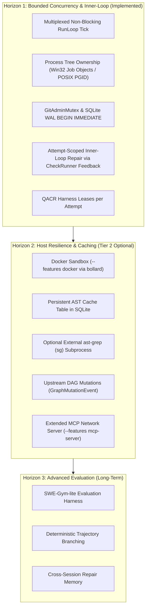

# Modular Architecture: Bounded Concurrency, Self-Repair, and Host Governance

- **Status:** Approved Architecture Proposal
- **Date:** 2026-09-15
- **Related Documents:** ADRs 0001, 0003, 0005, 0007, 0009, 0016, 0022, 0024, 0025, 0026, 0027, 0029.

---

## 1. Context and Grounding

Meshloop is a local orchestration engine in Rust designed to run agent workloads directly from authenticated CLI sessions (Claude Code, Codex, Grok, Pi, Agy) or local models without requiring background service daemons.

Core architectural properties established post-ADR 0022:
1. **Zero External Daemons:** Agents run as direct child subprocesses (`CliHarness`) inside ephemeral Git worktrees.
2. **Synchronous Hexagonal Architecture:** `meshloop-domain` and `meshloop-engine` contain no async runtimes (no Tokio, no `async_trait`). Disk access and persistence reside strictly within adapters (`rusqlite` bundled + `serde_json`), compiling with `#![forbid(unsafe_code)]`.
3. **Multi-Language Context Reduction:** `meshloop-context` covers 7 languages (Rust, TS/JS, Python, Go, C#, PHP, C++), reducing context size via AST skeleton pruning (`skeleton.rs`), prompt cache normalization (`cache.rs`), and Tier 1 provider resolution (`tier1.rs`).
4. **Deterministic Verification:** Local test suites, linters, and compilers evaluate code via `CheckRunner`, generating deterministic evidence from process exit codes.

---

## 2. Capability Horizons



---

## 3. Core Concurrency and Repair Architecture

### 3.1 Concurrency without Tokio: Synchronous Multiplexed `tick`
The `RunLoop` coordinator remains single-threaded:

1. **Non-Blocking Invocations:** `harness.invoke()` returns a handle immediately upon spawning the subprocess / Job Object.
2. **Non-Blocking Polling:** `harness.try_collect()` inspects active child processes without sleeping or blocking the engine thread.
3. **Unified `tick` Pipeline:**
   - *Collect:* Inspects active `Running` nodes; when processes exit, runs validation via `CheckRunner`.
   - *Promote:* Advances `Pending` nodes to `Ready` when parent dependencies are satisfied.
   - *Concurrent Dispatch:* Spawns new `Ready` nodes up to `max_concurrent_workers`, acquiring a harness lease.
   - *Serial Integration:* Branch integration via `meshloop integrate` remains strictly serial.

### 3.2 Concurrency Protocols and Process Ownership
- **`GitAdminMutex` (Serialized Git Administrative Operations):**  
  Operations on the shared repository (`git worktree add`, `remove`, `prune`) are protected by an intra-process mutex with exponential backoff retry (50ms to 2s) to absorb transient `.git/index.lock` contention caused by background file indexers. Worktree-local operations (`git add`, `commit`, `diff`) run concurrently without locking.
- **Atomic SQLite WAL Transactions:**  
  State updates are wrapped in `BEGIN IMMEDIATE`:
  ```sql
  BEGIN IMMEDIATE;
  INSERT INTO events (event_id, task_id, attempt_id, from_state, to_state, event_type, ...) VALUES (...);
  INSERT INTO attempts (attempt_id, task_id, harness, model_ref, started_at, ...) VALUES (...)
    ON CONFLICT(attempt_id) DO UPDATE SET ended_at=excluded.ended_at, outcome=excluded.outcome;
  COMMIT;
  ```
- **Process Tree Ownership:**  
  On Windows, child processes are bound to Windows Job Objects configured with `JOB_OBJECT_LIMIT_KILL_ON_JOB_CLOSE`. On Linux, processes are bound to POSIX process groups (PGID). When an attempt cancels or times out, all child processes terminate cleanly.

### 3.3 Attempt-Scoped Inner-Loop Self-Repair
- **No Extra Global States:** Self-repair operates within `TaskState::Running`. The task graph maintains standard states without intermediate repair states.
- **Attempt Budget:** Each attempt tracks `repair_rounds: u32` (bounded by `MAX_ROUNDS`, default 3).
- **Prompt Cache Preservation:**
  - Resumes CLI sessions with `--resume <session_id>` or `--continue` when supported by the harness.
  - Normalizes compiler/linter error output before re-injection: removes transient timestamps, process IDs, ANSI escape sequences, and ephemeral paths.
- **Evidence Evaluation Standard:**  
  Only the **final code revision** produced within an attempt is evaluated for acceptance. Intermediate failed rounds are recorded for audit purposes, but only a zero exit code from `CheckRunner::run` allows transition to `Accepted`.

### 3.4 Crash Recovery
If execution is interrupted unexpectedly:
1. Upon restart, `reconcile` checks whether the tracked process ID / Job Object is still active.
2. If the process terminated during an intermediate repair round, the attempt is marked as failed.
3. The worktree is preserved for inspection (`meshloop inspect`).
4. Running `meshloop resume --retry` creates a new attempt and a clean worktree.

---

## 4. Modularity and Feature Matrix

The default distribution maintains zero external runtime dependencies:

| Component | Default Mode (Zero-Config) | Advanced Mode | Cargo Feature Flag |
| :--- | :--- | :--- | :--- |
| **Agent Execution** | Direct native subprocess in worktree | Isolated Docker container | `--features docker` (uses `bollard`) |
| **Process Supervision** | Windows Job Objects / POSIX PGID | Container process supervisor | Built-in target detection |
| **MCP Interface** | Native stdio JSON-RPC server | Network-enabled async MCP server | `--features mcp-server` (uses `rmcp` and `tokio`) |
| **AST Extraction** | Pure Rust parser (`skeleton.rs`) | External `ast-grep` (`sg`) binary | Optional subprocess (no C FFI) |
| **Context Cache** | SQLite WAL table | Content-addressed filesystem | Built-in |

---

## 5. Architectural Decision References

1. **ADR 0024: Bounded Concurrent Execution without Tokio** — Multiplexed non-blocking tick, `GitAdminMutex`, and `BEGIN IMMEDIATE` transactions.
2. **ADR 0025: Host Process-Tree Ownership via Windows Job Objects** — Clean process tree termination on cancellation.
3. **ADR 0026: Attempt-Scoped Inner-Loop Self-Repair** — Error normalization and convergence evaluation.
4. **ADR 0027: Modular MCP Server** — Stdio JSON-RPC Model Context Protocol server.
5. **ADR 0029: Deterministic Loop Algorithms** — Diagnostic lattice and Lyapunov convergence ($\phi$).
