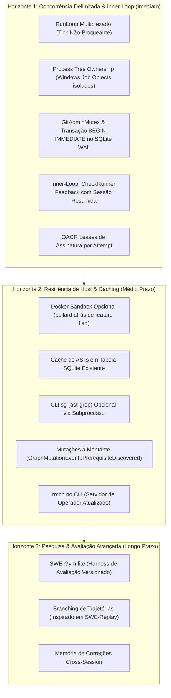

# Arquitetura Meshloop: Concorrência Delimitada, Auto-Cura e Modularidade Resiliente

- **Status:** Proposta Aprovada em Refinamento Multiagente (Round 2)
- **Data:** 2026-09-15
- **Autores & Revisores:** Antigravity (Autor/Síntese), Claude Code (Pesquisa Científica & Design de Agentes), Grok (Sistemas Rust, SO & Runtime)
- **Documentos Relacionados:** ADRs 0001, 0003, 0005, 0007, 0009, 0016, 0022 (Daemonless Context Engineering).

---

## 1. Contexto Atual e Grounding Real (Pós-ADR 0022)

### 1.1 Estado Fato no Repositório
O Meshloop é um motor de orquestração local em Rust concebido para operar **a partir de sessões autenticadas em CLIs de IA sob assinaturas planas** (*flat-rate subscriptions* — Claude Code, Codex, Grok, Pi, Agy), sem depender de cobrança por token de APIs metrificadas nem de daemons centralizados.

O estado real do código após a ADR 0022 (implementada em 2026-09-14) estabelece:
1. **Zero Daemons Externos**: A dependência do daemon Herdr foi permanentemente removida (`meshloop-adapters/src/herdr.rs` deletado). Os agentes rodam como subprocessos diretos (`CliHarness`) em Git Worktrees efêmeros isolados.
2. **Hexágono 100% Síncrono e Puro**: `meshloop-domain` e `meshloop-engine` não possuem runtime assíncrono (zero `tokio`, zero `async_trait`). As dependências de I/O em `meshloop-adapters` são enxutas (`rusqlite` bundled + `serde_json`), compilando com `#![forbid(unsafe_code)]`.
3. **Engenharia de Contexto Multi-Linguagem**: O crate `meshloop-context` cobre 7 linguagens (Rust, TS/JS, Python, Go, C#, PHP, C++), reduzindo de 70% a 90% dos tokens via poda de esqueletos AST (`skeleton.rs`), normalização de cache (`cache.rs`) e resolução de leitores Tier 1 (`tier1.rs`).
4. **Verificação Determinística como Juiz**: O `CheckRunner` (`ports.rs`) e `CommandCheckRunner` (`check.rs`) produzem `DeterministicEvidence` a partir da execução real de linters/testes/compiladores locais, rejeitando terminantemente auto-relatos não verificados dos modelos.

### 1.2 O Fosso Competitivo do Meshloop vs. Gaps de Mercado
O Meshloop possui um fosso único no ecossistema: **Windows/WSL2 nativo + assinaturas CLI planas + event sourcing estrito em SQLite WAL + verificação determinística + recuperação pós-crash reconciliando Git, processos e banco**.

Contudo, três restrições críticas impediam o Meshloop de alcançar a fronteira da indústria (SOTA 2025/2026):
- **Concorrência = 1 (Subutilização de Recursos)**: O `RunLoop::tick` bloqueava a thread principal aguardando a saída do processo (`harness.collect()`). Se o usuário possui 3 assinaturas ativas (ex: Claude, Codex e Grok), duas ficam permanentemente ociosas.
- **Fragilidade por Ausência de Inner-Loop**: A menor falha sintática ou erro de compilação encerrava a tentativa, marcando o nó como `Failed` e exigindo nova intervenção ou descarte de worktree.
- **Processos Órfãos no Windows**: No Windows, cancelar ou encerrar o processo raiz de uma CLI não finaliza processos filhos (como `rustc.exe`, `node.exe` ou `python.exe`), acumulando compiladores zumbis na máquina.

---

## 2. Visão de Progressão em 3 Horizontes



---

## 3. Arquitetura Proposta: Concorrência sem Tokio e Inner-Loop Confinado

### 3.1 Concorrência no Motor: Multiplexação Síncrona do `tick`
O coordenador do `RunLoop` permanece **single-threaded**, eliminando a necessidade de runtime Tokio ou `async_trait` no motor central:

1. **Invoke Não-Bloqueante**: `harness.invoke()` passa a retornar um `HarnessHandle` imediatamente após criar o processo/Job Object, sem bloquear o motor.
2. **Try-Collect / Polling Eficiente**: Substitui-se o busy-sleep de 20ms por `harness.try_collect()`, permitindo inspecionar o status de N workers em execução no mesmo ciclo do `tick`.
3. **Ciclo Unificado do `tick`**:
   - *Colheita*: Inspeciona todos os nós em `Running`; se o processo terminou, dispara a validação pelo `CheckRunner`.
   - *Promoção*: Transita nós `Pending` para `Ready` quando dependências são satisfeitas.
   - *Despacho Concorrente*: Despacha novos nós `Ready` até `max_concurrent_workers`, reservando um lease exclusivo no harness correspondente.
   - *Integração Serial*: O merge de nós `Accepted` na branch de destino em `integrate` permanece estritamente serial (um único integration owner por vez).

### 3.2 Protocolo de Concorrência, Locks e Processos
- **`GitAdminMutex` (Serialização de Operações Administrativas Git)**:
  Toda operação no repositório compartilhado (`git worktree add`, `remove`, `prune`, criação de branches) é protegida por um mutex intra-processo e equipada com política de retry e backoff exponencial (50ms a 2s) para absorver contenções no `.git/index.lock` causadas por indexadores do Windows (ex: Windows Defender). Operações locais a cada worktree (`git add`, `commit`, `diff`) executam concorrentemente sem contenção.
- **Transação Atômica no SQLite WAL**:
  Toda transição de tentativa é envelopada em `BEGIN IMMEDIATE`:
  ```sql
  BEGIN IMMEDIATE;
  INSERT INTO events (event_id, task_id, attempt_id, from_state, to_state, event_type, ...) VALUES (...);
  INSERT INTO attempts (attempt_id, task_id, harness, model_ref, started_at, ...) VALUES (...)
    ON CONFLICT(attempt_id) DO UPDATE SET ended_at=excluded.ended_at, outcome=excluded.outcome;
  COMMIT;
  ```
  Isso elimina o risco de interrupção entre a emissão do evento e a persistência da tentativa.
- **Ownership de Árvore de Processos (Windows Job Objects)**:
  Para erradicar processos órfãos no Windows, os processos do harness e os comandos executados pelo `CheckRunner` são vinculados a um Windows Job Object configurado com `JOB_OBJECT_LIMIT_KILL_ON_JOB_CLOSE`. O código Win32 inseguro fica restrito a um submódulo isolado com `#![allow(unsafe_code)]` documentado.

### 3.3 Inner-Loop de Auto-Cura Confinado à Tentativa
- **Sem Novo Estado Global no Grafo**: O ciclo de auto-cura opera inteiramente dentro de `TaskState::Running`. Não há estados intermediários como `Repairing` ou `SelfHealing`.
- **Contrato de Tentativa**: A entidade `AttemptRow` ganha o contador `repair_rounds: u32` (limitado a `MAX_ROUNDS`, default 3).
- **Preservação de Prompt Cache**:
  - Para harnesses que suportam retomada de sessão, o comando é reinvocado com `--resume <session_id>` / `--continue`, reaproveitando o KV-Cache do provedor.
  - O `stderr` do compilador/teste é normalizado antes da injeção: caminhos absolutos do worktree efêmero, timestamps, PIDs e códigos ANSI são removidos.
- **Regra de Ouro da Evidência**:
  A transição para `Accepted` exige estritamente que a **última revisão de código** gerada na tentativa passe em `CheckRunner::run` com código zero. Rodadas intermediárias com erro ficam gravadas no log de eventos para auditoria, mas nunca bloqueiam o gate se a última revisão for válida. Modelos revisores nunca atuam como substitutos de testes determinísticos.

### 3.4 Recuperação Pós-Crash (*Crash Recovery*)
O inner-loop não é durável contra desligamento de máquina. Se o Meshloop for interrompido:
1. Ao reiniciar, o `reconcile` inspeciona se o Job Object / PID correspondente ainda está vivo.
2. Se o processo morreu durante uma rodada intermediária de auto-cura, a tentativa é encerrada com `HarnessCrashedOrTimeout -> TaskState::Failed`.
3. O worktree sujo é mantido intacto para inspeção (`meshloop inspect`).
4. Um eventual `meshloop resume --retry` gera uma **nova** `AttemptId` e um **novo** worktree limpo.

---

## 4. Matriz de Modularidade e Feature Flags

O princípio basilar é manter o binário padrão leve e com zero dependências externas:

| Módulo / Recurso | Modo Padrão (Zero-Config) | Modo Avançado | Feature Flag no Cargo |
| :--- | :--- | :--- | :--- |
| **Execução de Agentes** | Subprocesso nativo no worktree | Container Docker isolado | `--features docker` (puxa `bollard`) |
| **Supervisão de Processos** | Windows Job Objects / `taskkill /T` | POSIX process groups (Linux/WSL) | Padrão condicional por target SO |
| **Interface MCP** | Servidor CLI nativo sobre stdio | SDK MCP oficial v2026 | `--features mcp-server` (puxa `rmcp` e `tokio` no CLI) |
| **Extração de AST** | Heurística Rust pura (`skeleton.rs`) | Executável CLI `sg` (ast-grep) | Subprocesso externo opcional (sem FFI C) |
| **Cache de Contexto** | Tabela dedicada no SQLite WAL | Sistema de arquivos content-addressed | Nativo (zero-dep) |

---

## 5. Sequência de ADRs para Implementação

A evolução é estruturada em 3 ADRs concisas e independentes (dando sequência ao ADR 0023 já proposto para benchmarks):

1. **ADR 0024: Bounded Concurrent Execution without Tokio**:
   - Formaliza o `tick` multiplexado não-bloqueante.
   - Introduz o `GitAdminMutex` e a transação atômica `BEGIN IMMEDIATE` no SQLite.
   - Implementa leases de cota no QACR por tentativa ativa.
   - Habilita `max_concurrent_workers > 1`.
2. **ADR 0025: Host Process-Tree Ownership via Windows Job Objects**:
   - Isola o wrapper Win32 de Job Objects com política `KILL_ON_JOB_CLOSE`.
   - Garante terminação limpa de árvores completas de processos no cancelamento e timeout.
3. **ADR 0026: Attempt-Scoped Inner-Loop Self-Repair**:
   - Modela o contador `repair_rounds` em `AttemptRow`.
   - Implementa a normalização determinística de `stderr`.
   - Formaliza a regra de avaliação de evidência restrita à última revisão.

*(ADRs subsequentes de médio prazo: ADR 0027 para atualização do protocolo MCP no CLI via `rmcp`, e ADR 0028 para mutações a montante via `GraphMutationEvent`).*
