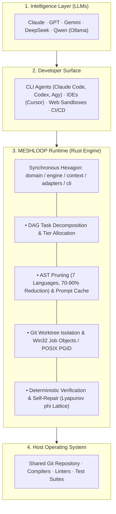
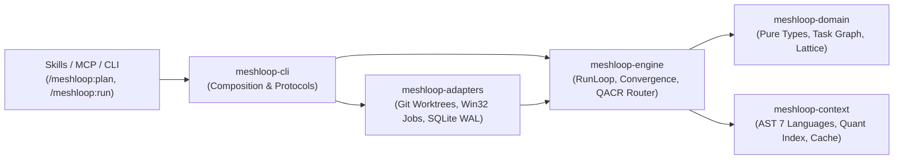
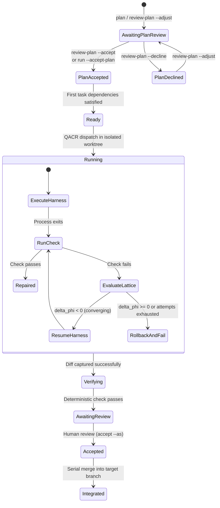

# Architecture Overview

Meshloop is the multi-agent development optimization and loop engineering runtime in Rust, providing synchronous daemonless execution in isolated Git worktrees with deterministic compiler verification.

Documentation Hub: [docs/README.md](../README.md) · Product Brief: [product/brief.md](../product/brief.md) · ADR Index: [adr/README.md](adr/README.md)

---

## 1. Stack Topology: Where Meshloop Fits

Meshloop operates as the loop engineering runtime between developer-facing surfaces and host operating system environments:

---

## 2. Hexagonal Layered Architecture

Meshloop is organized into crates with strictly segregated boundaries, compiling with `#![forbid(unsafe_code)]` across all domain, context, and engine crates:

### Crate Responsibilities

| Crate | Responsibilities (What It Owns) | Invariants (What It Must NOT Contain) |
| :--- | :--- | :--- |
| **`meshloop-domain`** | Task graph (DAG) with iterative topological sorting and cycle detection via `petgraph`, lifecycle states, error diagnostic lattice, pure evidence types, and policy definitions. | Zero I/O, zero OS dependencies, zero model or network awareness. |
| **`meshloop-context`** | AST skeleton pruning across 8 languages (*Rust, TS/JS, Python, Go, C#, PHP, C++, Markdown*), prompt cache normalizer, quantized signature indexing (64-dim FWHT), and Tier 1 reader resolution. | Zero subprocess execution, zero disk persistence, zero saga lifecycle coupling. |
| **`meshloop-engine`** | Structural DAG planner, adaptive QACR router (*Restless Bandit*), `RunLoop` coordinator with bounded concurrency ($N \in [1, 16]$), and self-repair convergence via Lyapunov potential ($\phi$). | Zero concrete adapter instantiation; operates strictly via traits. |
| **`meshloop-adapters`** | Direct CLI agent execution (`CliHarness`), Git worktree isolation with `GitAdminMutex`, atomic SQLite WAL persistence with `BEGIN IMMEDIATE`, and process tree management via Win32 Job Objects. | Zero business logic or high-level orchestration decisions. |
| **`meshloop-cli`** | Command-line argument parsing, adapter composition into the engine, structured JSON reporting, and the stdio Model Context Protocol server (`meshloop mcp`). | Zero orchestration logic in the CLI binary; strictly delegates to the engine. |

---

## 3. Technical Glossary

1. **Daemonless Direct-CLI Execution:**  
   Execution model where Meshloop manages agent lifecycles via direct OS subprocesses, eliminating permanent background services, hidden daemons, or terminal multiplexer sockets ([ADR 0022](adr/0022-daemonless-context-engineering.md)).
2. **Git Worktree Isolation:**  
   Isolation mechanism where every execution attempt runs in a dedicated ephemeral worktree (`.meshloop-worktrees/<task-id>`), leaving the active development branch unmodified until explicit human approval ([ADR 0005](adr/0005-execution-recovery.md)).
3. **AST Skeleton Pruning & Markdown Document Skeletons:**  
   Deterministic context engineering technique in `meshloop-context` that parses source code in 7 programming languages plus Markdown technical documentation (.md). For code, it strips method bodies; for documentation, it preserves the heading spine, metadata, and tables while pruning narrative prose to stable sentinels (`<!-- meshloop:pruned -->`). Reduces token consumption by **60% to 90%** ([ADR 0022](adr/0022-daemonless-context-engineering.md), [ADR 0031](adr/0031-markdown-doc-ast-context-engineering.md)).
4. **Prompt Cache Normalization:**  
   Structuring prompts with byte-identical static prefixes (system policy, project constraints, and repository skeletons) with LF normalization and whitespace stripping to maximize provider KV-cache reuse above **80%** ([ADR 0022](adr/0022-daemonless-context-engineering.md), [ADR 0031](adr/0031-markdown-doc-ast-context-engineering.md)).
5. **Quantized Signature Retrieval (FWHT):**  
   In-memory code signature index using Fast Walsh-Hadamard Transforms (64 dimensions) and 1-bit/2-bit quantization, enabling sub-millisecond symbol search and ranking without external vector databases or unsafe FFI ([ADR 0029](adr/0029-deterministic-loop-algorithms.md)).
6. **Diagnostic Lattice & Lyapunov Convergence ($\phi$):**  
   Formal error modeling in `meshloop-domain::diagnostic` where compiler and linter diagnostics form a partially ordered lattice. Inner-loop self-repair continues only if error energy $\phi$ decreases; regressions trigger an immediate `git reset --hard` and oscillations terminate the attempt ([ADR 0026](adr/0026-inner-loop-repair-connection.md), [ADR 0029](adr/0029-deterministic-loop-algorithms.md)).
7. **Host Process-Tree Ownership (Win32 Job Objects):**  
   Process management (`meshloop-adapters::process`) binding compilers and agent subprocesses to Windows Job Objects configured with `KILL_ON_JOB_CLOSE`, ensuring all child processes exit upon cancellation ([ADR 0025](adr/0025-process-tree-ownership.md)).
8. **GitAdminMutex with Exponential Backoff:**  
   Serializer for Git administrative operations (`worktree add`, `remove`, `prune`) with exponential retry backoff (50ms to 2s) to handle transient `.git/index.lock` contention caused by file indexers or scanners ([ADR 0024](adr/0024-bounded-concurrency.md)).
9. **Restless Bandit QACR:**  
   Task routing algorithm balancing Quality, Affinities, Cost, and Reliability, incorporating exploration bonuses and time-decay weights to manage rate limits ([ADR 0009](adr/0009-routing-budgets.md)).
10. **Stdio MCP Server:**  
    Synchronous Model Context Protocol server over `stdin`/`stdout` allowing external IDEs and clients to inspect state, trigger plans, and execute tasks via a standardized protocol ([ADR 0027](adr/0027-mcp-modular-server.md)).
11. **Iterative DAG Engine (`petgraph`):**  
    Cycle-safe task graph dependency ordering using `petgraph::graphmap::DiGraphMap` with zero recursion, preventing call-stack overflow on deep task hierarchies and guaranteeing sub-millisecond scheduling overhead across 7 canonical manifest topologies ([ADR 0030](adr/0030-petgraph-dag-engine.md)).
12. **World S Autonomy Benchmark & Wilson 95% CI:**  
    Opt-in stochastic evaluation suite across 8 polyglot exercises measuring First-Pass Acceptance Rate (FPAR) bounded by analytical Wilson score 95% confidence intervals, preventing deceptive pass rates on small samples ([ADR 0023](adr/0023-measurement-and-benchmark-framework.md)).

---

## 4. Support Matrix, Boundaries, and Anti-Patterns

| Category | Capabilities | Guarantees & Invariants |
| :--- | :--- | :--- |
| **Integrated & Verified (Tier 1 Core)** | - Synchronous Rust 2024 engine. - Bounded concurrency $N \in [1, 16]$. - Git worktree isolation with `GitAdminMutex`. - SQLite WAL state store with `BEGIN IMMEDIATE`. - AST skeleton pruning across 7 languages. - Subprocess management via Win32 Job Objects / POSIX PGID. - Diagnostic lattice with attempt-scoped self-repair. - Iterative petgraph DAG engine with 7 canonical manifests. - World S polyglot autonomy benchmark suite. - Stdio MCP JSON-RPC server. | - `#![forbid(unsafe_code)]` across domain and engine. - Zero async runtime (`tokio`) in domain and engine. - Serial merges into integration branch. - Zero credentials stored by Meshloop. - 100% test pass rate (`xtask check`, `xtask bench`). |
| **Planned & Feature-Gated (Tier 2)** | - Container isolation (`--features docker`, via `bollard`). - AST parsing via external `ast-grep` (`sg`) binary. - Network-enabled MCP server (`--features mcp-server`). - Dedicated AST cache in SQLite. | - Feature flags never affect standard default build (`default = []`). - Host missing optional tool automatically falls back to native Tier 1 mode. |
| **Disallowed by Design (Anti-Patterns)** | - **Background daemons:** No background services or hidden daemon processes. - **Viral async in core:** No async runtimes in `domain` or `engine`. - **Unprompted branch mutation:** Meshloop never modifies your working branch without explicit human confirmation. - **Unverified self-reports:** Model text output is never used as proof of task completion; only compiler exit codes (`CheckRunner`) grant verification. | - Invariants ensure operational stability, safety, and predictability. |

---

## 5. Execution State Machine

Task lifecycles follow deterministic transitions persisted in SQLite WAL:

---

## 6. Next Steps

- Process isolation and concurrency details: [Modular Architecture](modern-modular-architecture.md).
- Crate dependency rules: [Component Boundaries](boundaries.md).
- Extending languages and harnesses: [Contributing Guide](../../CONTRIBUTING.md).
