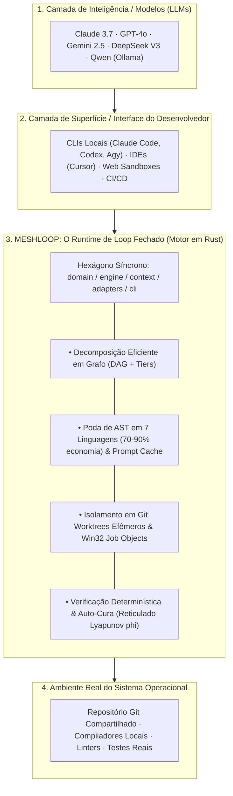
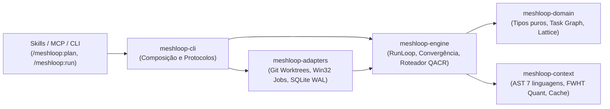
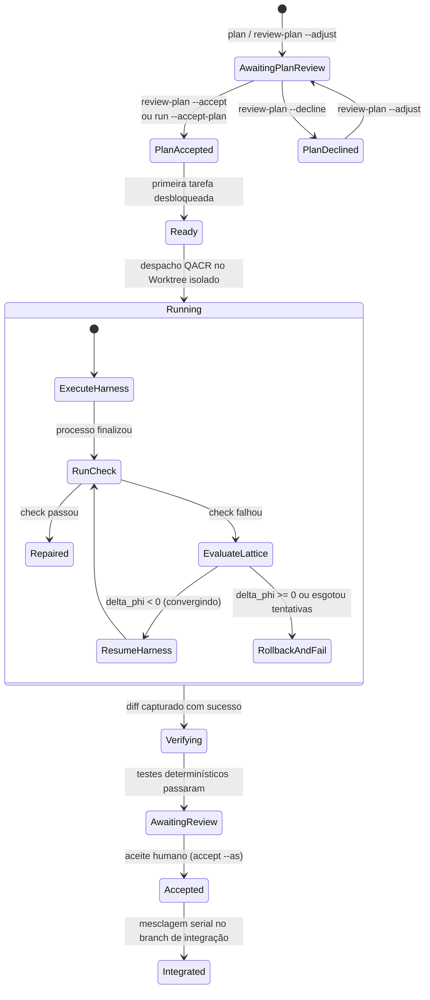

# Visão Geral da Arquitetura do Meshloop

> **O Ambiente de Engenharia de Loop Fechado de Alta Eficiência para Agentes**  
> Hexágono 100% Síncrono em Rust 2024, Isolamento por Git Worktree, Concorrência Delimitada e Reticulado de Diagnósticos.

Hub de Documentação: [docs/README.md](../README.md) · Visão do Produto: [product/brief.md](../product/brief.md) · Índice de ADRs: [adr/README.md](adr/README.md)

---

## 1. Topologia do Stack: Onde o Meshloop se Encontra

O Meshloop não é um modelo de linguagem e não é uma interface de chat. Ele atua na camada intermediária fundamental de **tempo de execução de engenharia (*Engineering Runtime*)**:

---

## 2. Arquitetura Hexagonal em Camadas

O Meshloop é estruturado em crates com responsabilidades rigorosamente isoladas, compilando com `#![forbid(unsafe_code)]` em todo o código de domínio e motor:

### Responsabilidades por Crate

| Crate | Responsabilidades (O que Possui) | Invariantes (O que NUNCA Deve Conter) |
| :--- | :--- | :--- |
| **`meshloop-domain`** | Grafo de tarefas (DAG), estados do ciclo de vida, reticulado de diagnósticos de erro, tipos puros de evidência determinística e políticas. | Zero I/O, zero dependências de sistema operacional, zero conhecimento de modelos ou rede. |
| **`meshloop-context`** | Poda sintática de AST em 7 linguagens (*Rust, TS/JS, Python, Go, C#, PHP, C++*), normalizador determinístico de prompt cache, índice quantizado de assinaturas (FWHT 64-dim) e resolução de leitores Tier 1. | Zero execução de subprocessos, zero persistência em disco, sem dependência do ciclo de vida da saga. |
| **`meshloop-engine`** | Planejador estrutural de DAG, Roteador adaptativo QACR (*Restless Bandit*), coordenador `RunLoop` com concorrência delimitada ($N \in [1, 16]$), auto-cura e convergência via potencial de Lyapunov ($\phi$). | Zero construção de adaptadores concretos; opera estritamente através de portas (`traits`). |
| **`meshloop-adapters`** | Execução de agentes via subprocessos diretos (`CliHarness`), isolamento em Git Worktrees com `GitAdminMutex`, persistência atômica em SQLite WAL com `BEGIN IMMEDIATE` e gestão de árvores de processos via Win32 Job Objects. | Zero lógica de regras de negócio de produto ou orquestração de alto nível. |
| **`meshloop-cli`** | Parsing de argumentos da linha de comando, composição dos adaptadores no motor, relatórios estruturados em JSON e servidor síncrono Model Context Protocol (`meshloop mcp`). | Zero lógica de orquestração no executável; apenas invoca o motor. |

---

## 3. Dicionário de Tecnologia (Lexicon de Engenharia SOTA)

1. **Daemonless Direct-CLI Execution:**  
   Arquitetura de execução em que o Meshloop gerencia o ciclo de vida dos agentes via subprocessos diretos do SO, eliminando permanentemente serviços residentes, daemons ocultos ou soquetes de multiplexação de terminal ([ADR 0022](adr/0022-daemonless-context-engineering.md)).
2. **Git Worktree Isolation:**  
   Mecanismo de isolamento no qual cada tentativa de execução (*attempt*) ocorre em um diretório efêmero isolado (`.meshloop-worktrees/<task-id>`), mantendo a branch de trabalho do desenvolvedor intacta até a aprovação humana explícita ([ADR 0005](adr/0005-execution-recovery.md)).
3. **AST Skeleton Pruning:**  
   Técnica determinística de engenharia de contexto implementada em `meshloop-context` que analisa código-fonte em 7 linguagens e remove corpos de funções e métodos internos, preservando apenas assinaturas públicas, tipos, interfaces e docstrings. Reduz o consumo de tokens em **70% a 90%** ([ADR 0022](adr/0022-daemonless-context-engineering.md)).
4. **Prompt Cache Normalization:**  
   Estruturação determinística de prompts de IA com prefixos estáticos byte-a-byte idênticos (políticas de sistema, contratos e esqueletos do repositório), maximizando a taxa de acerto do KV-Cache dos provedores acima de **80%**.
5. **Quantized Signature Retrieval (FWHT):**  
   Indexação em memória de assinaturas de código baseada em rotação de Walsh-Hadamard (FWHT de 64 dimensões) e quantização determinística de 1 e 2 bits, permitindo busca de símbolos e ranking de contexto em sub-milissegundo sem redes neurais e sem FFI `unsafe` ([ADR 0029](adr/0029-deterministic-loop-algorithms.md)).
6. **Diagnostic Lattice & Lyapunov Convergence ($\phi$):**  
   Formalismo matemático em `meshloop-domain::diagnostic` onde erros de compiladores e linters são modelados em reticulado. A auto-cura só progride se a energia de erro $\phi$ diminuir estritamente; regressões disparam `git reset --hard` instantâneo e oscilações são abortadas ([ADR 0026](adr/0026-inner-loop-repair-connection.md), [ADR 0029](adr/0029-deterministic-loop-algorithms.md)).
7. **Host Process-Tree Ownership (Win32 Job Objects):**  
   Governança de processos de baixo nível (`meshloop-adapters::process`) que vincula compiladores e agentes a Windows Job Objects configurados com `KILL_ON_JOB_CLOSE`, garantindo a terminação de todos os processos filhos no cancelamento e erradicando processos zumbis ([ADR 0025](adr/0025-process-tree-ownership.md)).
8. **GitAdminMutex com Exponential Backoff:**  
   Serializador de operações administrativas do repositório Git (`worktree add`, `remove`, `prune`) com política de retry exponencial (50ms a 2s), absorvendo bloqueios transitórios do `.git/index.lock` causados por antivírus ou indexadores de arquivo no Windows ([ADR 0024](adr/0024-bounded-concurrency.md)).
9. **Restless Bandit QACR:**  
   Algoritmo adaptativo de roteamento de tarefas que equilibra Quota, Aptidão (Affinities), Custo e Confiabilidade (Reliability), incorporando bônus de exploração e densidade temporal para mitigar saturação de limites de taxa ([ADR 0009](adr/0009-routing-budgets.md)).
10. **Stdio MCP Server:**  
    Servidor Model Context Protocol síncrono sobre `stdin`/`stdout` que permite a IDEs e plataformas externas inspecionarem estados, dispararem planos e gerenciarem o ciclo de vida do Meshloop via protocolo padrão ([ADR 0027](adr/0027-mcp-modular-server.md)).

---

## 4. Matriz de Suporte, Limites e Anti-Patterns

| Categoria | Funcionalidades | Garantias & Invariantes |
| :--- | :--- | :--- |
| **Integrado & Verificado (Tier 1 Core)** | - Motor síncrono em Rust 2024. - Concorrência delimitada $N \in [1, 16]$. - Isolamento por Git Worktrees com `GitAdminMutex`. - State store em SQLite com WAL e `BEGIN IMMEDIATE`. - Poda de esqueleto AST em 7 linguagens. - Árvores de processos vinculadas a Win32 Job Objects / POSIX PGID. - Reticulado de diagnósticos e auto-cura confinada à tentativa. - Servidor MCP stdio síncrono. | - Zero `unsafe` no workspace (`#![forbid(unsafe_code)]`). - Zero runtime async (`tokio`) no core. - Merge estritamente serial no branch de integração. - Nenhuma credencial ou chave armazenada pelo Meshloop. - 100% dos testes e benchmarks passando (`xtask check`, `xtask bench`). |
| **Proposto & Opcional via Feature Flag (Tier 2)** | - Isolamento em containers Docker (`--features docker`, via `bollard`). - Extração de AST via binário externo `ast-grep` (`sg`). - Servidor MCP assíncrono para conexões remotas via rede (`--features mcp-server`). - Cache persistente de ASTs em banco SQLite dedicado. | - Feature flags nunca poluem as dependências do build padrão (`default = []`). - Se o recurso opcional não estiver presente no host, o fallback é automático para o modo nativo Tier 1. |
| **Invariantes Proibidos por Design (Anti-Patterns)** | - **Daemons permanentes em segundo plano:** Proibido manter serviços de SO ou sockets ocultos. - **Async viral no core:** Proibido introduzir `tokio` em `domain` ou `engine`. - **Auto-merge cego na branch do operador:** O Meshloop nunca muta a branch de trabalho do usuário sem confirmação humana. - **Validação por auto-relato de IA:** Evidência de sucesso só é concedida por ferramentas determinísticas reais (`CheckRunner`) com código de saída zero. | - A preservação rigorosa desses invariantes é o que assegura o fosso de confiabilidade, estabilidade e segurança do Meshloop. |

---

## 5. Máquina de Estados do Motor de Execução

O ciclo de vida de uma tarefa segue transições determinísticas persistidas no SQLite WAL:

---

## 6. Próximos Passos
- Para aprofundar na mecânica do RunLoop e isolamento de processos: [Arquitetura Modular Resiliente](modern-modular-architecture.md).
- Para entender as regras de escopo por crate: [Fronteiras de Componentes](boundaries.md).
- Para criar novos adaptadores ou estender o suporte a linguagens: [Guia de Contribuição](../../CONTRIBUTING.md).
