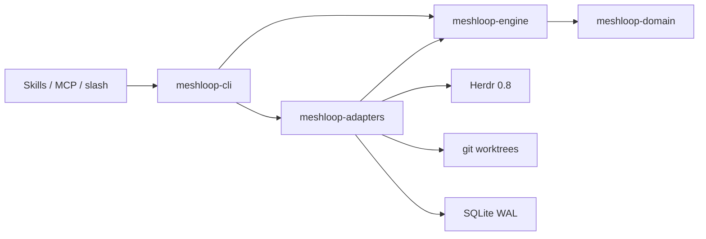
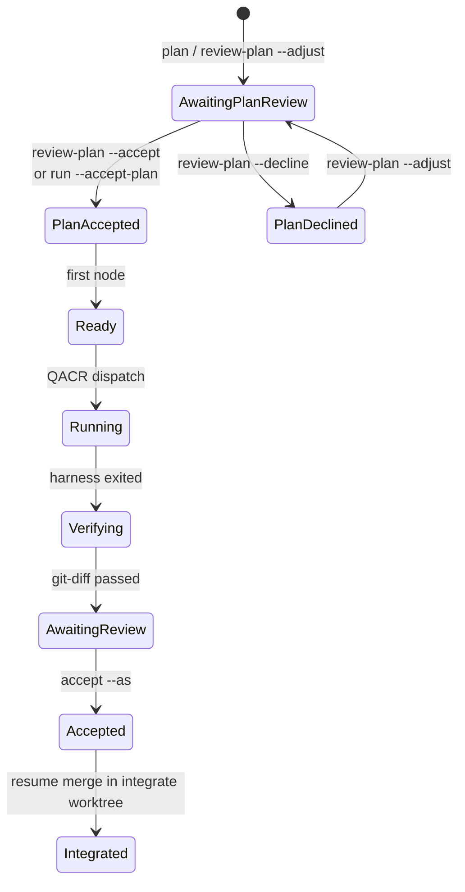

# Architecture overview

Public map: [docs/README.md](../README.md). R1: [ADR 0016](adr/0016-r1-closed-loop.md).

This page is the **v1 shape**. R1 ships the subset in ADR 0016 on **native
Windows**. Named residuals: WSL2 unverified, concurrency = 1, prebuilt
binaries not started, quota windows not queried from vendors. crates.io 0.1.0
is published.

## Two surfaces (ADR 0001)

| Surface | Role |
|---|---|
| `meshloop:` skills + local MCP | Operator UX (slash `/meshloop:plan`) |
| Compiled `meshloop` binary | Engine / saga (ML-014). Skills contain no orchestration. |

You sit in an authenticated agent pane (`meshloop:origin`). Meshloop asks Herdr
to open **other** panes for planner, worker, and reviewers. Isolation is git
worktrees, not panes. The origin pane is never split.

| Layer | Owns |
|---|---|
| meshloop-domain | Task graph, lifecycle, evidence, policy — no I/O |
| meshloop-engine | Planner, QACR router, RunLoop saga, recovery — ports only |
| meshloop-adapters | Herdr CLI, CliHarness (fixture), Git, SQLite |
| meshloop-cli | Argv, compose, JSON envelope, MCP stdio |

## Engine states (R1)

Operator pane loop: [Getting started](../start.md). This diagram is the
persisted machine, not the slash order.

Per-node table: [execution-lifecycle.md](execution-lifecycle.md). Plan gate:
[ADR 0009](adr/0009-routing-budgets.md). Transport: [ADR 0017](adr/0017-session-control-plane.md).

## Routing, in one paragraph

QACR runs at **dispatch**, not inside the planner. Candidates = configured
TOML only. Hard filters: `probe` dispatchable, `tier_fits`, cooldown if
exhaustion was observed. Score: tier efficiency, historical success after
git-diff pass, load (headroom map is empty in R1 → neutral), coupling
(penalty currently 0). Feedback cannot add a harness the user did not
configure. [ADR 0009](adr/0009-routing-budgets.md).

## Where to go next

- Mechanism behind every ADR: [runtime-design.md](runtime-design.md)
- Ports vs adapters: [boundaries.md](boundaries.md)
- What is actually built: [implementation status](../engineering/implementation-status.md)
