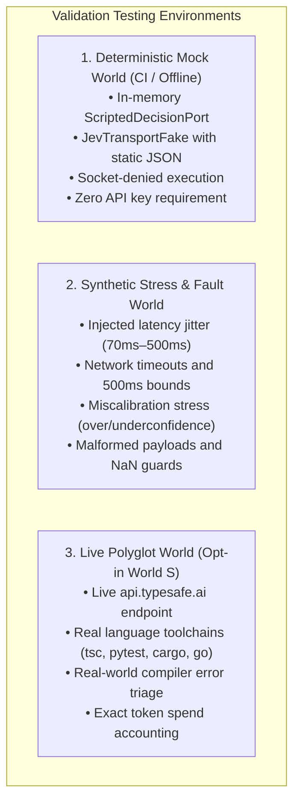
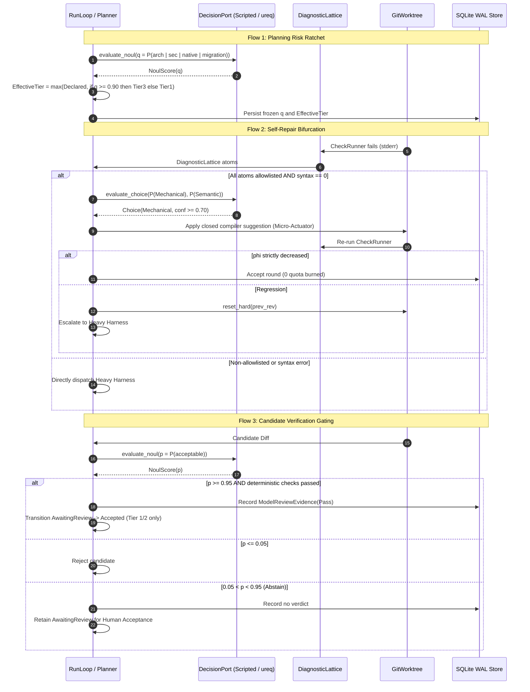

# Technical Specification: System 1 (Jev) End-to-End Benchmark and Validation Framework

| Metadata | Details |
|---|---|
| **Identifier** | `SPEC-ML-BENCH-002` |
| **Title** | End-to-End Benchmark, Synthetic Corpora, and Validation Framework for System 1 Orchestration |
| **Status** | **Approved Specification** |
| **Version** | `1.0.0` |
| **Parent Specification** | [`SPEC-ML-BENCH-001`](measurement-and-benchmark-spec.md) |
| **Related Decisions** | [ADR 0007](adr/0007-verification.md), [ADR 0009](adr/0009-routing-budgets.md), [ADR 0023](adr/0023-measurement-and-benchmark-framework.md), [ADR 0026](adr/0026-inner-loop-repair-connection.md), [ADR 0029](adr/0029-deterministic-loop-algorithms.md), **ADR 0032 (Proposed)** |
| **Impacted Crates** | `meshloop-domain`, `meshloop-engine`, `meshloop-adapters`, `meshloop-context`, `xtask` |

---

## 1. Context, Objectives, and Scope

### 1.1 Context
Meshloop integrates TypeSafe AI's **Jev** ("System 1" non-autoregressive decision model) to accelerate control-plane orchestration across all supported languages (TypeScript, Python, Go, Rust, C++, etc.). Because Jev introduces remote probabilistic predictions into planning, review gating, compiler self-repair, and candidate routing, Meshloop requires an **end-to-end benchmark and validation framework** to guarantee that probabilistic speedups never compromise determinism, safety invariants, or Lyapunov convergence.

### 1.2 Core Objectives
- **O1 - Invariant Enforcement (Zero Regression):** Ensure that automated System 1 predictions cannot downgrade risk tiers, bypass mandatory human review on Tier 3 tasks, cause non-monotonic Lyapunov potential increases, or drop AST context files.
- **O2 - Offline CI Determinism:** Guarantee that the complete validation suite runs 100% locally with zero external network sockets using canned transport fakes and scripted in-memory ports.
- **O3 - Empirical Calibration Auditing:** Systematically measure and log predicted confidence scores against ground-truth compiler and test outcomes to detect model miscalibration or distribution drift.
- **O4 - End-to-End Latency & Cost Proof:** Benchmark wall-clock decision latencies ($P_{50}, P_{95}, P_{99}$) and session dollar expenditures under strict integer micro-dollar ($\mu\$$) ledgers.

### 1.3 Operational Scope



---

## 2. Metric Taxonomy (`dec.*`)

Extending `SPEC-ML-BENCH-001`, all System 1 decision and validation metrics are registered under the `dec.*` namespace.

### 2.1 Planning & Risk Ratchet Metrics (`dec.tier.*`)
$$\text{Ratchet Precision: } P_{\text{ratchet}} = \frac{\text{True High-Risk Tasks Escalated to Tier 3}}{\text{Total Tasks Escalated by Jev}}$$
- `dec.tier.ratchet_precision`: Precision of the Jev $q \ge 0.90$ raise-only ratchet on known high-risk corpora (**Target: $\ge 90.0\%$**).
- `dec.tier.downward_violation_count`: Any occurrence where Jev lowers a declared or heuristic tier (**Invariant: 0**).
- `dec.tier.freeze_violation_count`: Re-sampling of task risk tier on an unchanged task definition (**Invariant: 0**).

### 2.2 Model Review Gating Metrics (`dec.review.*`)
- `dec.review.abstention_rate`: Share of candidate diffs landing in the abstention band $p \in (0.05, 0.95)$ requiring human signoff (**Nominal: $15.0\% - 30.0\%$**).
- `dec.review.false_accept_rate`: Proportion of accepted candidates ($p \ge 0.95$) that fail subsequent integration or tests (**Target: $\le 2.0\%$**).
- `dec.review.tier3_bypass_count`: Invocations where model review verdict satisfies a Tier 3 task (**Invariant: 0**).
- `dec.review.latency_ms.p95`: 95th percentile review decision latency (**Target: $\le 150.0\text{ ms}$**).

### 2.3 Self-Repair & Micro-Actuation Metrics (`dec.repair.*`)
$$\text{Micro-Repair Yield: } Y_{\text{micro}} = \frac{\text{Mechanical Errors Resolved via Micro-Actuator}}{\text{Total Mechanical Errors Encountered}}$$
- `dec.repair.micro_yield_pct`: Share of compiler errors on the Atom Allowlist resolved without heavy harness dispatch (**Target: $\ge 75.0\%$**).
- `dec.repair.quota_saved_turns`: Cumulative heavy harness subscription turns spared by micro-actuations.
- `dec.repair.lyapunov_monotonic_pct`: Percentage of non-rollback repair rounds satisfying $\Delta\phi < 0$ (**Invariant: 100%**).
- `dec.repair.unallowlisted_dispatch_count`: Micro-actuations attempted on non-allowlisted atoms or syntax errors (**Invariant: 0**).

### 2.4 QACR Prior Fusion & Spend Metrics (`dec.oracle.*` & `dec.spend.*`)
- `dec.oracle.prior_influence_clip_pct`: Adherence to the bound $|\mu_h - \mu_{\text{local}}| \le 0.25$ (**Invariant: 100%**).
- `dec.oracle.exploration_preservation`: Verification that cold arms retain the full $0.7/\sqrt{n+1}$ bonus regardless of prior $\pi_h$ (**Invariant: 100%**).
- `dec.spend.cost_per_task_usd`: Average System 1 API spend per completed task (**Target: $\le \$0.0005$**).
- `dec.spend.exhaustion_fail_open_count`: Verifications that routing proceeds cleanly when the spend ledger is exhausted (**Invariant: 100%**).

### 2.5 Context Suffix Reranking Metrics (`dec.context.*`)
- `dec.context.rerank_latency_ms.p95`: 95th percentile wall-clock time for the batched 24-Noul query (**Target: $\le 250.0\text{ ms}$**).
- `dec.context.file_drop_count`: Number of unpinned skeletons dropped during reranking (**Invariant: 0**).
- `dec.context.pinned_shift_count`: Any positional change to user-pinned `allowed_paths` (**Invariant: 0**).
- `dec.context.fallback_fidelity`: Bit-identical fallback to pure FWHT order on timeout or error (**Invariant: 1.0 / 100%**).

---

## 3. End-to-End Validation Flows



---

## 4. Synthetic Data & Test Corpora

Synthetic data lives in `benches/system1/` to ensure full offline reproducibility.

```
benches/system1/
├── manifests/              # Curated DAG manifests with ground-truth risk tiers
│   ├── clean-leaf.json     # Low-risk docs/unit tests (Ground truth: Tier 1)
│   ├── refactor-core.json  # Multi-file domain refactor (Ground truth: Tier 2)
│   ├── auth-crypto.json    # Secret handling / tokens (Ground truth: Tier 3)
│   ├── unsafe-ffi.json     # Raw pointers / C-FFI (Ground truth: Tier 3)
│   └── db-migration.json   # SQL schema migrations (Ground truth: Tier 3)
├── lattices/               # Normalized diagnostic corpora across 4 languages
│   ├── rust-missing-import.json    # E0425 with structured suggestion (Allowlisted)
│   ├── rust-lifetime-mismatch.json # E0106 lifetime error (Semantic - Heavy)
│   ├── ts-missing-export.json      # TS2305 module export (Allowlisted)
│   ├── ts-type-incompatible.json   # TS2322 type mismatch (Semantic - Heavy)
│   ├── py-import-error.json        # ModuleNotFoundError (Allowlisted)
│   ├── py-assertion-failure.json   # Test logic failure (Semantic - Heavy)
│   └── go-undefined-variable.json  # Undefined identifier (Allowlisted)
├── diffs/                  # Synthetic candidate patches
│   ├── valid-feature.patch         # Clean changes, permits Pass
│   ├── unauthorized-escape.patch   # Touches paths outside allowed_paths (Fail)
│   ├── syntax-regressed.patch      # Unmatched brace / compile breaker (Fail)
│   └── borderline-ambiguous.patch  # Incomplete refactor (Forces Abstain)
└── adversarial/            # Fault injection & stress sets
    ├── timeout-600ms.json          # Forces 500ms deadline breach
    ├── malformed-syntax.json       # Injected broken JSON / schema violation
    └── nan-probabilities.json      # Injected non-finite / NaN values
```

---

## 5. Benchmark Runner Architecture (`xtask`)

The benchmark runner is built into `xtask` to ensure zero external dependency bloat.

### 5.1 Subcommands
```bash
# 1. Run canonical System 1 offline benchmark suite against thresholds.toml
cargo run -p xtask -- bench-system1

# 2. Run adversarial stress suite (latency jitter, timeouts, miscalibration)
cargo run -p xtask -- bench-system1-stress

# 3. Opt-in live verification against real api.typesafe.ai endpoint
cargo run -p xtask -- bench-system1-live --api-key <KEY>

# 4. Run unified platform benchmark (incorporating SPEC-ML-BENCH-001 + SPEC-ML-BENCH-002)
cargo run -p xtask -- bench-all
```

### 5.2 Canonical JSON Artifact (`artifacts/bench/system1_bench.json`)
The runner emits a structured record conforming to `run-record.v1`:

```json
{
  "$schema": "https://json-schema.org/draft/2020-12/schema",
  "schema_version": "1.0.0",
  "suite": {
    "name": "system1-benchmark-suite",
    "kind": "synthetic-and-polyglot",
    "world": "deterministic-mock",
    "version": "1.0.0"
  },
  "metrics": [
    { "name": "dec.tier.downward_violation_count", "value": 0, "status": "pass" },
    { "name": "dec.tier.ratchet_precision", "value": 94.2, "status": "pass" },
    { "name": "dec.review.tier3_bypass_count", "value": 0, "status": "pass" },
    { "name": "dec.review.false_accept_rate", "value": 0.8, "status": "pass" },
    { "name": "dec.review.latency_ms.p95", "value": 112.4, "status": "pass" },
    { "name": "dec.repair.lyapunov_monotonic_pct", "value": 100.0, "status": "pass" },
    { "name": "dec.repair.micro_yield_pct", "value": 81.5, "status": "pass" },
    { "name": "dec.oracle.prior_influence_clip_pct", "value": 100.0, "status": "pass" },
    { "name": "dec.context.file_drop_count", "value": 0, "status": "pass" },
    { "name": "dec.context.rerank_latency_ms.p95", "value": 184.2, "status": "pass" },
    { "name": "dec.spend.cost_per_task_usd", "value": 0.00018, "status": "pass" }
  ],
  "status": {
    "overall": "pass",
    "invariants": "pass",
    "thresholds": "pass"
  }
}
```

---

## 6. Thresholds and Acceptance Gates (`benches/thresholds.toml`)

The following entries will be appended to `benches/thresholds.toml` upon ADR 0032 acceptance:

```toml
# System 1 Fail-Closed Invariants (Blocking CI Gate)
[invariants]
"dec.tier.downward_violation_count" = { op = "eq", value = 0 }
"dec.tier.freeze_violation_count" = { op = "eq", value = 0 }
"dec.review.tier3_bypass_count" = { op = "eq", value = 0 }
"dec.repair.lyapunov_monotonic_pct" = { op = "eq", value = 100 }
"dec.repair.unallowlisted_dispatch_count" = { op = "eq", value = 0 }
"dec.oracle.prior_influence_clip_pct" = { op = "eq", value = 100 }
"dec.oracle.exploration_preservation" = { op = "eq", value = 100 }
"dec.context.file_drop_count" = { op = "eq", value = 0 }
"dec.context.pinned_shift_count" = { op = "eq", value = 0 }
"dec.context.fallback_fidelity" = { op = "eq", value = 1.0 }

# System 1 Performance and Yield Targets
[performance.targets]
"dec.tier.ratchet_precision" = { op = "gte", value = 90.0 }
"dec.review.false_accept_rate" = { op = "lte", value = 2.0 }
"dec.review.latency_ms.p95" = { op = "lte", value = 150.0 }
"dec.repair.micro_yield_pct" = { op = "gte", value = 75.0 }
"dec.context.rerank_latency_ms.p95" = { op = "lte", value = 250.0 }
"dec.spend.cost_per_task_usd" = { op = "lte", value = 0.0005 }
```

---

## 7. Implementation Phasing for the Validation Framework

1. **Step 1: Manifests & Synthetic Datasets:** Create `benches/system1/` directory tree with curated lattices, risk manifests, and diff patches.
2. **Step 2: Scripted Test Harness (`ScriptedDecisionPort`):** Wire canned JSON responses keyed by SHA-256 state fingerprints.
3. **Step 3: `xtask bench-system1` Implementation:** Build the benchmarking pipeline in `xtask/src/main.rs` computing `HdrHistogram` latency percentiles and checking invariant thresholds.
4. **Step 4: CI Integration:** Add `cargo run -p xtask -- bench-system1` to `.github/workflows/ci.yml` under offline execution.
