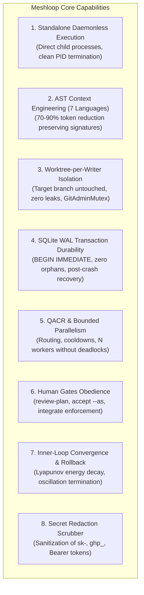

# Test and Performance Architecture Plan

- **Reference:** ADR 0023 (`SPEC-ML-BENCH-001`), ADR 0022, ADR 0024, ADR 0026, ADR 0029
- **Status:** Architecture Proposal & Reference

---

## 1. Measurement Framework Overview

The Meshloop benchmark and testing infrastructure provides continuous validation of system invariants:
- **3-Tier Architecture (Tiers A, B, C):** Micro-benchmarks (Criterion), synthetic parametric workloads (`benches/manifests/`), and E2E disposable test repositories under RAII (`temp_dir()`).
- **Dual-World Methodology:** Deterministic/mock execution (World D, CI gate) vs. stochastic live agent sampling (World S, $N \ge 10$, Wilson 95% confidence intervals).
- **Metric Taxonomy:** Prefixes `ctx.*`, `orch.*`, `iso.*`, `dev.*`, `conv.*`, `quant.*`, `slice.*`, `conc.*`.
- **Fail-Closed Invariants (`iso.*`):** Zero worktree leakage (`iso.worktree.leak_count == 0`), WAL integrity upon crash recovery (`100%`), secret redaction (`100%`), and adherence to human review gates (`100%`).
- **Canonical Schemas:** Standard JSON records (`run.json`) and Markdown executive scorecards (`scorecard.md`).

---

## 2. Core Product Capabilities Under Test



---

## 3. Validation Architecture: Two Complementary Levels

```
┌────────────────────────────────────────────────────────────────────────┐
│                        RELEASE & CI TEST CYCLE                         │
├───────────────────────────────────┬────────────────────────────────────┤
│   Level 1: SMOKE TEST             │   Level 2: BENCHMARK SUITE         │
│   (Fast, Blocking in PRs)         │   (Empirical Metrics & Breakdown)  │
│   `cargo run -p xtask -- smoke`   │   `cargo run -p xtask -- bench`    │
├───────────────────────────────────┼────────────────────────────────────┤
│ • Duration: < 5 seconds           │ • Duration: < 15 seconds           │
│ • CLI Surface + Doctor Checks     │ • 7 Languages AST Parsing          │
│ • Disposable E2E Workflow Cycle   │ • SQLite WAL Latency & Contention  │
│ • Invariant Verification (0 leaks)│ • Concurrency Scaling              │
│ • Fails closed if branch dirty    │ • run.json & Scorecard Generation  │
└───────────────────────────────────┴────────────────────────────────────┘
```

### 3.1 Level 1: Smoke Test (`xtask smoke`)
1. **Preflight & Doctor:** Runs `meshloop doctor --json` and validates `daemonless: true` and `live_transport: direct-cli`.
2. **Ephemeral Sandbox:** Allocates an isolated temporary Git repository (`temp_dir()`).
3. **Workflow Cycle:**
   - `meshloop plan --objective "smoke objective"`
   - `meshloop review-plan --plan plan.json --accept --as "smoke-tester"`
   - `meshloop run --plan plan.json` (runs via `fixture_harness` in isolated worktree)
   - `meshloop accept --task 1 --as "smoke-tester"`
   - `meshloop resume` (completion confirmed)
   - `meshloop status --json`
4. **Invariant Verification:**
   - Ensures host working branch contains no untracked or modified files (`git status --porcelain` empty).
   - Validates no orphan `.git/index.lock` files remain.
   - Verifies SQLite database integrity (`PRAGMA integrity_check`).
   - Confirms sensitive tokens do not appear in unredacted form in outputs.

### 3.2 Level 2: Benchmark Suite (`xtask bench`)
1. **AST Context (`bench-context`):**
   - Synthesizes files across 7 supported languages: Rust, TypeScript, Python, Go, C#, PHP, C++.
   - Evaluates parse latency (`ctx.parse.latency_ms`) and token reduction (`ctx.tokens.reduction_pct`).
   - Measures `SignatureIndex` search latency (`quant.search.latency_us`) and compression ratio (`quant.index.compression_ratio`).
2. **WAL Persistence (`bench-orch`):**
   - Measures SQLite WAL commit latency (`orch.txn.wal_commit_ms`) across atomic `BEGIN IMMEDIATE` transactions.
3. **Isolation & Invariants (`bench-iso`):**
   - Verifies worktree cleanup (`iso.worktree.leak_count == 0`).
   - Audits secret redaction scrubber (`iso.redact.pass_rate_pct == 100%`).
   - Tests error convergence and oscillation termination in `RepairSession`.

---

## 4. Quality Thresholds Configuration (`benches/thresholds.toml`)

Quality gates read from `benches/thresholds.toml`:

```toml
score_version = "1"
schema_version = "1.0.0"

[invariants]
"iso.worktree.leak_count" = { op = "eq", value = 0 }
"iso.redact.pass_rate_pct" = { op = "eq", value = 100 }
"iso.gate.bypass_count" = { op = "eq", value = 0 }
"iso.crash.recovery_fidelity" = { op = "eq", value = 1.0 }
"conc.orphan_process_count" = { op = "eq", value = 0 }

[performance.targets]
"ctx.tokens.reduction_pct" = { op = "gte", value = 65.0 }
"ctx.parse.latency_ms.p95" = { op = "lte", value = 15.0 }
"quant.search.latency_us.p95" = { op = "lte", value = 500.0 }
"quant.index.compression_ratio" = { op = "gte", value = 4.0 }
"orch.txn.wal_commit_ms.p95" = { op = "lte", value = 10.0 }
"smoke.wall_clock_s" = { op = "lte", value = 5.0 }
```
