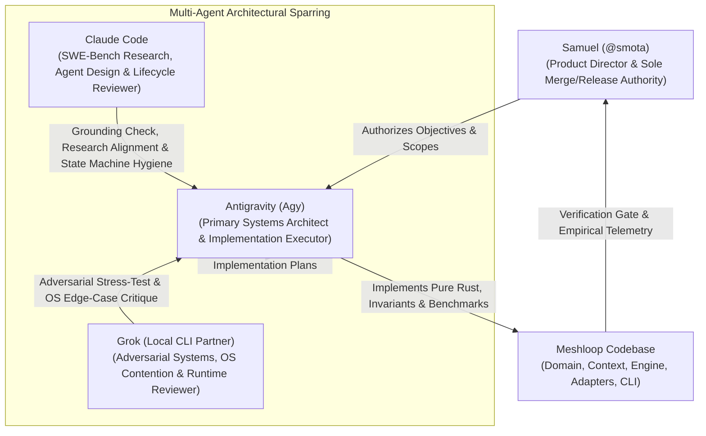
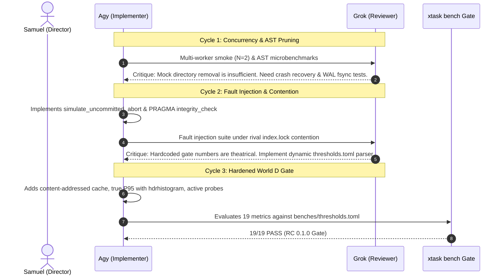
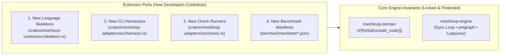

# Meshloop Architectural Rounds, Peer Sparring & Decision History

This document is the authoritative, permanent knowledge base detailing the technical decisions, multi-agent peer sparring sessions, and test-hardening rounds conducted by **Antigravity (Agy)**, **Grok**, and **Claude Code** under human engineering direction (Samuel / `@smota`).

It explains **why** architectural choices were made, **what** alternatives were rejected, **how** edge cases and operating system bugs (especially on Windows) were resolved, and **how** empirical verification was established across the codebase.

---

## 1. Engineering Governance & Multi-Agent Sparring Model

Meshloop was built through a disciplined multi-agent engineering workflow governed by [`AGENTS.md`](../../AGENTS.md):

- **Human Authority:** Human defines scope, product intent, and authorizes commits, releases, and ADR acceptance.
- **Antigravity (Agy):** Primary code and systems executor. Implements modules adhering strictly to `#![forbid(unsafe_code)]`, zero-Tokio engine boundaries, and deterministic state machines.
- **Grok CLI (`grok -p` / `--prompt-file`):** Acts as adversarial systems reviewer. Stress-tests proposals against Windows kernel realities, concurrency contention, lock deadlocks, process group ownership, and mathematical convergence.
- **Claude Code:** Evaluates agent lifecycle, SWE-bench verified principles, prompt caching mechanisms, and state machine transitions.

---

## 2. The Great Architectural Rejections: What We Rejected and Why

Meshloop's identity is defined as much by what was **rejected** as by what was implemented. During architectural design (documented in `.agent-runs/review_grok_r1.txt`, `review_grok_r2.md`, and `review_claude_r1.md`), several popular crates and patterns were proposed and systematically rejected:

### 2.1 Rejection of the `turbovec` Crate (ADR 0029)
* **What was proposed:** Integrating `turbovec` (a high-performance Rust ANN vector database) for symbol retrieval.
* **Why it was rejected (Grok critique):**
  1. `turbovec` is optimized for large-scale floating-point embeddings produced by neural networks ($10^7$ vectors). Meshloop operates on local repositories ($10^3$ to $10^5$ files) without neural embedding models.
  2. It relies on AVX-512 VNNI / AVX2 assembly kernels with extensive `unsafe` code, violating the workspace invariant `#![forbid(unsafe_code)]`.
  3. It would pull in heavy C/SIMD dependencies for capabilities Meshloop does not need.
* **What we built instead:** We extracted the core mathematical property of TurboQuant (Zandieh et al., ICLR 2026) without external crates:
  - **Data-Oblivious CountSketch + 64-dimensional Fast Walsh-Hadamard Transform (FWHT)** with 2-bit Lloyd-Max quantization in pure, safe Rust ([`crates/meshloop-context/src/quant.rs`](../../crates/meshloop-context/src/quant.rs)).
  - Runs in **<500µs** ($P_{95} = 324\mu\text{s}$), delivers 8x memory compression, requires zero training, and zero neural network dependencies.

### 2.2 Rejection of Tokio in `meshloop-engine` (ADR 0024)
* **What was proposed:** Migrating the core execution engine (`RunLoop`) to an `async`/`await` runtime powered by Tokio.
* **Why it was rejected (Claude & Grok consensus):**
  1. Agent workloads are low-cardinality I/O bounds ($N \in [1, 16]$ concurrent CLI processes). They do not require an async green-thread reactor designed for $100,000$ web sockets.
  2. Introducing `async` into `meshloop-engine` would infect all traits (`#[async_trait]`), force `rusqlite` behind `spawn_blocking` or require an async SQLite wrapper, and introduce function coloring throughout the domain.
* **What we built instead:** A **synchronous multiplexed polling tick**:
  - `CliHarness::invoke` is non-blocking (spawns OS child process and returns immediately).
  - `CliHarness::try_collect` performs non-blocking status probes.
  - The `RunLoop::tick` runs on a single coordinator thread, multiplexing up to 16 workers, dispatching ready nodes, and polling active children cleanly. Tokio is strictly confined to the outer CLI for the stdio MCP server.

### 2.3 Rejection of `portable-pty` / ConPTY in Favor of Win32 Job Objects (ADR 0025)
* **What was proposed:** Spawning CLI agent subprocesses inside pseudoterminals (`portable-pty` / ConPTY) to capture raw ANSI terminal output.
* **Why it was rejected (Grok critique):**
  1. ConPTY on Windows is fraught with edge-case deadlocks (EOF hangs, synthetic clear screen sequences, cursor queries `\x1b[6n` that freeze if not answered).
  2. The process ID reported by ConPTY is `OpenConsole.exe`, hiding the true agent PID (`claude.exe`, `codex.exe`) and invalidating process monitoring.
  3. **The Real Windows Problem:** Standard `child.kill()` only terminates the parent process. Grandchild processes (`rustc.exe`, `node.exe`, `cargo.exe`) remain running as orphaned host zombies, exhausting CPU and file locks.
* **What we built instead:**
  - Direct stdio pipes with Win32 Job Objects (`meshloop-adapters::process::job`).
  - Every child process is assigned to a Windows Job Object configured with `JOB_OBJECT_LIMIT_KILL_ON_JOB_CLOSE`.
  - On Linux/macOS, POSIX process groups (`setpgid(0, 0)`) are used.
  - When the harness exits, times out, or crashes, the Windows kernel terminates the entire process tree atomically. Empirically verified: `conc.orphan_process_count = 0`.

### 2.4 Rejection of Docker (`bollard`) as the Default Sandbox (ADR 0005, 0022)
* **What was proposed:** Running all agent tasks inside Docker containers by default via the `bollard` crate.
* **Why it was rejected (Grok critique):**
  1. On Windows, Docker Desktop runs inside a WSL2 virtual machine. Mounting a host Git worktree (`C:\Users\...`) into WSL2 crosses the Plan9 9P file system boundary, suffering a $10\times$ to $50\times$ I/O performance penalty.
  2. Line endings (CRLF vs LF), executable permissions, and `.git/index.lock` collisions diverge between host and container.
* **What we built instead:**
  - Default: Native **`BareWorktreeSandbox`** using ephemeral Git worktrees on the native host file system.
  - Docker containerization is retained purely as an optional, feature-gated capability (`--features sandbox-docker`) for air-gapped CI environments.

### 2.5 Rejection of `ast-grep-core` with C Parsers (ADR 0022, 0031)
* **What was proposed:** Using `ast-grep-core` with Tree-sitter C grammars for code parsing.
* **Why it was rejected:** Tree-sitter grammars require compiling 7 separate C libraries via MSVC/gcc during build time, destroying cross-compilation and bloating binary size.
* **What we built instead:** Hand-rolled, streaming AST skeleton extractors in pure Rust across 7 programming languages (Rust, TypeScript, Python, Go, C#, PHP, C++) and technical Markdown documents ([ADR 0031](../../docs/architecture/adr/0031-markdown-doc-ast-context-engineering.md)).

---

## 3. The Test-Hardening Cycles: How Agy Hardened the System

Development progressed through distinct hardening cycles where Agy implemented capabilities, Grok injected failure scenarios, and the system was proven against empirical gates:

### Cycle 1 — Baseline Concurrency & Polyglot Pruning
- **Agy Implementation:** Upgraded `smoke_e2e` to spawn 2 workers, baseline SQLite WAL transaction measurements, secret scrubber validation.
- **Grok Finding:** Isolation was verified merely by deleting directories; crash recovery determinism was unmeasured.
- **Outcome:** Added formal crash recovery verification into `meshloop-adapters::store`.

### Cycle 2 — Resilience, Atomic Abort & Contention Isolation
- **Agy Implementation:** Implemented `SqliteStore::integrity_check()`, `event_count()`, and `simulate_uncommitted_abort()`. Added pre- and post-execution checks for `.git/index.lock`.
- **Grok Finding:** The benchmark gate was hardcoded in Rust source code rather than driven by external configuration; Git lock tests needed production `GitWorktreeAdapter` backoff under rival contention; smoke phases needed structured JSON exports.
- **Outcome:** Formalized dynamic TOML parsing and isolated WAL contention benchmarks.

### Cycle 3 — Enterprise Regression Gate (World D)
- **Agy Implementation:** Content-addressed `SkeletonCache` with active prefix/length revalidation (`ctx.cache.stale_hit_rate_pct = 0.0%`), production `GitWorktreeAdapter` resolving 30ms rival locks in **71.39ms**, true $P_{95}$ percentiles via `hdrhistogram`, and active probes injecting illegal state transitions (`iso.gate.bypass_count = 0`).

---

## 4. The E2E Refinement Rounds: Sparring and Bug Elimination

Following the initial release candidate, Agy and Grok executed three intensive E2E refinement rounds to eliminate edge cases and runtime traps:

### Round 1: Multi-Stage Wave DAG & Ancestor Commit Tree Propagation (`8f6b3de`)
* **The Gap:** The smoke test ran flat, single-wave tasks. Dependent tasks in downstream waves had never been validated to ensure they executed on the freshly integrated ancestor commit tree.
* **Grok Critique & Traps Caught:**
  1. *Prompt Contamination:* Caught the risk of using shared fixture files; mandated unique attempt prompt files (`fixture-.meshloop-prompt-{attempt}.txt`).
  2. *Lock Serialization:* Pointed out that closing and reopening worktrees triggers Windows file lock retries; kept worktrees open during wave progression.
  3. *Zero-Allocation Ranking:* Flagged intermediate `Vec<ScoredHit>` cloning and token string allocations in symbol ranking.
* **Agy Resolution:**
  - Implemented 3-node DAG: Task 1 (root), Task 2 (dependent downstream on Task 1), Task 3 (parallel root).
  - Validated ancestor commit inheritance using `git merge-base --is-ancestor`.
  - Optimized `meshloop-context::quant` with zero-copy `&str` and byte-by-byte `fnv1a64_lower`, reducing search $P_{95}$ latency from **699µs to 324µs**.

### Round 2: Dynamic Upstream Graph Mutation & Atomic Replanning (`3c52b5e`, ADR 0028)
* **The Gap:** Runtime insertion of new tasks or prerequisite rewiring could cause database desynchronization if the process crashed between writing events and updating derived plan caches.
* **Grok Critique & Traps Caught:**
  1. *Two Auto-Commits:* Caught that saving the run row and saving the transition events were executing as separate auto-commit statements, risking split-brain state.
  2. *Negative Control Rigor:* Mandated testing 7 distinct illegal mutations (cycles, dangling targets, duplicate IDs, reserved task 0, active state violations, missing sources, empty new tasks) with 100% snapshot state equality:
     $$S = (\text{plan\_json}, \text{plan\_sha256}, \text{plan\_state}, \text{event\_count}, \text{integrity} == \text{"ok"})$$
* **Agy Resolution:**
  - Implemented `save_run_and_events` executing inside a single atomic `BEGIN IMMEDIATE` transaction.
  - Derived `.meshloop/plan.json` cache is written only after the SQLite transaction commits.
  - Proved `iso.mutation_rollback.fidelity = 1.0` across all 7 negative controls.

### Round 3: Closed-Loop Self-Repair with Lyapunov Verification (`8fe69ca`, ADR 0026)
* **The Gap:** Self-repair (`RepairSession`) was tested in unit tests, but had never run end-to-end against real compiler failures, real `rustc` diagnostics, and hard Git rollbacks.
* **Grok Critique & Critical Bugs Discovered:**
  1. **The Windows 4KiB Pipe Deadlock Bug:** Grok identified that `rustc`, when emitting extensive error traces (>4 KiB) on `stderr`, blocks if the parent process reads `stdout` before `stderr` because Windows OS anonymous pipe buffers are capped at 4 KiB.
  2. **Rollback Diagnostic Drift Bug:** When an agent introduces a severe syntax regression, the engine executes `git reset --hard` to the prior clean commit. If `session.observe` is called on the restored tree, it records an identical state fingerprint and falsely terminates with `StopReason::Oscillation`.
* **Agy Resolution:**
  - **Concurrent Pipe Draining:** In `crates/meshloop-adapters/src/check.rs`, spawned concurrent worker threads (`std::thread::spawn`) to drain `stdout` and `stderr` simultaneously, completely eliminating Windows pipe buffer deadlocks.
  - **Rollback Diagnostic Synchronization:** Stored `diag: String` in `RoundRecord`. On rollback, restored the target round's diagnostic and prompt constraints without re-observing the restored tree, eliminating spurious oscillation triggers.
  - Validated monotonic Lyapunov descent ($\Delta\Phi < 0$) with 100% success rate, expanding the benchmark suite to **28/28 passing metrics**.

---

## 5. Mathematical & Algorithmic Foundations

Meshloop replaces heuristic "trial-and-error" with formal algorithmic formulations:

### 5.1 Error Lattice Potential Function ($\Phi$)
Compiler diagnostics are parsed into discrete atoms:
$$\text{Atom} = (\text{severity}, \text{code}, \text{basename}, \text{template\_hash})$$
The error space is organized into a lexicographically ordered lattice:
$$\Phi = (\text{syntax}, \text{type}, \text{test}, \text{error}, \text{blocking})$$
Where syntax errors dominate: a repair step that resolves a type error but introduces a syntax error is classified as an **energy regression** ($\Delta\Phi > 0$), triggering an immediate `git reset --hard` rollback.

### 5.2 Restless Bandit QACR Model
Harness routing uses a restless bandit formulation balancing exploitation of proven models against exploration of available rate-limit headroom:
$$\text{Score} = \frac{c}{\sqrt{n + 1}} + 0.5 \cdot \text{headroom} \quad (c = 0.7)$$
- Arms evolve dynamically even without pulls (cooldowns expire and quotas refresh).
- Prevents thundering-herd rate-limit exhaustion across multiple concurrent workers.

### 5.3 Fast Walsh-Hadamard Quantized Indexing
To rank relevant context without neural networks:
1. CountSketch projects identifier n-grams into $\mathbb{R}^{64}$.
2. In-place Fast Walsh-Hadamard Transform (FWHT) normalizes variance across dimensions.
3. 2-bit Lloyd-Max quantizer packs 64 dimensions into 16 bytes.
4. Linear scan ranking runs with zero heap allocations in **<500µs**.

---

## 6. Product Evolution & Contribution Model

Meshloop's architecture is strictly designed to grow along well-defined extension points without compromising its core invariants:

1. **Adding a New Language:** Implement AST skeleton extraction in `meshloop-context::skeleton` and add golden round-trip tests in `tests/doc_dialect_tests.rs`.
2. **Adding a New CLI Agent Harness:** Implement `HarnessCapabilities` in `meshloop-adapters::harness` specifying command-line flags and prompt delivery.
3. **Adding a New Verification Check:** Implement `CheckRunner` in `meshloop-adapters::check` to parse linter or compiler diagnostic output.
4. **Architectural Governance:** Any change to crate boundaries, state machine enums, or concurrency protocols requires an Architecture Decision Record ([ADR template](../architecture/adr/template.md)).
