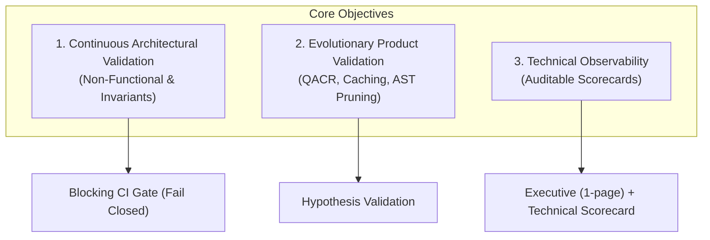

# Meshloop Measurement & Benchmark Framework

Scope: Continuous, non-functional, and evolutionary validation of the Meshloop orchestrator and the `meshloop-context` engine.  
Operational principle: Performance, quality, and safety claims must be reproducible from a versioned artifact, an `xtask` command, and a canonical JSON schema.

---

## 0. System Premises Under Measurement

Meshloop is a local Rust orchestrator that:
- Dispatches authenticated CLI agents (Codex, Claude Code, Pi, Grok, Agy);
- Constructs multi-language context via AST pruning (`meshloop-context`: Rust, TypeScript, Python, Go, C#, PHP, C++);
- Executes work in isolated Git worktrees;
- Persists transactional state in SQLite WAL.

The benchmark framework verifies that under controlled workloads, Meshloop continues to satisfy its invariants: isolation, context efficiency, and developer cycle integrity.

---

## 1. Framework Objectives



### 1.1 Continuous Architectural Validation
Detect architectural regressions before they impact users:
- **Critical Path Latency:** AST parsing, context assembly, QACR scheduling, WAL commits, worktree checkouts.
- **Context Overhead:** Effective tokens dispatched to agents vs. raw repository token volume.
- **Isolation:** Ensuring worktree attempts do not leak into the operator working branch; process termination cleans up child processes.
- **Human Gates:** Ensuring privileged steps cannot bypass human approval.
- **Redaction:** Scrubber prevents secrets from leaking into logs or diffs.

### 1.2 Evolutionary Product Validation
- **QACR Routing:** Validating accuracy in assigning appropriate model tiers and quotas.
- **Prompt Cache Normalization:** Measuring cache hit rates (>80%) and ensuring zero stale cache hits.
- **AST Pruning:** Measuring context token reduction (70–90%) while preserving required type signatures and docstrings.

---

## 2. Metric Taxonomy

Prefix convention:
- `ctx.*` — Context, AST, tokens, and prompt caching.
- `orch.*` — Orchestration, QACR, scheduling, concurrency, and WAL.
- `iso.*` — Isolation, process management, crash integrity, and human gates.
- `dev.*` — Developer cycle, FPAR (First-Pass Acceptance Rate), and wall-clock timings.

| Metric | Unit | Direction | Description |
|---|---|---|---|
| `ctx.tokens.raw` | tokens | Info | Raw corpus tokens before pruning. |
| `ctx.tokens.pruned` | tokens | Lower | Tokens delivered after AST skeleton pruning. |
| `ctx.tokens.reduction_pct` | % | Higher | `100 * (1 - pruned / raw)`. Target: 70–90% reduction on structured code. |
| `ctx.cache.hit_rate_pct` | % | Higher | AST parse cache and prompt prefix hit rate (>80%). |
| `orch.schedule.overhead_ms.p95` | ms | Lower | Scheduling latency across 7 manifests via `HdrHistogram`. Target P95 <= 25.0ms. |
| `orch.txn.wal_commit_ms` | ms | Lower | SQLite WAL transaction commit latency. Target P95 <= 10.0ms. |
| `iso.worktree.leak_count` | count | Target: 0 | Dirty files or uncommitted references left in the host repo. |
| `iso.crash.recovery_fidelity`| ratio | Target: 1.0 | Consistency upon crash recovery reconciliation. |
| `iso.gate.obedience_rate_pct`| % | Target: 100% | Enforcement of human review gates (`review-plan`, `accept`, `integrate`). |
| `conc.orphan_process_count` | count | Target: 0 | Residual child processes after cancellation (enforced via Win32 Job Objects / POSIX PGID). |
| `dev.fpar` | % | Higher | First-Pass Acceptance Rate with Wilson 95% confidence intervals (World S). |
| `dev.wall_clock_s` | s | Lower | End-to-end execution time per task node. |

---

## 3. Operational Surface via `xtask`

```bash
# Run workspace check suite (formatting, clippy -D warnings, workspace tests)
cargo run -p xtask -- check

# Run canonical SPEC-ML-BENCH-001 scorecard against thresholds.toml
cargo run --release -p xtask -- bench

# Benchmark 7 canonical DAG manifests against P95 scheduling gate
cargo run -p xtask -- bench-dag

# Run World S opt-in autonomy benchmark suite (8 polyglot exercises)
cargo run -p xtask -- bench-world-s

# Verify daemonless mode and worktree isolation launch gate
cargo run -p xtask -- live

# Build session pack and embedded bundles
cargo run -p xtask -- bundle
```
