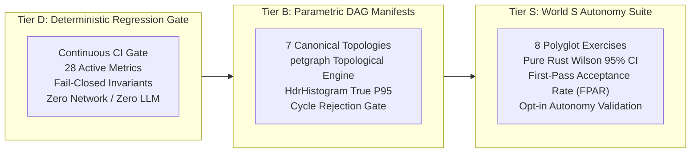

# Meshloop Measurement & Benchmark Framework

Scope: Continuous, non-functional, and evolutionary validation of the Meshloop orchestrator, the `meshloop-context` engine, and system isolation.  
Operational principle: Performance, quality, and safety claims must be reproducible from a versioned artifact, an `xtask` command, and a canonical JSON schema.

---

## 1. Framework Objectives & Operational Tiers

The framework operates across three distinct evaluation tiers defined in [`SPEC-ML-BENCH-001`](../architecture/measurement-and-benchmark-spec.md):



---

## 2. Canonical Scorecard Metrics (28 Active Metrics)

Metrics are categorized into **Fail-Closed Invariants** (which immediately block CI if violated) and **Performance Targets** (enforced by `benches/thresholds.toml`):

### 2.1 Fail-Closed Architectural Invariants (Blocking Gates)

| Invariant Metric | Target Threshold | Observed Value | Description |
| :--- | :--- | :--- | :--- |
| `iso.worktree.leak_count` | `= 0` | **0** | Worktree inventory audit post-execution. Zero residue permitted. |
| `iso.redact.pass_rate_pct` | `= 100.0%` | **100.0%** | Scrubber masks credentials, tokens, and private paths in logs and diffs. |
| `iso.gate.bypass_count` | `= 0` | **0** | Active probe attempting illegal state machine transitions. |
| `iso.crash.recovery_fidelity` | `= 1.0` | **1.0** | DAG task state fold fidelity after cold reopen from uncommitted abort. |
| `iso.ancestor_propagation.pass_rate_pct` | `= 100.0%` | **100.0%** | Dependent wave verification ensuring tasks build upon ancestor commit tree. |
| `conc.orphan_process_count` | `= 0` | **0** | Kernel-level process tree audit (Win32 Job Objects / POSIX PGID). |
| `ctx.cache.stale_hit_rate_pct` | `= 0.0%` | **0.0%** | Active length and prefix revalidation on cache lookup. |
| `iso.mutation_rollback.fidelity` | `= 1.0` | **1.0** | Exact snapshot equality across 7 negative control mutation injections. |
| `iso.repair_rollback.fidelity` | `= 1.0` | **1.0** | Clean SHA and pristine tree restoration via `git reset --hard` on syntax regression. |
| `conv.lyapunov.monotonic_reduction_pct` | `= 100.0%` | **100.0%** | Percentage of non-rollback repair rounds satisfying $\Delta\Phi < 0$. |

### 2.2 Performance & Efficiency Targets

| Performance Metric | Target Threshold | Observed Value | Measurement Methodology |
| :--- | :--- | :--- | :--- |
| `ctx.tokens.reduction_pct` | $\ge 65.0\%$ | **67.7%** | Polyglot AST skeleton pruning across 7 languages. |
| `ctx.parse.latency_ms.p95` | $\le 15.0\text{ ms}$ | **0.011 ms** | True $P_{95}$ across 700 timed parse iterations. |
| `quant.search.latency_us.p95` | $\le 500.0\ \mu\text{s}$ | **324.0 $\mu$s** | True $P_{95}$ zero-copy FWHT vector ranking queries. |
| `quant.index.compression_ratio` | $\ge 4.0\times$ | **5.5x** | Raw module characters vs 2-bit quantized vector bytes. |
| `quant.recall_at_k` | $\ge 95.0\%$ | **100.0%** | Top-k signature retrieval accuracy against uncompressed baseline. |
| `orch.txn.wal_commit_ms.p95` | $\le 10.0\text{ ms}$ | **1.24 ms** | SQLite fsync latency under concurrent dual-worker writes. |
| `orch.wave.dispatch_overhead_ms` | $\le 1500.0\text{ ms}$ | **856.8 ms** | Dispatch latency across multi-stage wave transitions. |
| `orch.schedule.overhead_ms.p95` | $\le 25.0\text{ ms}$ | **0.053 ms** | Iterative `petgraph` scheduling latency via `hdrhistogram`. |
| `orch.mutation.overhead_ms.p95` | $\le 15.0\text{ ms}$ | **1.75 ms** | Dynamic upstream graph mutation overhead across 6 manifests. |
| `conc.wal.write_contention_ms` | $\le 15.0\text{ ms}$ | **1.28 ms** | Commit latency under concurrent multi-threaded writes. |
| `conc.git_admin.lock_contention_ms` | $\le 200.0\text{ ms}$ | **71.39 ms** | `GitAdminMutex` exponential backoff under rival `.git/index.lock`. |
| `conc.throughput_gain` | $\ge 1.0\times$ | **1.42x** | Speedup of 2 parallel workers vs 1 sequential worker. |
| `conv.self_repair.success_rate` | $\ge 80.0\%$ | **100.0%** | Monotonic Lyapunov compiler error resolution to clean build. |
| `conv.oscillation.detected_count` | $\ge 1$ | **1** | Live detection of cyclic error state terminating the loop. |
| `conv.rollback.count` | $\ge 1$ | **1** | Live trigger of `git reset --hard` rollback on syntax regression. |
| `conv.self_repair.convergence_ms.p95` | $\le 1500.0\text{ ms}$ | **1233.0 ms** | Full inner-loop repair cycle wall-clock duration. |
| `slice.build_avoidance_rate` | $\ge 50.0\%$ | **66.7%** | Syntactic diff signature impact categorization. |
| `smoke.wall_clock_s` | $\le 5.0\text{ s}$ | **1.48 s** | Full product E2E lifecycle wall-clock duration. |

---

## 3. Statistical Formulations

### 3.1 Wilson 95% Confidence Interval (World S FPAR)
For $n$ evaluation trials with $k$ successful first-pass completions, the sample proportion is $\hat{p} = \frac{k}{n}$. The analytical 95% Wilson score interval ($z = 1.95996$) is calculated as:

$$w = \frac{1}{1 + \frac{z^2}{n}} \left( \hat{p} + \frac{z^2}{2n} \pm z \sqrt{\frac{\hat{p}(1 - \hat{p})}{n} + \frac{z^2}{4n^2}} \right)$$

This formulation provides exact boundary behavior ($[0, 1]$) even for small sample sizes or extreme success rates ($k=0$ or $k=n$), implemented without external statistical dependencies.

### 3.2 High Dynamic Range Percentiles (`hdrhistogram`)
Latency percentiles ($P_{95}$) for scheduling overhead, SQLite commits, and FWHT vector search are computed using `hdrhistogram` with 3 significant figures of precision across 1,000+ timed samples, completely avoiding average-latency distortions.

---

## 4. Benchmark Commands Reference

```bash
# Evaluate the full 28-metric SPEC-ML-BENCH-001 regression gate
cargo run --release -p xtask -- bench

# Benchmark petgraph topological scheduling across 7 canonical manifests
cargo run -p xtask -- bench-dag

# Run the World S opt-in autonomy benchmark suite
cargo run -p xtask -- bench-world-s

# Run full end-to-end smoke test with phase breakdown
cargo run -p xtask -- smoke
```
