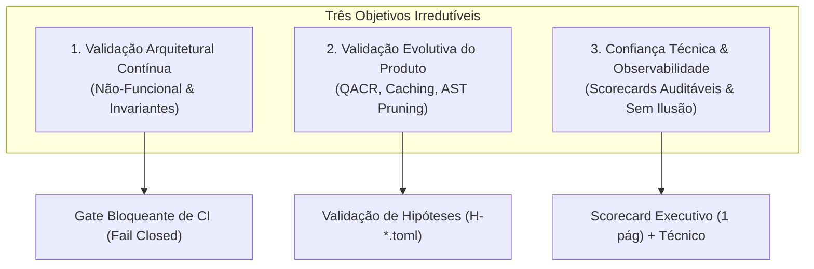
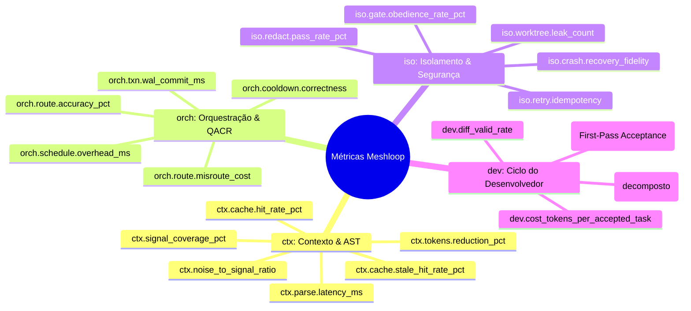

# Meshloop Measurement & Benchmark Framework

> Co-projetado em sessão colaborativa entre **Antigravity** e **Grok** (Harness executor parceiro).
> Escopo: Validação contínua, não-funcional e evolutiva do orquestrador Meshloop e do motor `meshloop-context`.
> Princípio operacional: Toda afirmação de performance, qualidade ou segurança deve ser reproduzível a partir de um artefato versionado, um comando `xtask` e um schema JSON canônico.

---

## 0. Premissas do Sistema sob Medição

O Meshloop é um orquestrador **local** em Rust. Ele:
- Despacha agentes CLI autenticados (Codex, Claude Code, Pi, Grok, Agy);
- Constrói contexto multi-linguagem via AST (`meshloop-context`: Rust, TypeScript, Python, Go, C#, PHP, C++);
- Executa trabalho em **worktrees Git isolados**;
- Persiste estado transacional em **SQLite WAL**.

Qualquer framework de benchmark que ignore essas quatro superfícies (agentes, AST, worktrees, WAL) mede um sistema diferente do que o produto realmente é.

O framework **não** substitui testes unitários, testes de contrato nem revisão humana. Ele responde a uma pergunta distinta:
> *Dado um recorte controlado do produto, o Meshloop continua a cumprir as invariantes de qualidade, isolamento, custo de contexto e ciclo do desenvolvedor — e, se não, **onde** e **por quanto** degradou?*

---

## 1. Objetivos do Framework



### 1.1 Validação Arquitetural Contínua e Não-Funcional
Detectar **regressão estrutural** antes que ela vire incidente de produto:
- **Latência de caminho crítico:** parsing AST, montagem de contexto, scheduling QACR, commit WAL, checkout de worktree.
- **Custo de contexto:** tokens efetivos enviados ao agente versus tokens brutos do repositório.
- **Isolamento:** worktree não vaza para o working tree do operador; crash não corrompe o ledger SQLite.
- **Gates humanos:** nenhum caminho automático contorna aprovação quando o gate está armado.
- **Redaction:** nenhum segredo conhecido atravessa a fronteira do harness.

**Invariantes Arquiteturais a Proteger (Gates de CI):**
| Invariante | Falha se... | Tipo de Gate |
|---|---|---|
| Isolamento de worktree (`iso.worktree.leak_count`) | Arquivos, refs ou index do repo pai mudam sem intenção | Bloqueante (0 permitido) |
| Durabilidade WAL (`iso.crash.recovery_fidelity`) | Crash em barreira de transação deixa estado inconsistente | Bloqueante (100% recuperação) |
| Redação total (`iso.redact.pass_rate_pct`) | Fixture de segredo vaza em logs, prompts, diffs ou artefatos | Bloqueante (100% redacted) |
| Gate humano (`iso.gate.obedience_rate_pct`) | Ação privilegiada executa sem registro de aprovação | Bloqueante (100% obediência) |
| Determinismo do mock | Mesma fixture + mesmo seed ⇒ grafo de eventos diverge | Bloqueante (0 divergência) |
| Orçamento de contexto (`ctx.budget.utilization_pct`) | Contexto montado excede o budget declarado | Bloqueante (≤ 100%) |

### 1.2 Validação Evolutiva do Produto
Medir se as apostas de produto **realmente melhoram** o sistema, e em que dimensão:
- **QACR (Quality / Capability / Risk routing):** Roteamento no tier correto, com cooldown e fallback precisos, evitando under-tiering (falha de tarefa) e over-tiering (desperdício).
- **Prompt Caching Normalization:** Medir `hit_rate_pct` (>80%) e garantir `stale_hit_rate_pct == 0%`.
- **AST Context Pruning (`meshloop-context`):** Avaliar o trade-off real entre redução de tokens (%), cobertura de sinal relevante (`signal_coverage_pct`) e taxa de ruído (`noise_to_signal_ratio`). Reduzir 70% de tokens derrubando aceitação não é vitória.

### 1.3 Confiança Técnica e Observabilidade Transparente
- Scorecards objetivos e concisos para humanos (1 página executiva + anexo técnico com incerteza explícita).
- Proveniência completa (Git SHA, versão de harness/CLI, seed, fatores, OS, CPU noise class).
- Separação ontológica rigorosa entre **Mundo D (Determinístico/Mock)** e **Mundo S (Estocástico/Live)**. Misturar ambos em uma única média é metodologicamente proibido.
- O que o framework **recusa medir**: qualidade literária de texto LLM, "inteligência" abstrata, e métricas vaidosas desprovidas de vínculo com integridade e custo.

---

## 2. Taxonomia de Métricas

Convenção de prefixos:
- `ctx.*` — Contexto, AST, tokens e prompt caching.
- `orch.*` — Orquestração, QACR, scheduling, concorrência e WAL.
- `iso.*` — Isolamento, segurança, integridade de crash e gates humanos.
- `dev.*` — Ciclo do desenvolvedor, eficácia, FPAR e wall-clock.
- `lab.*` — Meta-métricas do laboratório e ruído ambiental.



### 2.1 Métricas de Contexto e Tokens (`ctx.*`)
| Métrica | Unidade | Direção | Descrição / Limiar |
|---|---|---|---|
| `ctx.tokens.raw` | tokens | Informativo | Tokens do corpus candidato antes de pruning (tokenizer explicitado: ex. `cl100k_base`). |
| `ctx.tokens.pruned` | tokens | Menor | Tokens entregues ao agente após extração de esqueleto AST e budget pack. |
| `ctx.tokens.reduction_pct` | % | Maior | `100 * (1 - pruned / raw)`. Alvo: 70–90% em código estruturado sem perda de sinal. |
| `ctx.signal_coverage_pct` | % | Maior | % de nós e símbolos indispensáveis (oráculo gold) preservados no contexto. |
| `ctx.noise_to_signal_ratio` | ratio | Menor | `tokens_irrelevantes / tokens_relevantes` contra oráculo estático da tarefa. |
| `ctx.parse.latency_ms` | ms | Menor | Latência de extração AST p50/p95/p99 por linguagem (`rust`, `ts`, `py`, `go`). |
| `ctx.cache.hit_rate_pct` | % | Maior | Taxa de acerto de cache de parse AST e prompt prefixes (>80%). |
| `ctx.cache.stale_hit_rate_pct` | % | Menor | Cache que acertou chave com conteúdo desatualizado. **CI Gate: 0%**. |

### 2.2 Métricas de Orquestração e QACR (`orch.*`)
| Métrica | Unidade | Direção | Descrição / Limiar |
|---|---|---|---|
| `orch.route.accuracy_pct` | % | Maior | Acurácia de escolha de harness/tier contra gold label da fixture. |
| `orch.route.misroute_cost` | matriz | Menor | Matriz de confusão separando `under_tier` (risco de falha) de `over_tier` (desperdício). |
| `orch.schedule.overhead_ms` | ms | Menor | Latência do scheduler (leitura SQLite + seleção QACR + despacho). Alvo p95 < 25ms. |
| `orch.cooldown.correctness` | enum | Zero violação | Respeito estrito a cooldowns de rate-limit observados. `violation_count == 0`. |
| `orch.txn.wal_commit_ms` | ms | Menor | Latência de commit WAL (begin → fsync visível) segmentada por OS (`windows`, `linux`). |
| `orch.concurrency.effective_parallelism` | ratio | Maior | Paralelismo real vs largura teórica do DAG (detecta locks excessivos no SQLite). |

### 2.3 Métricas de Isolamento, Segurança e Robustez (`iso.*`)
| Métrica | Unidade | Alvo CI | Descrição |
|---|---|---|---|
| `iso.worktree.leak_count` | count | **0** | Detecção de arquivos dirty, refs orfãs ou locks deixados no repo pai. |
| `iso.crash.recovery_fidelity` | ratio | **1.0 (100%)** | Recuperação consistente após kill injetado em barreiras WAL (`before_commit`, `after_wal_write`). |
| `iso.redact.pass_rate_pct` | % | **100%** | Eficácia do scrubber de segredos em logs, prompts, diffs e banco SQLite. |
| `iso.gate.obedience_rate_pct` | % | **100%** | Bloqueio estrito de avanço de nós sem aprovação humana (`review-plan`, `accept`, `integrate`). |
| `iso.retry.idempotency` | count | **0 duplicatas** | Replay de comando já commitado não duplica efeitos colaterais. |

### 2.4 Métricas do Ciclo do Desenvolvedor (`dev.*`)
| Métrica | Unidade | Direção | Descrição |
|---|---|---|---|
| `dev.fpar` | % | Maior | **First-Pass Acceptance Rate:** % de tarefas aceitas no primeiro diff sem retries. |
| `dev.diff_valid_rate` | % | Maior | % de diffs sintaticamente válidos que aplicam via `git apply` limpo na worktree. |
| `dev.wall_clock_s` | s | Menor | Tempo de ciclo ponta a ponta, decomposto obrigatoriamente: `parse + assemble + schedule + worktree + exec + apply + test + wal`. |
| `dev.cost_tokens_per_accepted_task` | tokens | Menor | Custo acumulado total de tokens divididos por tarefa aprovada (incluindo retries). |

---

## 3. Metodologia Científica e Repetível

### 3.1 Três Andares de Carga
1. **Andar A — Micro-benchmarks (Criterion):**
   - Funções puras em memória: parsing tree-sitter de esqueletos AST, packing de orçamento, encoding WAL.
   - Corpora estáticos versionados (`benches/fixtures/corpora/{rust, ts, py, go}/`) categorizados em pequeno, médio e patológico.
2. **Andar B — Workloads Sintéticos com DAGs Paramétricos:**
   - Repositório descartável efêmero gerado dinamicamente com grafo de tarefas parametrizado:
     - 7 famílias canônicas: `linear-tiny`, `fanout-prune`, `deep-txn`, `wide-cooldown`, `polyglot-mix`, `adversary-gates`, `cache-churn`.
     - Parametrização controlada: `nodes`, `width`, `depth`, `edge_density`, `secret_plants`, `crash_barriers`.
3. **Andar C — E2E em Repositórios Descartáveis:**
   - Loop completo com sandbox temporária em `temp_dir()` sob RAII (`Drop` com cleanup forçado).
   - Três submodos: `e2e.replay` (cassetes gravadas), `e2e.mock` (`FixtureHarness`), `e2e.live` (agentes CLI reais).

### 3.2 Dualidade Determinística vs Estocástica

```
                    ┌────────────────────────────────────────────────────────┐
                    │                      BENCHMARK                         │
                    └───────────┬────────────────────────────────┬───────────┘
                                │                                │
                 ┌──────────────┴───────────────┐ ┌──────────────┴───────────────┐
                 │    Mundo D (Determinístico)  │ │     Mundo S (Estocástico)    │
                 ├──────────────────────────────┤ ├──────────────────────────────┤
                 │ • FixtureHarness / Replay    │ │ • CLI Real (Grok, Codex, ...)│
                 │ • Clock injetado / Tokens fix│ │ • N >= 10 repetições         │
                 │ • Bit-reproduzível (N=1 ou 3)│ │ • Incerteza (Wilson 95%)     │
                 │ • Gate de PR em CI           │ │ • Nightly & Release Scorecard│
                 │ • Prova o MESHLOOP           │ │ • Estima o MODELO NO PRODUTO │
                 └──────────────────────────────┘ └──────────────────────────────┘
```

- **Mundo D:** Avalia a lógica de orquestração, pruning e persistência. Se dois runs D com mesmo seed divergirem, é **bug do orquestrador**.
- **Mundo S:** Avalia agentes reais com variância estatística. Exige $N \ge 10$, reporte de intervalos de confiança (Wilson 95% para FPAR) e distribuições p50/p95/p99. **Proibido misturar runs D e S na mesma média.**

### 3.3 Controle de Variáveis e Ambiente (`lab.env`)
- Preflight check ambiental antes de iniciar o benchmark:
  - `quiet`: CPU idle > 80%, memória suficiente, sem indexadores concorrentes agressivos.
  - `loaded`: Ambiente com ruído. Rejeita medições micro-bench em PR; se rodar, marca o scorecard como `lab_valid: false`.
- Isolamento estrito de filesystem e variáveis de ambiente (`GIT_CONFIG_GLOBAL=/dev/null`, sandbox isolada, DB SQLite de telemetria segregado do DB de estado do Meshloop).

---

## 4. Artefatos, Schema JSON e Scorecards

### 4.1 Schema JSON Canônico (`run-record` v1)
Todo benchmark gera um registro JSON padronizado (`artifacts/bench/<run_id>/run.json`):
```json
{
  "schema_version": "1.0.0",
  "run_id": "1726400000000-a1b2c3d4-fanout-prune",
  "suite": {
    "name": "fanout-prune",
    "kind": "synthetic",
    "world": "deterministic",
    "suite_version": "1.0.0",
    "hypothesis_id": "H-2026-09-prune-reachability"
  },
  "subject": {
    "git_sha": "a1b2c3d4e5f6...",
    "git_dirty": false,
    "os": "windows",
    "rustc": "1.98.0"
  },
  "harness": {
    "name": "fixture",
    "cli_version": null,
    "model": null
  },
  "factors": {
    "seed": 42,
    "tokenizer": "cl100k_base",
    "cache_state": "cold",
    "max_inflight": 3,
    "budget_tokens": 8000
  },
  "metrics": [
    {
      "name": "ctx.tokens.reduction_pct",
      "unit": "pct",
      "direction": "higher",
      "value": 78.4,
      "baseline": 72.0,
      "delta": 6.4,
      "status": "pass"
    }
  ],
  "invariants": [
    { "name": "iso.worktree.leak_count", "observed": 0, "allowed": 0, "status": "pass" },
    { "name": "iso.redact.pass_rate_pct", "observed": 100, "allowed_min": 100, "status": "pass" },
    { "name": "iso.gate.bypass_count", "observed": 0, "allowed": 0, "status": "pass" },
    { "name": "iso.crash.recovery_fidelity", "observed": 1.0, "allowed_min": 1.0, "status": "pass" }
  ],
  "decomposition": {
    "dev.wall_clock_s": {
      "parse": 0.08,
      "assemble": 0.04,
      "schedule": 0.02,
      "worktree": 0.35,
      "harness_exec": 4.10,
      "apply": 0.05,
      "test": 0.80,
      "wal": 0.02
    }
  },
  "status": {
    "overall": "pass",
    "invariants": "pass",
    "thresholds": "pass",
    "lab_valid": true
  }
}
```

### 4.2 Modelo de Scorecard Executivo (Markdown)
Gerado automaticamente pelo comando `xtask bench-scorecard`:

```markdown
# Meshloop Bench Scorecard
**Run:** `fanout-prune` · **World:** deterministic · **SHA:** `a1b2c3d4`
**Overall:** PASS · **Isolation:** PASS · **Lab:** valid (quiet)
**Hypothesis:** H-2026-09-prune-reachability — SUPPORTED

## Selo de Integridade e Performance
| Eixo              | Status | Sumário em uma linha                           |
|-------------------|--------|------------------------------------------------|
| Contexto / AST    | PASS   | Redução 78.4% (base 72.0%), Sinal Coberto 96% |
| QACR / Orch       | PASS   | Roteamento 97%, Overhead p95 12ms              |
| Isolamento        | PASS   | Leaks 0, Redact 100%, Gates 100%, Crash 100%   |
| Ciclo Dev         | PASS   | FPAR mock 1.00, Diff Valid 1.00, WallClock 5.4s|

## Trocas Visíveis (Trade-offs)
- Tokens ↓ 6.4pp vs baseline; FPAR mock estável (1.00 -> 1.00).
- Parse p95 rust +4% (dentro do gate limite de 10%).

## O que este scorecard NÃO mede
- FPAR live com agentes reais (reservado à suíte estocástica noturna).
- Custos financeiros externos em USD.
```

---

## 5. Superfície Operacional via `xtask`

Contrato estável de comandos integrados ao fluxo do desenvolvedor:

```bash
# Execução completa da suíte padrão de PR (Mundo D + Criterion subset + Gates)
cargo run -p xtask -- bench

# Benchmarks especializados por subsistema
cargo run -p xtask -- bench-context      # AST parse, prune, prompt cache, noise-to-signal
cargo run -p xtask -- bench-orch         # QACR, scheduler overhead, cooldown, WAL
cargo run -p xtask -- bench-iso          # Crash injection, worktree leaks, secret redaction, gates
cargo run -p xtask -- bench-e2e          # E2E replay/mock (opcional: --live com --harness e --n)

# Validação estrita de gates contra thresholds.toml
cargo run -p xtask -- bench-gate         # Exit code 1 se quebrar invariante ou regredir além do limite

# Geração de scorecards a partir de resultados gravados
cargo run -p xtask -- bench-scorecard --from artifacts/bench/<run_id>/run.json --out scorecard.md
```

### Configuração de Limiares (`benches/thresholds.toml`)
```toml
score_version = "1"
schema_version = "1.0.0"

[gates.pr]
"iso.worktree.leak_count" = { op = "eq", value = 0 }
"iso.redact.pass_rate_pct" = { op = "eq", value = 100 }
"iso.gate.bypass_count" = { op = "eq", value = 0 }
"iso.crash.recovery_fidelity" = { op = "eq", value = 1.0 }
"ctx.cache.stale_hit_rate_pct" = { op = "eq", value = 0 }
"ctx.budget.utilization_pct" = { op = "lte", value = 100 }
"orch.cooldown.violation_count" = { op = "eq", value = 0 }

[gates.pr.regression]
"ctx.parse.latency_ms" = { p = "p95", max_regression_pct = 10 }
"orch.schedule.overhead_ms" = { p = "p95", max_regression_pct = 15 }

[gates.release.live]
"dev.fpar" = { min = 0.40, n_min = 10, world = "stochastic" }
"dev.diff_valid_rate" = { min = 0.85, world = "stochastic" }
```

---

## 6. Plano de Implantação Fisiológico (M0 a M5)

1. **M0 — Instrumentação Básica:** Schema JSON `run-record.v1`, preflight `lab.env`, scanner de redaction e snapshot git.
2. **M1 — Invariantes de Isolamento (`bench-iso`):** Testes de leak de worktree, verificação de segredos e injeção de crash em WAL com CI gate bloqueante.
3. **M2 — Context Engine (`bench-context`):** Avaliação de redução de tokens AST, coverage e latência Criterion para Rust, TS, Python e Go.
4. **M3 — Orquestração & QACR (`bench-orch`):** Cooldown accuracy, paralelismo SQLite WAL e mensuração de overhead do scheduler.
5. **M4 — Developer Cycle E2E:** Suítes sintéticas e replay determinístico com medição de FPAR de oráculo e decomposição de wall-clock.
6. **M5 — Suíte Noturna Estocástica (Live Agents):** Matriz automatizada de testes com agentes reais ($N \ge 10$), análise de variância estatística e geração de scorecards de release.
