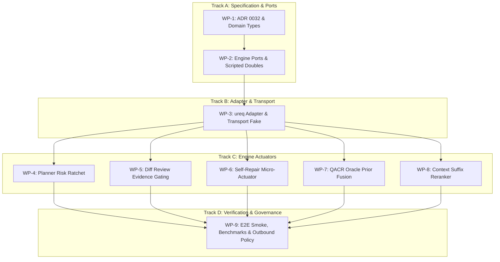
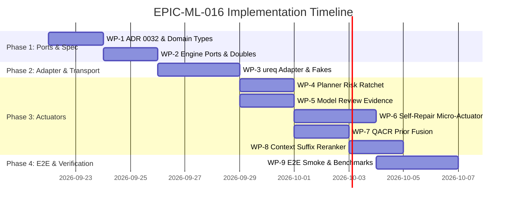

# EPIC-ML-016: System 1 Machine-Native Decision Engine & Predictive Success Oracle (TypeSafe Jev Integration)

- **Status:** Proposed Epic (Consensus from Codex & Grok Two-Round Reviews)
- **Target Milestone:** Meshloop 0.2.0 (Post-R1 Orchestration Optimization)
- **Linked ADRs:** [ADR 0003](../architecture/adr/0003-harness-contracts.md), [ADR 0007](../architecture/adr/0007-verification.md), [ADR 0009](../architecture/adr/0009-routing-budgets.md), [ADR 0026](../architecture/adr/0026-inner-loop-repair-connection.md), [ADR 0029](../architecture/adr/0029-deterministic-loop-algorithms.md), **ADR 0032 (Proposed)**
- **Linked Requirements:** ML-002, ML-005, ML-007, ML-009, ML-011, ML-012, **ML-016**

---

## 1. Executive Summary & Objective

Meshloop orchestrates multi-agent coding loops across diverse target codebases (Python, TypeScript, Go, Rust, C++, etc.). Currently, all semantic judgments—such as task risk tiering, candidate diff review, compiler/test failure triage, and context skeleton filtering—either rely on crude structural heuristics (e.g. `dep_count >= 2 => Tier3` in `planner.rs`) or require dispatching heavy "System 2" coding harnesses (Claude Code, Codex, Grok).

Using heavy autoregressive LLMs for control-plane decisions suffers from:
1. **Excessive Latency:** 3,000ms to 15,000ms per decision.
2. **Severe Quota Depletion:** Consuming flat-rate subscription turns on trivial triage, triggering `CapacityExhausted` rate limits.
3. **Format Drift & Non-Determinism:** Markdown fences, malformed JSON, and uncalibrated verbal confidence.

**Objective:** Integrate TypeSafe AI's **Jev** ("System 1" non-autoregressive decision model) into Meshloop's hexagonal architecture. By providing sub-100ms, strictly-typed decisions (`Choice`, `Noul`, `Score`) with RLCD-calibrated probabilities at \$0.042/1M input tokens (free output), Meshloop accelerates its orchestration loops by orders of magnitude while preserving Lyapunov convergence, bounded retries, and strict isolation invariants.

---

## 2. Architectural Invariants (The Grok-Codex Consensus)

The following invariants are strictly enforced across all work packages:

1. **Hexagonal Boundary Purity:**
   - [`meshloop-domain`](../../crates/meshloop-domain) defines pure domain value types (`DecisionOutcome`, `DecisionVerdict`, `Confidence`, `RiskFloor`). Zero network, HTTP, or vendor types enter `domain`.
   - [`meshloop-engine::ports`](../../crates/meshloop-engine/src/ports.rs) defines the abstract traits: `DecisionPort` and `PredictiveSuccessOracle`.
   - [`meshloop-adapters`](../../crates/meshloop-adapters) contains the synchronous HTTP client (`ureq` + pinned `rustls`).
2. **Raise-Only Planning Ratchet:**
   - Jev evaluates risk as a single-draw Bernoulli union: $q = P(\text{architectural} \lor \text{security} \lor \text{unsafe/native} \lor \text{migration})$.
   - Effective tier is strictly $\max(\text{DeclaredTier}, \;\text{if } q \ge 0.90 \text{ then Tier3 else Tier1})$. Jev can **never** downgrade a tier.
3. **Dual-Threshold Review Gate:**
   - Candidate diff verification evaluates $p = P(\text{acceptable} \mid \text{diff}, \text{lattice})$.
   - $p \ge 0.95 \land \text{deterministic\_passed} \implies \text{Pass}$; $p \le 0.05 \implies \text{Fail}$; otherwise **Abstain** (task remains in `AwaitingReview` for human review).
   - Tier 3 tasks **never** accept model review; human acceptance remains unconditionally required.
4. **Self-Repair Purity & Micro-Actuation:**
   - [`RepairSession::observe`](../../crates/meshloop-engine/src/converge.rs) remains 100% pure and deterministic over [`DiagnosticLattice`](../../crates/meshloop-domain/src/diagnostic.rs).
   - Micro-repair runs outside `observe()` only if: all blocking error atoms are allowlisted, syntax error count is 0, $P(\text{Mechanical}) \ge 0.70$, and $P(\text{Semantic}) \le 0.20$.
   - Micro-edits in v1 are strictly closed (compiler structured suggestions or deletion-only lints like `unused_imports`). A failed micro-repair costs exactly 1 observation and triggers standard Lyapunov rollback.
5. **QACR Oracle Fusion (Not an Arm):**
   - Jev is a `PredictiveSuccessOracle`, **never** an arm in the restless bandit.
   - Fused mean: $\mu_h = \text{clip}\left(\frac{s_h + 4\pi_h}{n_h + 4}\right)$ bounded by $|\mu_h - \mu_{\text{local}}| \le 0.25$.
   - Exploration bonus $0.7 / \sqrt{n+1}$ operates strictly on real pulls $n_h$. API spend is tracked on a separate integer micro-dollar ($\mu\$$) ledger.
6. **Batched Context Reranking:**
   - [`meshloop-context::quant`](../../crates/meshloop-context/src/quant.rs) remains offline, seed-stable, and sub-500$\mu$s.
   - The engine sends one batched 24-Noul query to rerank the unpinned FWHT suffix. No skeletons are dropped; ties preserve FWHT order; any error falls back immediately to pure FWHT.
7. **Offline CI & Socket Isolation:**
   - `cargo test --workspace --locked --offline` runs 100% locally with zero sockets using `ScriptedDecisionPort` and canned transport fakes. Live API calls require an explicit runtime opt-in flag.

---

## 3. Work Breakdown Structure (WBS) for Orchestration

### WP-1: Architecture Decision Record (ADR 0032) & Domain Value Types
* **Target:** `docs/architecture/adr/0032-system1-decision-port.md`, `meshloop-domain`
* **Tasks:**
  1. Author ADR 0032 capturing the consensus decision, alternatives (in-tree model vs LLM router vs System 1 API), RLCD calibration, and invariants.
  2. Add pure domain value types in `meshloop-domain`:
     * `Confidence(f64)` with invariant $c \in [0.0, 1.0]$.
     * `DecisionOutcome` enum: `Selected(String)`, `Boolean(bool)`, `Score(f64)`, `Abstain(SanitizedReason)`.
     * `RiskFloor` enum ensuring mandatory human tiers cannot be superseded.
* **Verification:** `cargo test -p meshloop-domain` passing; ADR 0032 approved.

### WP-2: Engine Ports & Scripted Test Doubles
* **Target:** `meshloop-engine::ports`
* **Tasks:**
  1. Define `DecisionPort` trait with methods for `evaluate_choice`, `evaluate_noul`, `evaluate_score`, and `evaluate_batch_noul`.
  2. Define `PredictiveSuccessOracle` trait returning `Result<OracleOutcome, DecisionError>`.
  3. Implement `ScriptedDecisionPort` in `meshloop-engine::ports` (in-memory hash map keyed by input SHA-256 fingerprint) for deterministic unit testing.
* **Verification:** Unit tests verifying error handling, fingerprint matching, and abstention propagation.

### WP-3: Safe-Rust Adapter & Transport Fakes
* **Target:** `meshloop-adapters::jev`
* **Tasks:**
  1. Add `ureq` dependency to `crates/meshloop-adapters/Cargo.toml` with `default-features = false` and `rustls` with pinned provider. Audit for `unsafe_code = "deny"`.
  2. Implement `JevClient` with bounded 500ms total timeout (DNS + TLS + transfer + read) and maximum response size cap (64 KB).
  3. Implement `JevTransportFake` supplying static JSON fixtures for offline adapter unit testing.
  4. Ensure socket-denied test environment passes under `cargo test -p meshloop-adapters --offline`.
* **Verification:** Contract tests asserting timeout enforcement, malformed JSON recovery, and zero socket leaks.

### WP-4: Planner Integration (JevTierAssigner & Risk Ratchet)
* **Target:** `meshloop-engine::planner`
* **Tasks:**
  1. Implement `JevTierAssigner` implementing `TierAssigner`.
  2. Query Jev with composite single-draw question: $q = P(\text{architectural} \lor \text{security} \lor \text{unsafe/native} \lor \text{migration})$.
  3. Apply raise-only ratchet: $q \ge 0.90 \implies \text{Tier3}$; else keep heuristic/declared tier. Never downgrade.
  4. Freeze sample: Store $q$ and prompt hash in task metadata to prevent re-sampling walks.
* **Verification:** Tests asserting that low-risk tasks stay Tier 1/2, high-risk tasks ratchet to Tier 3, and heuristic Tier 3 tasks never downgrade.

### WP-5: Candidate Verification Integration (ModelReviewEvidence Gating)
* **Target:** `meshloop-engine::verify`, `meshloop-domain::evidence`
* **Tasks:**
  1. Implement `evaluate_candidate_diff` using Jev Noul ($p = P(\text{acceptable})$).
  2. Enforce gating:
     * $p \ge 0.95 \land \text{all\_deterministic\_passed} \implies \text{Pass}$.
     * $p \le 0.05 \implies \text{Fail}$.
     * $0.05 < p < 0.95 \implies \text{Abstain}$ (record no row, retain `AwaitingReview`).
  3. Enforce Tier 3 human-only gate: model review verdicts on Tier 3 candidates are discarded or recorded as advisory telemetry only.
  4. Verify backward-compatible JSON serialization in `evidence.payload_json` in SQLite.
* **Verification:** Tests asserting candidate acceptance, rejection, and human-fallback across tiers.

### WP-6: Attempt-Scoped Self-Repair Bifurcation
* **Target:** `meshloop-engine::run_loop`, `meshloop-engine::converge`
* **Tasks:**
  1. Keep `RepairSession::observe` unchanged.
  2. In `RunLoop::verify_attempt`, after `RepairAction::Continue` or `Rollback`:
     * Check error atoms against `ATOM_ALLOWLIST` (e.g. `E0425` with suggestion, `unused_imports`).
     * Check `syntax_errors == 0`.
     * Query Jev Choice: if $P(\text{Mechanical}) \ge 0.70$ and $P(\text{Semantic}) \le 0.20$, invoke `MicroRepairActuator`.
  3. `MicroRepairActuator` applies compiler suggestion or mechanical deletion; re-runs deterministic checks.
  4. The micro-edit costs 1 observation in `RepairSession`. If $\phi$ does not decrease, trigger `reset_hard` and fall back to heavy harness.
* **Verification:** Tests verifying that mechanical typos resolve in 1 micro-turn without heavy harness dispatch, while complex errors immediately route to the heavy harness.

### WP-7: QACR Oracle Prior Fusion & Dollar Spend Ledger
* **Target:** `meshloop-engine::router`, `meshloop-adapters::store`
* **Tasks:**
  1. Add `PredictiveSuccessOracle` to `RoutingContext`.
  2. Update candidate scoring: fuse prior into empirical mean $\mu_h = \text{clip}((s_h + 4\pi_h)/(n_h + 4))$ bounded by $|\mu_h - \mu_{\text{local}}| \le 0.25$.
  3. Maintain exploration bonus $0.7 / \sqrt{n+1}$ on real pulls $n_h$ only.
  4. Implement `SessionSpendLedger` tracking cumulative API spend in integer micro-dollars ($\mu\$$). Decrement budget; fail open on exhaustion.
* **Verification:** Unit tests verifying UCB exploration remains active on cold arms, prior influence is clipped to 0.25, and spend exhaustion fails open without blocking dispatch.

### WP-8: Context Suffix Reranker
* **Target:** `meshloop-engine::agent`, `meshloop-context`
* **Tasks:**
  1. Keep `select_context()` in `quant.rs` completely unchanged (offline, $p95 \le 500\mu s$).
  2. In `AgentSpec` assembly, extract the unpinned candidate suffix from the 24-file budget.
  3. Send single batched 24-Noul request to Jev.
  4. Permute unpinned suffix using sort key `(noul_score desc, quant_score desc, path asc)`.
  5. On timeout, HTTP error, or partial response, discard all Noul scores and use pure FWHT order.
* **Verification:** Tests asserting pinned paths never move, zero skeletons are dropped, and network timeouts fall back to byte-identical FWHT ordering.

### WP-9: End-to-End Orchestration & Governance
* **Target:** `xtask`, `docs/product/brief.md`, `docs/engineering/testing.md`
* **Tasks:**
  1. Reconcile outbound network data transmission policy in `brief.md` and `threat-model.md` for telemetry/skeletons sent to `api.typesafe.ai`.
  2. Add `xtask bench` metric: `orch.decision.p95_latency_ms <= 250ms` and `orch.decision.cost_per_task <= $0.001`.
  3. Run full E2E lifecycle smoke test (`xtask smoke`) verifying orchestration passes with observation-only and active Jev modes.
* **Verification:** `cargo run -p xtask -- check` and `cargo run -p xtask -- bench` pass cleanly on native Windows and Linux.

---

## 4. Delivery Phases & Milestone Gates

| Phase | Milestone | Acceptance Criteria |
| :--- | :--- | :--- |
| **Phase 1: Observation-Only Core** | WP-1, WP-2 | ADR 0032 merged; `meshloop-domain` pure; `ScriptedDecisionPort` passes all unit tests; observation-only telemetry recorded without altering loop execution. |
| **Phase 2: Transport & Isolation** | WP-3 | `ureq` + pinned `rustls` compiles cleanly; socket-denied offline tests pass; transport fake simulates 70ms–500ms responses with zero thread leaks. |
| **Phase 3: Actuator Activation** | WP-4, WP-5, WP-6, WP-7, WP-8 | Risk tiering ratchets high-risk tasks to Tier 3; model review passes candidate diffs in $<200\text{ ms}$; mechanical repairs resolve in 1 turn; QACR fuses Bayesian priors; context reranks without dropping files. |
| **Phase 4: Release Hardening** | WP-9 | `cargo run -p xtask -- bench` confirms zero benchmark regressions; `cargo test --workspace --locked --offline` passes 100%; outbound data policy documented. |

---

## 5. Summary of Orchestration Benefits

1. **Deterministic Speed:** Decision latency drops from **10s to 120ms** for tiering, diff reviews, and context reranking.
2. **Quota Preservation:** Spares flat-rate subscription turns on Claude Code, Codex, and Grok for actual multi-file code synthesis.
3. **Provable Safety:** Lyapunov convergence ($\Delta\phi < 0$), atomic git rollbacks on regression, and strict human gates on Tier 3 tasks guarantee that System 1 speed never compromises runtime correctness.
