# Plano de Implementação: Concorrência, Auto-Cura e Algoritmos de Loop

- **Status:** Proposta Aprovada (Versão Canônica pós-Sessão)
- **Data:** 2026-09-15
- **Autores:** Antigravity, Claude Code, Grok
- **ADRs Vinculadas:** ADR 0023, ADR 0024, ADR 0025, ADR 0026, ADR 0027, ADR 0028, ADR 0029

---

## 1. Escopo das Capacidades Consolidadas

Este plano consolida o conjunto de 9 capacidades especificadas, refinadas e parcialmente prototipadas durante esta sessão de arquitetura:

| # | Capacidade | Módulo / Crate | ADR | Status de Implementação |
|---|---|---|---|---|
| **1** | **Treliça de Diagnósticos (*Diagnostic Lattice*)** | `meshloop-domain::diagnostic` | ADR 0029 | **Implementado & Testado** |
| **2** | **Convergência e Poda em Árvore Git** | `meshloop-engine::converge` | ADR 0029 | **Implementado & Testado** |
| **3** | **Índice TurboQuant Seguro em Rust** | `meshloop-context::quant` | ADR 0029 | **Implementado & Testado** |
| **4** | **Fatiamento de Impacto Sintático** | `meshloop-engine::slice` | ADR 0029 | **Implementado & Testado** |
| **5** | **Roteamento QACR Restless Bandit** | `meshloop-engine::router` | ADR 0029 | **Implementado & Testado** |
| **6** | **Concorrência Delimitada sem Tokio** | `meshloop-engine::run_loop` | ADR 0024 | **Implementado & Testado** |
| **7** | **Process-Tree Ownership (Job Objects)** | `meshloop-adapters::process` | ADR 0025 | **Implementado & Testado** |
| **8** | **Inner-Loop Conectado ao RunLoop** | `meshloop-engine::run_loop` | ADR 0026 | **Implementado & Testado** |
| **9** | **Mutações a Montante & MCP 2026** | `meshloop-domain`, `cli` | ADR 0027/28 | **Implementado & Testado** (ADR 0027 MCP implementado; ADR 0028 formalizado) |

---

## 2. Fases de Execução e Roadmap de PRs

A execução é dividida em 3 fases sequenciais e estritamente delimitadas por fronteiras de arquitetura:

```mermaid
flowchart LR
  subgraph Fase1 ["Fase 1: Núcleo Algorítmico (Concluída)"]
    F1_1["Domain: Treliça e Normalização"]
    F1_2["Context: TurboQuant FWHT"]
    F1_3["Engine: Convergência & Fatiamento"]
  end

  subgraph Fase2 ["Fase 2: Concorrência e Host (Imediato)"]
    F2_1["PR 1 (ADR 0025): Job Objects no Windows"]
    F2_2["PR 2 (ADR 0024): GitAdminMutex & SQLite WAL"]
    F2_3["PR 3 (ADR 0024): RunLoop Multiplexado (N > 1)"]
  end

  subgraph Fase3 ["Fase 3: Auto-Cura e Avaliação (Curto Prazo)"]
    F3_1["PR 4 (ADR 0026): Conexão do Inner-Loop ao Tick"]
    F3_2["PR 5 (ADR 0023): Framework de Medição xtask"]
    F3_3["PR 6 (ADR 0027): Servidor MCP v2026 via rmcp"]
  end

  Fase1 --> Fase2 --> Fase3
```



### Fase 1: Núcleo Algorítmico e Determinístico (Concluída)
- **Entregas**:
  - `meshloop-domain`: Estrutura de dados `DiagnosticLattice`, normalização determinística de mensagens de erro do compilador/teste, hashing portátil FNV-1a e vetor de potencial $\phi = (\text{syntax}, \text{type}, \text{test}, \text{error}, \text{blocking})$.
  - `meshloop-context`: `SignatureIndex` implementando a transformada de Walsh-Hadamard (DIM=64) e quantização 1-bit/2-bit data-oblivious para ranking sublinear de contexto.
  - `meshloop-engine`: `RepairSession::observe` com regras estritas de redução monotônica, anti-oscilação e rollback; `SyntacticImpactSlicer` para pular compilações desnecessárias; `RestlessBanditSignal` para roteamento dinâmico por janelas de cota.
- **Validação**: 101 testes unitários passando em `cargo test --workspace`.

### Fase 2: Concorrência de Motor e Governança de Host (Imediato)
- **PR 1 — ADR 0025: Host Process-Tree Ownership via Windows Job Objects**:
  - Implementar módulo `meshloop-adapters::process::job` com `JOB_OBJECT_LIMIT_KILL_ON_JOB_CLOSE`.
  - Vincular processos CLI gerados e subprocessos de teste (`CheckRunner`) ao Job Object da tentativa.
  - Testes: spawn de processo filho que gera netos; cancelamento do pai confirma liquidação total dos netos sem processos órfãos (`conc.orphan_process_count = 0`).
- **PR 2 — ADR 0024: GitAdminMutex e Atomicidade no SQLite WAL**:
  - Criar `GitAdminMutex` com retries (50ms–2s) para absorver contenções em `.git/index.lock`.
  - Envelopar escritas de eventos e tentativas em transações atômicas `BEGIN IMMEDIATE`.
  - Implementar leases de cota no QACR por tentativa ativa.
- **PR 3 — ADR 0024: RunLoop Multiplexado (`concurrency > 1`)**:
  - Tornar `harness.invoke()` não-bloqueante.
  - Substituir o busy-sleep de 20ms por `harness.try_collect()`.
  - Habilitar `max_concurrent_workers > 1`, mantendo o merge em `integrate` estritamente serial.

### Fase 3: Auto-Cura Conectada e Framework de Medição (Curto Prazo)
- **PR 4 — ADR 0026: Conexão da `RepairSession` ao Ciclo do RunLoop**:
  - Interceptar falhas do `CheckRunner` no tick: alimentar a `RepairSession::observe`.
  - Se `Continue`: reinvocar o harness na mesma worktree via `--resume <session_id>`, injetando o `stderr` normalizado e as restrições negativas.
  - Se `Rollback`: acionar `WorkspacePort::reset_hard` para o commit da rodada anterior.
  - Se `Accept`: transitar para `Accepted` avaliando unicamente a última revisão commitada.
- **PR 5 — ADR 0023: Implementação dos Comandos `xtask bench`**:
  - Implementar a coleta das novas métricas de convergência (`conv.*`), quantização (`quant.*`), fatiamento (`slice.*`) e concorrência (`conc.*`).
  - Geração automatizada do Scorecard executivo em Markdown para PRs.
- **PR 6 — ADR 0027: Upgrade do Servidor MCP de Operador**:
  - Incorporar a crate `rmcp` exclusivamente em `meshloop-cli` para suportar o protocolo MCP 2026.

---

## 3. Atualização do Framework de Medição (`SPEC-ML-BENCH-001`)

O framework de benchmark oficial ([`measurement-and-benchmark-spec.md`](../architecture/measurement-and-benchmark-spec.md)) foi expandido para incorporar as seguintes métricas canônicas:

```text
+---------------------------------------------------------------------------------------+
|                              NOVO QUADRO DE MÉTRICAS                                  |
+------------------------------------+--------------------------------------------------+
| Categoria                          | Métricas Canônicas                               |
+------------------------------------+--------------------------------------------------+
| conv.* (Convergência de Loop)      | • conv.lattice.reduction_rate (Delta Phi / round)|
|                                    | • conv.self_repair.success_rate (%)              |
|                                    | • conv.oscillation.detected_count (Ciclos A->B->A)|
|                                    | • conv.rollback.count (Rollbacks acionados)      |
|                                    | • conv.negative_constraint.effectiveness (%)     |
+------------------------------------+--------------------------------------------------+
| quant.* (Recuperação TurboQuant)   | • quant.index.compression_ratio (>= 6x)          |
|                                    | • quant.search.latency_us (< 500 us)             |
|                                    | • quant.recall_at_k (% vs fp32 exato)            |
+------------------------------------+--------------------------------------------------+
| slice.* (Fatiamento Sintático)     | • slice.build_avoidance_rate (% checks evitados)  |
|                                    | • slice.check_time_saved_s (Tempo economizado)   |
+------------------------------------+--------------------------------------------------+
| conc.* (Escalabilidade Host)       | • conc.throughput_gain (S_N = T_1 / T_N)         |
|                                    | • conc.git_admin.lock_contention_ms              |
|                                    | • conc.wal.write_contention_ms                   |
|                                    | • conc.orphan_process_count (Gate: 0)            |
+------------------------------------+--------------------------------------------------+
```

---

## 4. Processo Formal de Contribuição e Governança de PRs

Para manter a arquitetura limpa, o desempenho extremo e a integridade de testes, todas as contribuições (humanas ou por agentes de IA) devem obedecer às seguintes regras:

### 4.1 Escopo Bounded por Componente (Regra da Camada Única)
- **Princípio**: Todo Pull Request deve restringir suas alterações a **uma única camada arquitetural do hexágono**:
  - `feat(domain)/...`: Apenas tipos de dados puros, validação estrutural e máquinas de estado (zero I/O).
  - `feat(context)/...`: Análise sintática, quantização e montagem de prompts (zero execução de agente).
  - `feat(engine)/...`: Algoritmos de agendamento, roteamento QACR e RunLoop (consome apenas portas abstratas).
  - `feat(adapters)/...`: Implementações concretas de I/O (Git, SQLite, Processos de SO, Docker).
  - `feat(cli)/...`: Composição de comandos, skills de operador e servidores de protocolo.
- **Proibição**: PRs que misturem alterações de modelo de domínio com I/O de adaptadores serão rejeitados automaticamente na triagem.

### 4.2 Requisitos Mínimos de Testes e CI
1. **Passagem Integral da Suíte**: `cargo test --workspace` deve passar com 100% de sucesso.
2. **Zero Advertências**: O código deve compilar limpo sob `cargo clippy --workspace --all-targets -- -D warnings` e `cargo fmt --check`.
3. **Novos Testes Obrigatórios**: Qualquer nova transição de estado, função de cálculo ou regra de poda deve vir acompanhada de testes unitários determinísticos cobrindo casos positivos e casos de erro/violação.
4. **Determinismo e Isolamento**: Testes nunca devem depender de conexões de rede externa, de chaves de API secretas ou de pausas temporais aleatórias (`sleep` arbitrário).

### 4.3 Resultados do Framework de Medição Obrigatórios no PR
Todo PR de motor, contexto ou adaptadores deve anexar no corpo da descrição o bloco de evidência de benchmark:
```markdown
### Benchmark & Invariants Scorecard (`xtask bench`)
- Invariantes de Isolamento:
  - `iso.worktree.leak_count`: 0 (PASS)
  - `iso.crash.recovery_fidelity`: 100% (PASS)
  - `conc.orphan_process_count`: 0 (PASS)
- Métricas de Desempenho:
  - `ctx.tokens.reduction_pct`: 78.4%
  - `quant.search.latency_us`: 120us
  - `orch.schedule.overhead_ms`: 0.8ms
- Comparação contra Baseline: Sem regressão em relação ao branch `main`.
```

### 4.4 Princípios de Design e Invariantes Não-Negociáveis
1. **`#![forbid(unsafe_code)]`**: Regra estrita em todo o core (`meshloop-domain`, `meshloop-engine`, `meshloop-context`). A única exceção admitida é o invólucro de chamadas Win32 dos Job Objects em `meshloop-adapters::process::job`, isolado com `#![allow(unsafe_code)]` justificado em ADR.
2. **Zero Tokio no Engine**: O coordenador da saga permanece estritamente síncrono e single-threaded. Tokio é restrito a adaptadores opcionais (`rmcp`, `bollard`) isolados sob feature flags.
3. **Workers como CLIs Locais sob Assinatura**: O Meshloop orquestra processos locais de ferramentas que o desenvolvedor já assina. Chamadas diretas de API são restritas a leitores em massa Tier 1.
4. **Honestidade Absoluta de Evidência**: Nenhuma alegação de modelo substitui o `DeterministicEvidence`. O gate para `Accepted` exige execução real de ferramentas com código de retorno zero na última revisão do patch.
5. **Fronteira Windows/WSL2 Inviolável**: Executáveis nativos do Windows operam exclusivamente sobre caminhos Windows; ambientes sob WSL2 operam sobre caminhos Linux. É proibido cruzar limites de filesystem via `/mnt/c` ou `\\wsl$`.
