# Implementation Plan: Concurrency, Self-Repair, and Loop Algorithms

- **Status:** Approved Proposal (Canonical Post-Session Reference)
- **Date:** 2026-09-15
- **Linked ADRs:** ADR 0023, ADR 0024, ADR 0025, ADR 0026, ADR 0027, ADR 0028, ADR 0029

---

## 1. Scope of Capabilities

| # | Capability | Module / Crate | ADR | Implementation Status |
|---|---|---|---|---|
| **1** | **Diagnostic Lattice** | `meshloop-domain::diagnostic` | ADR 0029 | **Implemented & Tested** |
| **2** | **Convergence & Git Tree Pruning** | `meshloop-engine::converge` | ADR 0029 | **Implemented & Tested** |
| **3** | **Safe TurboQuant Index in Rust** | `meshloop-context::quant` | ADR 0029 | **Implemented & Tested** |
| **4** | **Syntactic Impact Slicing** | `meshloop-engine::slice` | ADR 0029 | **Implemented & Tested** |
| **5** | **Restless Bandit QACR Routing** | `meshloop-engine::router` | ADR 0029 | **Implemented & Tested** |
| **6** | **Bounded Concurrency without Tokio** | `meshloop-engine::run_loop` | ADR 0024 | **Implemented & Tested** |
| **7** | **Process-Tree Ownership (Job Objects)** | `meshloop-adapters::process` | ADR 0025 | **Implemented & Tested** |
| **8** | **Inner-Loop Self-Repair in RunLoop** | `meshloop-engine::run_loop` | ADR 0026 | **Implemented & Tested** |
| **9** | **Upstream Mutations & MCP Server** | `meshloop-domain`, `cli` | ADR 0027/28 | **Implemented & Tested** |

---

## 2. Phased Roadmap

```mermaid
flowchart LR
  subgraph Phase1 ["Phase 1: Algorithmic Core (Completed)"]
    F1_1["Domain: Diagnostic Lattice & Normalization"]
    F1_2["Context: TurboQuant FWHT"]
    F1_3["Engine: Convergence & Slicing"]
  end

  subgraph Phase2 ["Phase 2: Concurrency & Host Governance (Completed)"]
    F2_1["ADR 0025: Job Objects on Windows"]
    F2_2["ADR 0024: GitAdminMutex & SQLite WAL"]
    F2_3["ADR 0024: Multiplexed RunLoop (N > 1)"]
  end

  subgraph Phase3 ["Phase 3: Self-Repair & Benchmark Framework (Completed)"]
    F3_1["ADR 0026: Inner-Loop Repair in RunLoop Tick"]
    F3_2["ADR 0023: xtask bench Measurement Framework"]
    F3_3["ADR 0027: Stdio MCP Server in meshloop-cli"]
  end

  Phase1 --> Phase2 --> Phase3
```

### Phase 1: Algorithmic and Deterministic Core (Completed)
- `meshloop-domain`: `DiagnosticLattice` data structure, deterministic error normalization, portable FNV-1a error hashing, and Lyapunov potential vector $\phi$.
- `meshloop-context`: `SignatureIndex` implementing Walsh-Hadamard Transforms (DIM=64) and 1-bit/2-bit quantization for sub-millisecond context ranking.
- `meshloop-engine`: `RepairSession::observe` with monotonic reduction, anti-oscillation, and rollback rules; `SyntacticImpactSlicer` to skip unneeded recompilation; `RestlessBanditSignal` for dynamic routing across quota windows.

### Phase 2: Engine Concurrency & Host Governance (Completed)
- **ADR 0025: Host Process-Tree Ownership via Windows Job Objects**:
  - `meshloop-adapters::process` wraps processes with `JOB_OBJECT_LIMIT_KILL_ON_JOB_CLOSE`.
  - Child processes and test runners (`CheckRunner`) bind to attempt-scoped Job Objects.
- **ADR 0024: GitAdminMutex & SQLite WAL Atomicity**:
  - `GitAdminMutex` with retry backoff (50ms–2s) prevents `.git/index.lock` contention.
  - Event and attempt writes wrapped in atomic `BEGIN IMMEDIATE` transactions.
- **ADR 0024: Multiplexed RunLoop (`max_concurrent_workers > 1`)**:
  - Non-blocking `harness.try_collect()` polling.
  - Enables concurrent workers while keeping branch integration strictly serial.

### Phase 3: Connected Self-Repair & Measurement Framework (Completed)
- **ADR 0026: RunLoop Inner-Loop Self-Repair**:
  - Passes check failures to `RepairSession::observe`.
  - Re-invokes harness with normalized `stderr` and negative constraints on continue.
  - Triggers `git reset --hard` to previous revision on regression rollback.
- **ADR 0023: `xtask bench` Implementation**:
  - Scorecard generation and canonical `artifacts/bench/run.json` persistence.
- **ADR 0027: Operator MCP Server**:
  - Stdio JSON-RPC Model Context Protocol server exposing `meshloop_<verb>` tools.

---

## 3. Contribution Rules and Engineering Invariants

1. **`#![forbid(unsafe_code)]`**: Enforced across domain, engine, context, and CLI. The only exception is the Win32 Job Object wrapper in `meshloop-adapters::process::job`, isolated with `#![allow(unsafe_code)]` and documented in ADR 0025.
2. **Synchronous Coordinator**: The `RunLoop` remains single-threaded and synchronous.
3. **Deterministic Verification**: LLM self-reports are never accepted as proof of completion. Acceptance requires compiler exit code 0 on the final commit revision.
4. **Isolated Filesystems**: Windows executables operate strictly on Windows paths; Linux environments operate on Linux paths. Cross-boundary paths (`/mnt/c`) are avoided.
