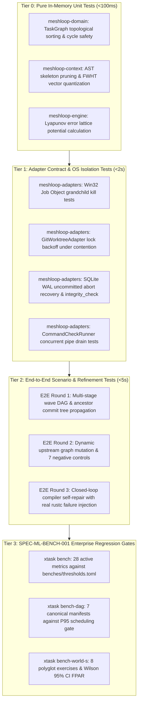

# Meshloop Testing & Verification Strategy

Meshloop's verification strategy rejects theatrical tests and mock success. Every capability is subject to multi-layered empirical verification, fault injection, and automated regression gates to ensure host safety, mathematical convergence, and zero workspace pollution.

---

## 1. Test Architecture & Verification Tiers

Verification is organized into four hierarchical tiers:



---

## 2. Test Execution Commands

All verification is orchestrated via `xtask` subcommands to maintain identical behavior across local developer workstations and CI/CD pipelines:

### 2.1 Standard Development Check (`xtask check`)
Runs code formatting checks, Clippy with all warnings denied (`-D warnings`), and executes all 142+ unit and integration tests across the workspace:
```bash
cargo run -p xtask -- check
```

### 2.2 Canonical SPEC-ML-BENCH-001 Gate (`xtask bench`)
Evaluates all 28 metrics against [`benches/thresholds.toml`](../../benches/thresholds.toml), generating a structured scorecard at `artifacts/bench/run.json`:
```bash
cargo run --release -p xtask -- bench
```
*Fail-closed rule:* If any of the 10 architectural invariants fail, or if any performance metric misses its target, the command exits with code 1.

### 2.3 DAG Manifest Latency Benchmarks (`xtask bench-dag`)
Tests scheduler and topological sorting overhead using `hdrhistogram` across 7 canonical manifests in `benches/manifests/`:
```bash
cargo run -p xtask -- bench-dag
```
Evaluates:
- `chain.json` (deep linear dependency)
- `diamond.json` (fan-out and fan-in)
- `wide-fanout.json` (1 root to 16 parallel workers)
- `wide-fanin.json` (16 parallel workers to 1 sink)
- `forest.json` (multiple disjoint trees)
- `nested-diamond.json` (hierarchical pipeline)
- `cyclic-negative-control.json` (verified cycle rejection)

### 2.4 Opt-in Polyglot Autonomy Benchmark (`xtask bench-world-s`)
Runs 8 curated polyglot programming exercises (`rust-two-fer`, `rust-clock`, `ts-bob`, `py-luhn`, `go-hamming`, `cs-nucleotide-count`, `php-gigasecond`, `cpp-reverse-string`) to calculate the First-Pass Acceptance Rate (FPAR) with analytical 95% Wilson confidence intervals:
```bash
cargo run -p xtask -- bench-world-s
```

### 2.5 Full-Lifecycle Smoke Test (`xtask smoke`)
Validates the complete product lifecycle (`doctor` $\to$ `review-plan` $\to$ `run` $\to$ `accept` $\to$ `resume` $\to$ `integrate`) on a disposable Git repository in **<5 seconds**:
```bash
cargo run -p xtask -- smoke
```

### 2.6 Packaging & Crate Isolation Check (`xtask publish-dry`)
Packages all five publishable crates (`meshloop-domain`, `meshloop-context`, `meshloop-engine`, `meshloop-adapters`, `meshloop-cli`) in strict offline isolation:
```bash
cargo run -p xtask -- publish-dry
```

---

## 3. Real Fault Injection & Negative Controls

Meshloop's test suite includes active negative controls to prove that security boundaries and state machines cannot be bypassed:

### 3.1 Process-Tree Ownership (Windows Job Objects)
- **Grandchild Elimination Test (`tests/process_tree.rs`):** Spawns a PowerShell process that in turn spawns child and grandchild worker processes. Cancelling the parent immediately terminates all descendants. Verified: `conc.orphan_process_count = 0`.
- **Parent Abort Test:** Simulates an unexpected parent process crash (`std::process::abort()`). The Windows kernel automatically kills all child processes attached to the Job Object.

### 3.2 Dynamic Graph Mutation Rollback Verification
Injects 7 distinct illegal mutations during live execution to verify that state rollbacks are 100% atomic:
1. Cycle injection (introducing directed loops).
2. Dangling dependency target (referencing non-existent task ID).
3. Duplicate task ID.
4. Reserved task ID 0.
5. Active state violation (mutating nodes currently executing in a worker).
6. Missing source node in followup chain.
7. Empty task list injection.

Each injection asserts that the post-rollback state strictly matches the pre-mutation baseline:
$$S = (\text{plan\_json}, \text{plan\_sha256}, \text{plan\_state}, \text{event\_count}, \text{integrity} == \text{"ok"})$$

### 3.3 Closed-Loop Compiler Self-Repair Failure Injection
- **Monotonic Convergence:** Injects type errors; verifies that repair rounds decrease error potential ($\Delta\Phi < 0$).
- **Syntax Regression Rollback:** Injects an unclosed delimiter (`error: this file contains an unclosed delimiter`); verifies that the engine triggers `git reset --hard` to restore the last clean commit and re-invokes with a negative constraint.
- **Oscillation Detection:** Injects alternating error states; verifies that the engine detects repeated diagnostic fingerprints and terminates deterministically without burning API budget.
