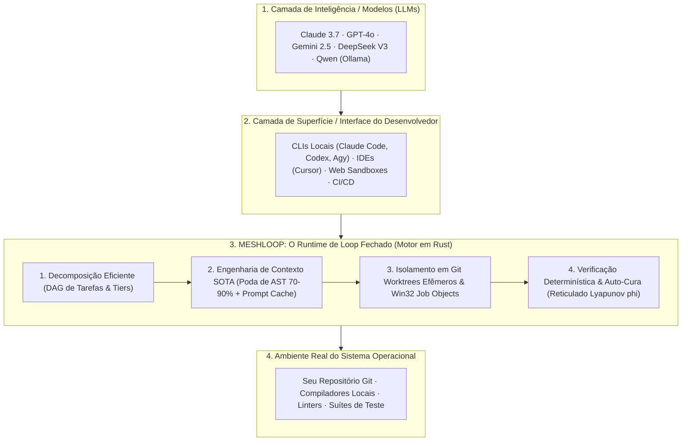

# Product brief — Meshloop

> **The State-of-the-Art Closed-Loop Engineering Environment for AI Agents**  
> Standalone, Daemonless, Multi-Language, and Deterministically Verified.

Public map: [docs/README.md](../README.md) · Architecture: [architecture/overview.md](../architecture/overview.md) · Install: [Install](../install.md)

---

## 1. O que é o Meshloop? (Onde ele se Encontra no Stack)

Hoje, a indústria possui modelos de linguagem excepcionais (Claude, GPT, Gemini, DeepSeek, Qwen) e interfaces de desenvolvedor ágeis (Claude Code, Codex CLI, Agy, Cursor). No entanto, quando esses agentes são colocados para resolver tarefas de engenharia de software em repositórios reais, eles enfrentam gargalos físicos críticos:

- **Esgotamento de contexto:** Projetos grandes estouram janelas de tokens ou custam fortunas.
- **Contaminação de repositório:** Agentes soltos quebram branches ativas e deixam lixo não versionado.
- **Processos zumbis no host:** Falhas de execução deixam compiladores e servidores rodando em segundo plano.
- **Alucinação de sucesso:** A IA afirma que "terminou com sucesso", mas o código não compila nem passa nos testes.

**O Meshloop não é mais um modelo e não é um simples encadeador de prompts.**  
O Meshloop é o **Runtime de Engenharia de Loop Fechado (*Closed-Loop Engineering Runtime*)**: a camada de infraestrutura que fornece a física, o isolamento, a eficiência de contexto e a verificação determinística para que qualquer agente produza software seguro.

---

## 2. Onde e Como Usar? (4 Cenários e Benefícios Reais)

O Meshloop se adapta de forma transparente ao perfil do seu fluxo de trabalho:

### Cenário A: Desenvolvedor Solo no Desktop (Assinaturas Planas de CLI)
* **Perfil:** Você já assina ferramentas de terminal como Claude Code, Codex, Agy, Grok ou Pi.
* **Como o Meshloop ajuda:**
  * Você não gasta nada a mais em APIs por token.
  * Você opera direto da sua sessão de terminal (`/meshloop:plan`, `/meshloop:run`).
  * O Meshloop cria Git Worktrees efêmeros em segundo plano. Sua branch de trabalho continua 100% limpa enquanto os agentes trabalham.
  * Quando um agente conclui, ele só integra o código na sua branch se passar nos testes locais e após seu aceite explícito (`/meshloop:review-plan` e `accept`).

### Cenário B: Desenvolvedores e Equipes usando APIs Comerciais (Gemini, Anthropic, DeepSeek)
* **Perfil:** Você consome chaves de API direto no terminal ou em automações de equipe.
* **Como o Meshloop ajuda:**
  * **Redução de 70% a 90% na fatura de tokens:** A poda de AST em 7 linguagens (*Rust, TS/JS, Python, Go, C#, PHP, C++*) descarta corpos de funções internas e preserva apenas contratos e tipos essenciais.
  * **Alinhamento de Prompt Cache (>80% de hit):** Prefixos de prompt determinísticos garantem aproveitamento máximo do cache do provedor.
  * **Roteamento Híbrido (Tier 1 vs Tier 2):** Despacha a leitura pesada de arquivos para modelos ultrabaratos de contexto longo (ex: Gemini Flash) e reserva modelos de alto raciocínio para a escrita cirúrgica.

### Cenário C: Empresas com Sigilo de Código / Ambientes Air-Gapped (Modelos Locais via Ollama)
* **Perfil:** Código confidencial ou proprietário que não pode sair da rede interna.
* **Como o Meshloop ajuda:**
  * Funciona 100% offline com instâncias locais do Ollama (`qwen2.5-coder`).
  * Como modelos locais possuem memória e contexto limitados, a indexação quantizada em memória (FWHT) e a poda sintática permitem que o modelo local compreenda o repositório sem engasgar.
  * Zero vazamento de dados ou telemetria.

### Cenário D: Plataformas Web, Agentes em Nuvem e CI/CD (E2B, Modal, GitHub Actions)
* **Perfil:** Plataformas autônomas de software na nuvem (estilo Devin/Bolt) ou pipelines de manutenção contínua de código.
* **Como o Meshloop ajuda:**
  * Binário único em Rust, ultraleve (<20MB de RAM, inicialização em milissegundos).
  * Servidor MCP stdio integrado ([`meshloop mcp`](../architecture/adr/0027-mcp-modular-server.md)) e suporte a containers Docker (`--features docker`).
  * Execução *headless* em pipelines de CI (`meshloop plan --accept-plan && meshloop run --accept-integrate`). Se um teste falhar, o motor ativa a auto-cura interna e só abre o PR com código validado.

---

## 3. Os 4 Pilares da Eficiência do Loop

O diferencial do Meshloop reside na sua eficiência mecânica:

1. **Eficiência de Decomposição:**  
   Planejamento estruturado em grafo acíclico dirigido (DAG). Tarefas são fatiadas em escopos atômicos com tiers de complexidade, evitando tarefas genéricas ou alucinações de escopo.
2. **Eficiência de Contexto:**  
   Poda de AST agnóstica em 7 linguagens, normalização de prompt cache e indexação quantizada de assinaturas via Walsh-Hadamard (FWHT) para busca de símbolos em sub-milissegundo sem FFI inseguro.
3. **Eficiência de Ambiente e Host:**  
   Isolamento estrito em Git Worktrees (`.meshloop-worktrees/<task-id>`). O `GitAdminMutex` com *backoff* exponencial previne conflitos de trava de arquivos no Windows (`.git/index.lock`), e os Win32 Job Objects erradicam qualquer processo zumbi (`conc.orphan_process_count = 0`).
4. **Eficiência de Verificação e Auto-Cura:**  
   O `CheckRunner` roda linters, compiladores e testes determinísticos da sua própria máquina. Se houver falha sintática ou lógica, o reticulado de diagnósticos confere se a energia de erro ($\phi$) está decrescendo. Se convergir, o agente corrige o código em até 3 rodadas; se regredir, o Meshloop reverte as alterações via `git reset --hard` instantaneamente.

---

## 4. Garantias Inegociáveis de Segurança

- **Zero Daemons em Background:** Sem serviços residentes no Windows, sem sockets ocultos. O Meshloop roda quando você manda e encerra quando conclui.
- **Zero Vazamento de Credenciais:** O Meshloop não armazena nem gerencia senhas ou chaves em banco local. Ele herda a autenticação do seu ambiente.
- **Sua Branch é Sagrada:** Nenhum agente escreve diretamente na sua branch ativa. A integração final para sua branch depende de aceite humano.
- **Determinismo Real:** A palavra da IA nunca é aceita como verdade. O único juiz de sucesso é o código de saída zero dos seus testes reais.
