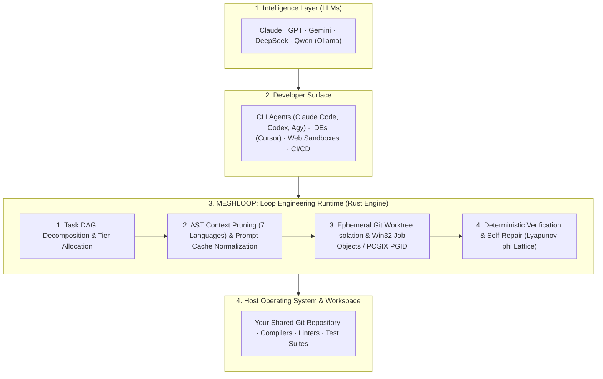

# Product Brief — Meshloop

Meshloop is the multi-agent development optimization and loop engineering runtime for AI coding agents. It optimizes the closed engineering loop through DAG task decomposition, 7-language AST context reduction, ephemeral Git worktree isolation, and Lyapunov-driven self-repair without background daemons.

Documentation Hub: [docs/README.md](../README.md) · Architecture: [architecture/overview.md](../architecture/overview.md) · Installation: [Install](../install.md)

---

## 1. Problem Statement & Loop Engineering

Modern coding agents (Claude Code, Codex, Agy, Cursor) and language models produce capable code suggestions. However, when multiple agents collaborate on complex software tasks in real repositories, they face critical operational bottlenecks:

- **Context Window Saturation:** Large repositories quickly exhaust token windows or incur high API costs when raw files are repeatedly re-ingested.
- **Working Tree Pollution:** Unconstrained agents mutate active branches, leave unstaged artifacts, or overwrite developer work without verification.
- **Orphan Background Processes:** Cancelled or timed-out runs leave zombie compilers, test runners, or language servers running in the background.
- **Unverified Completion & Regression Loops:** Language models frequently hallucinate task completion when code fails to compile or breaks existing tests. Unchecked retries often oscillate between conflicting syntax errors.

Meshloop solves this by acting as the **Loop Engineering Runtime** that coordinates, isolates, optimizes, and deterministically verifies multi-agent development:

---

## 2. Core Value Pillars

### 1. Loop Engineering & Optimization
- **70% to 90% AST Context Reduction:** Strips function bodies while preserving signatures, types, and interfaces across 7 languages (*Rust, TS/JS, Python, Go, C#, PHP, C++*).
- **Prompt Cache Alignment:** Byte-identical static prefix normalization maximizes provider KV-cache reuse above **80%**.
- **Deterministic Lyapunov Convergence ($\phi$):** Diagnostically bounds self-repair attempts; rolls back code via `git reset --hard` if regressions occur and aborts on oscillation cycles.
- **Fail-Closed Workspace Isolation:** Every task attempt executes in `.meshloop-worktrees/<task-id>`, keeping the working branch pristine until explicit human integration (`meshloop integrate --into`).

### 2. High-Performance Architecture
- **Sub-Millisecond Symbol Retrieval:** Quantized 64-dim Fast Walsh-Hadamard Transform (FWHT) indexing searches signatures in $< 500\mu\text{s}$ with **8x memory compression**.
- **Lightweight Standalone Footprint (<20MB RAM):** Zero background daemons, zero external multiplexers, and instant cold-start execution.
- **Bounded Concurrency ($N \in [1, 16]$):** Multiplexes multiple workers concurrently without Tokio or async runtime overhead.
- **Contention-Free Git Operations:** Intra-process `GitAdminMutex` with exponential retry backoff eliminates `.git/index.lock` collisions.

### 3. Universal Extensibility
- **7 Built-in Languages:** Native parsers for Rust, TypeScript/JavaScript, Python, Go, C#, PHP, and C++.
- **Universal Harness Support:** Operates over CLI terminal subscriptions (Claude Code, Codex, Agy, Grok, Pi), pay-as-you-go commercial APIs, or local offline Ollama models.
- **Complete Surface Parity:** Seamless execution via terminal slash commands (`/meshloop:*`), Model Context Protocol stdio tools (`meshloop_*`), or direct CLI verbs (`meshloop <verb>`).

---

## 3. Supported Execution Environments

Meshloop adapts to four primary development environments:

### Scenario A: Solo Developer at Terminal (Flat-Rate CLI Subscriptions)
- **Profile:** Developers with active terminal subscriptions (Claude Code, Codex, Agy, Grok, Pi).
- **Operation:**
  - Coordinates installed CLI tools directly without requiring additional API tokens.
  - Commands run from the active session (`/meshloop:plan`, `/meshloop:run`).
  - Workers execute in isolated Git worktrees in the background, keeping the active working branch clean.
  - Changes are merged into your working branch only after deterministic checks pass and explicit human approval (`/meshloop:accept` and `meshloop integrate`).

### Scenario B: Teams Using Commercial APIs (Pay-As-You-Go)
- **Profile:** Teams using API keys (Gemini, Anthropic, DeepSeek, OpenAI).
- **Operation:**
  - **70% to 90% Context Token Reduction:** Multi-language AST pruning across 7 languages (*Rust, TS/JS, Python, Go, C#, PHP, C++*) strips function bodies, retaining only type signatures and interfaces.
  - **Prompt Cache Alignment:** Normalizes static prompt prefixes to maximize provider KV-cache reuse above 80%.
  - **Tier Routing:** Routes broad context analysis to long-context models and targeted code modifications to high-capability reasoning models.

### Scenario C: Offline & Air-Gapped Systems (Local Models via Ollama)
- **Profile:** Proprietary or regulated codebases that cannot transmit data outside local infrastructure.
- **Operation:**
  - Runs fully offline using local Ollama instances (e.g., `qwen2.5-coder`).
  - Fast Walsh-Hadamard Transform (FWHT) quantized indexing and AST skeleton pruning enable local models with smaller context windows to navigate large repositories.
  - Zero external telemetry or network data transmission.

### Scenario D: Cloud Sandboxes, Web Platforms & CI/CD Pipelines
- **Profile:** Autonomous agent platforms or continuous integration validation runners (GitHub Actions, Modal, E2B).
- **Operation:**
  - Standalone Rust binary (<20MB RAM, fast startup).
  - Integrated stdio Model Context Protocol server ([`meshloop mcp`](../architecture/adr/0027-mcp-modular-server.md)) and optional container support.
  - Headless execution mode (`meshloop plan --accept-plan && meshloop run`). Automated self-repair attempts resolution before reporting final test status.

---

## 4. Safety & Invariants

- **No Daemons:** Runs on demand and exits cleanly without lingering background services.
- **No Stored Credentials:** Inherits authentication from the environment or local CLI tools; never stores keys or tokens in local databases.
- **Working Tree Integrity:** The active branch is never modified by worker agents; only explicit integration (`meshloop integrate --into`) updates the branch.
- **Deterministic Validation:** Compiler and test exit codes determine success, not model self-reports.
- **Pure Safe Rust:** `#![forbid(unsafe_code)]` across all domain, context, and engine crates.
