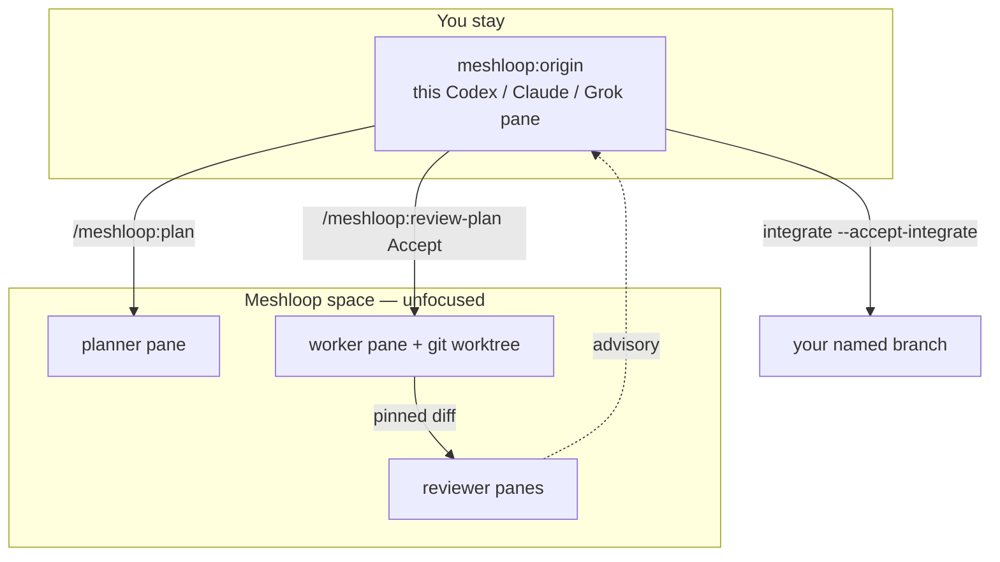

# Product brief

Public map: [docs/README.md](../README.md). Install:
[Install](../install.md). Operator loop: [Getting started](../start.md).

**Release 1** is an agent-session control plane on native Windows: you stay in
Claude Code, Codex, Pi, Grok, or Agy; Meshloop farms live Herdr workers,
verifies diffs, and waits for human accept. Fixture subprocess is the CI double.

Decline stops with no worker. Adjust returns to the planner pane.

## Problem

Each harness is a **flat-rate subscription** with its own capability set and
rate-limit window, not a metered API. Used one at a time, that capacity sits
idle or burns unevenly. Ad-hoc scripts can spawn a session; they do not plan a
graph, isolate the diff, or recover when the session dies mid-task.

## Value

Meshloop is the planning-and-orchestration layer on Herdr. One sequential
writer (concurrency is 1) turns configured CLIs into a bounded, verified loop:
decompose, route, isolate, verify, pause for you, then integrate.

Selected harnesses: Codex, Claude Code, Pi, Grok, Agy. Selection is not
discovery. Never substitute Agy with Antigravity by name alone.

## How work is split (one level down)

The planner does **not** pick models. It writes nodes. When a node is Ready,
QACR picks among **configured** harnesses (probe, tier fit, observed cooldown,
then score). R1 does **not** query vendor quota APIs. Detail:
[ADR 0009](../architecture/adr/0009-routing-budgets.md).

## Product rules (R1)

- Operator surface: `meshloop:` skills + local MCP. Binary is the engine (ML-014).
- Origin is supervisor-only. Never split that pane or tab the origin space.
- Live agents run in a Meshloop-owned Herdr workspace (`meshloop-<repo>`).
- Human gates: `review-plan` (or `run --accept-plan`), node `accept --as`, `integrate --accept-integrate`.
- No credential store, no daemon, no auto-merge to `main`.

Next: [Install](../install.md), then [Getting started](../start.md).
Builders: [architecture overview](../architecture/overview.md).
