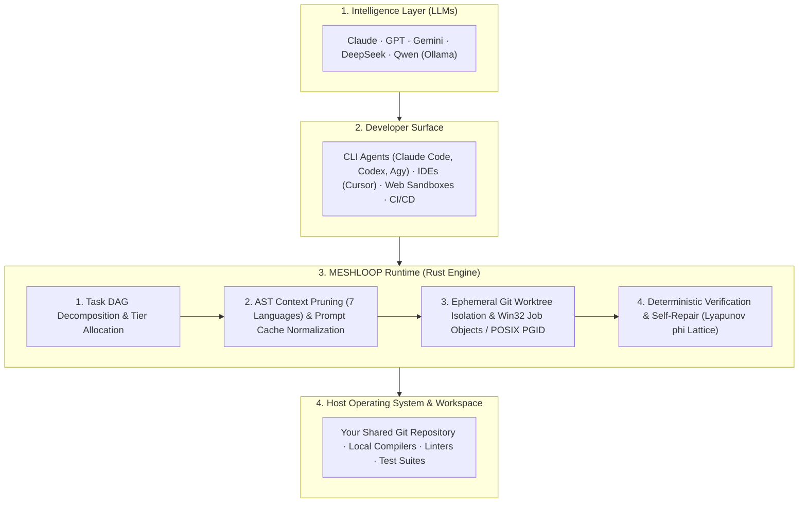

# Product Brief — Meshloop

Meshloop is a local orchestration runtime for AI coding agents. It provides task decomposition, multi-language AST context reduction, Git worktree process isolation, and compiler-driven verification without background daemons.

Documentation Hub: [docs/README.md](../README.md) · Architecture: [architecture/overview.md](../architecture/overview.md) · Installation: [Install](../install.md)

---

## 1. Problem Statement & Stack Positioning

Modern coding agents (Claude Code, Codex, Agy, Cursor) and language models produce capable code suggestions. However, executing multi-step engineering tasks against real repositories introduces operational challenges:

- **Context Window Saturation:** Large repositories quickly exceed token limits or increase API costs when full source files are sent repeatedly.
- **Working Tree Pollution:** Unconstrained agents can modify active branches, leave unstaged files, or overwrite uncommitted developer changes.
- **Orphan Background Processes:** Cancelled or interrupted agent runs often leave child compiler or test runner processes running in the background.
- **Unverified Completion:** Language models may claim a task is complete when code still fails to compile or pass automated test suites.

Meshloop addresses these issues by acting as a local execution runtime between developer-facing surfaces and host operating system environments:

---

## 2. Supported Execution Environments

Meshloop adapts to four primary development environments:

### Scenario A: Solo Developer at Terminal (Flat-Rate CLI Subscriptions)
- **Profile:** Developers with active terminal subscriptions (Claude Code, Codex, Agy, Grok, Pi).
- **Operation:**
  - Coordinates installed CLI tools directly without requiring additional API tokens.
  - Commands run from the active session (`/meshloop:plan`, `/meshloop:run`).
  - Workers execute in isolated Git worktrees in the background, keeping the active working branch clean.
  - Changes are merged into your working branch only after deterministic checks pass and explicit human approval (`/meshloop:accept` and `meshloop integrate`).

### Scenario B: Teams Using Commercial APIs (Pay-As-You-Go)
- **Profile:** Teams using API keys (Gemini, Anthropic, DeepSeek, OpenAI).
- **Operation:**
  - **70% to 90% Context Token Reduction:** Multi-language AST pruning across 7 languages (*Rust, TS/JS, Python, Go, C#, PHP, C++*) strips function bodies, retaining only type signatures and interfaces.
  - **Prompt Cache Alignment:** Normalizes static prompt prefixes to maximize provider KV-cache reuse above 80%.
  - **Tier Routing:** Routes broad context analysis to long-context models and targeted code modifications to high-capability reasoning models.

### Scenario C: Offline & Air-Gapped Systems (Local Models via Ollama)
- **Profile:** Proprietary or regulated codebases that cannot transmit data outside local infrastructure.
- **Operation:**
  - Runs fully offline using local Ollama instances (e.g., `qwen2.5-coder`).
  - Fast Walsh-Hadamard Transform (FWHT) quantized indexing and AST skeleton pruning enable local models with smaller context windows to navigate large repositories.
  - Zero external telemetry or network data transmission.

### Scenario D: Cloud Sandboxes, Web Platforms & CI/CD Pipelines
- **Profile:** Autonomous agent platforms or continuous integration validation runners (GitHub Actions, Modal, E2B).
- **Operation:**
  - Standalone Rust binary (<20MB RAM, fast startup).
  - Integrated stdio Model Context Protocol server ([`meshloop mcp`](../architecture/adr/0027-mcp-modular-server.md)) and optional container support.
  - Headless execution mode (`meshloop plan --accept-plan && meshloop run`). Automated self-repair attempts resolution before reporting final test status.

---

## 3. Core Mechanisms

1. **DAG Decomposition:**  
   Plans are decomposed into a Directed Acyclic Graph (DAG) with explicit dependency tiers, isolating changes into bounded units of work.
2. **Context Optimization:**  
   AST skeleton extraction across 7 languages, prompt cache prefix normalization, and quantized signature indexing enable fast symbol discovery.
3. **Workspace Isolation:**  
   Every attempt executes inside an ephemeral Git worktree (`.meshloop-worktrees/<task-id>`). A serialized `GitAdminMutex` prevents `.git/index.lock` contention, and Win32 Job Objects prevent orphan processes.
4. **Deterministic Verification & Self-Repair:**  
   Local compilers and test suites drive task evaluation through `CheckRunner`. If checks fail, a diagnostic lattice evaluates error energy ($\phi$): if error energy decreases, the agent continues repair; if regression occurs, changes are rolled back via `git reset --hard`.

---

## 4. Safety Invariants

- **No Daemons:** Runs on demand and exits cleanly without lingering background services.
- **No Stored Credentials:** Inherits authentication from the environment or local CLI tools; never stores keys or tokens in local databases.
- **Working Tree Integrity:** The active branch is never modified by worker agents; only explicit integration (`meshloop integrate --into`) updates the branch.
- **Deterministic Validation:** Compiler and test exit codes determine success, not model self-reports.
