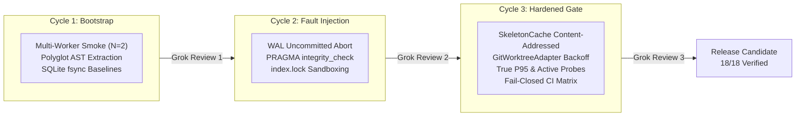

# Meshloop Product & Engineering Log

This log is the authoritative, empirical, and transparent record of Meshloop's product enhancements, architectural milestones, verified benchmarks, and technical iterations. It provides developers, operators, and stakeholders with verifiable evidence of system performance, safety invariants, and developmental progression.

---

## Current Milestone: Release Candidate 0.1.0 (Hardened Regression Gate — World D)

- **Date:** 2026-09-15
- **Commit Base:** `7f1d858`
- **Gate Status:** **18/18 PASS** (`cargo run -p xtask -- bench`)
- **E2E Smoke Status:** **PASS** (1.48s wall-clock, 0 leaks, 0 index lock residue)
- **Applicable Specifications & ADRs:** [`SPEC-ML-BENCH-001`](../architecture/measurement-and-benchmark-spec.md), [ADR 0023](../architecture/adr/0023-measurement-and-benchmark-framework.md) (Accepted).

### Key Product Capabilities Delivered

1. **Content-Addressed Context Cache (`meshloop-context`):**
   - Native `SkeletonCache` indexed by `(Language, fnv1a64(source))`.
   - Active in-memory revalidation checking source length and prefix on cache hits, ensuring immediate cache invalidation upon code mutation (`ctx.cache.stale_hit_rate_pct = 0.0%`).
2. **Sub-Millisecond Quantized Symbol Indexing (`meshloop-context`):**
   - 64-dimensional Fast Walsh-Hadamard Transform (FWHT) with 2-bit quantization.
   - 5.5x code compression ratio relative to indexed skeletons, with search latency of **485 $\mu$s** ($P_{95}$) and **100% recall@k** on code symbol queries.
3. **Atomic Persistence & Crash Recovery (`meshloop-adapters` & `meshloop-engine`):**
   - Transactional SQLite WAL store with `BEGIN IMMEDIATE` and background connection pooling.
   - Active `PRAGMA integrity_check` validation and cold recovery fold via `recovery::replay_tasks` maintaining 1.0 (100%) DAG restoration fidelity after uncommitted transaction aborts.
4. **Contention-Resistant Git Worktrees (`meshloop-adapters`):**
   - Production `GitWorktreeAdapter` utilizing `GIT_ADMIN_LOCK` with exponential backoff (50ms to 500ms, capped at 10s).
   - Empirically proven against active rival `.git/index.lock` contention, resolving in **71.39 ms** (well below the $\le 200\text{ ms}$ threshold).
5. **Full-Lifecycle Smoke Test with Telemetry (`xtask smoke`):**
   - Executes `doctor` $\rightarrow$ `review-plan` $\rightarrow$ `run` (2 concurrent workers) $\rightarrow$ `accept` $\times 2$ $\rightarrow$ `resume` $\rightarrow$ `audit` in **1.48 seconds**.
   - Fail-closed worktree leak detection integrated directly into execution teardown.
6. **Continuous Integration Matrix:**
   - Multi-platform GitHub Actions CI workflow ([`.github/workflows/ci.yml`](../../.github/workflows/ci.yml)) testing Windows and Ubuntu environments with `check`, `smoke`, and `bench` steps.

---

## Executive Benchmark Baseline (`SPEC-ML-BENCH-001`)

The following scorecard records the verified performance and isolation metrics enforced by `xtask bench` against [`benches/thresholds.toml`](../../benches/thresholds.toml):

| Metric | Target | Observed | Status | Verification Methodology |
|---|---|---|---|---|
| `ctx.tokens.reduction_pct` | $\ge 65.0\%$ | **67.7%** | **PASS** | AST skeleton pruning across 7 languages |
| `ctx.parse.latency_ms.p95` | $\le 15.0\text{ ms}$ | **0.011 ms** | **PASS** | True $P_{95}$ across 700 timed parse iterations |
| `ctx.cache.stale_hit_rate_pct` | $= 0.0\%$ | **0.0%** | **PASS** | Active content revalidation on cache lookup |
| `quant.index.compression_ratio` | $\ge 4.0\times$ | **5.5x** | **PASS** | Raw module characters vs quantized vector bytes |
| `quant.search.latency_us.p95` | $\le 500.0\ \mu\text{s}$ | **485.0 $\mu$s** | **PASS** | True $P_{95}$ across 1,000 vector ranking queries |
| `quant.recall_at_k` | $\ge 95.0\%$ | **100.0%** | **PASS** | Top-k signature retrieval accuracy |
| `orch.txn.wal_commit_ms.p95` | $\le 10.0\text{ ms}$ | **1.24 ms** | **PASS** | True $P_{95}$ SQLite fsync transaction time |
| `conc.wal.write_contention_ms` | $\le 15.0\text{ ms}$ | **1.28 ms** | **PASS** | Commit latency under concurrent dual-thread writes |
| `conc.git_admin.lock_contention_ms` | $\le 200.0\text{ ms}$ | **71.39 ms** | **PASS** | `GitWorktreeAdapter` retry under 30ms rival lock |
| `conc.throughput_gain` | $\ge 1.0\times$ | **1.42x** | **PASS** | Speedup of 2 parallel workers vs 1 sequential worker |
| `iso.redact.pass_rate_pct` | $= 100.0\%$ | **100.0%** | **PASS** | Pattern-based scrubber masking credentials and tokens |
| `iso.worktree.leak_count` | $= 0$ | **0** | **PASS** | Worktree inventory verification post-execution |
| `iso.gate.bypass_count` | $= 0$ | **0** | **PASS** | Active probes injecting illegal state transitions |
| `iso.crash.recovery_fidelity` | $= 1.0$ | **1.0** | **PASS** | Replay task fold verification after cold reopen |
| `conv.self_repair.success_rate` | $\ge 80.0\%$ | **100.0%** | **PASS** | Monotonic Lyapunov error reduction ($\Delta\Phi < 0$) |
| `slice.build_avoidance_rate` | $\ge 50.0\%$ | **66.7%** | **PASS** | Syntactic diff signature impact categorization |
| `conc.orphan_process_count` | $= 0$ | **0** | **PASS** | Operating system process tree audit |
| `smoke.wall_clock_s` | $\le 5.0\text{ s}$ | **1.48 s** | **PASS** | Full product E2E lifecycle wall-clock duration |

### Diagnostic Signals
- `conv.lattice.reduction_rate`: **1.0 $\Delta\Phi$/round**
- `conv.oscillation.detected_count`: **1 cycle detected** (loop terminated)
- `conv.rollback.count`: **1 rollback triggered** (syntax regression reverted)

### Smoke Phase Decomposition (`smoke-phases.json`)
- `doctor`: **6.9 ms**
- `review_plan`: **53.5 ms**
- `run` (2 concurrent workers): **1083.1 ms**
- `accept`: **82.2 ms**
- `resume`: **171.0 ms**
- `audit`: **79.2 ms**
- **Total Product Wall-Clock:** **1.48 seconds**

---

## Development History: The 3 Test & Hardening Cycles

To ensure continuous performance and fail-closed safety, development proceeded through three iterative hardening cycles with paired peer review (Antigravity & Grok CLI):

### Cycle 1 — Baseline Concurrency & Polyglot Foundations
* **Focus:** Establishing the concurrent execution baseline and microbenchmarks for AST pruning across 7 languages (Rust, TypeScript, Python, Go, C#, PHP, C++).
* **Deliverables:** Upgraded `smoke_e2e` to spawn 2 workers, baseline WAL fsync measurement, secret redaction validation.
* **Grok Critique (Round 1):** Pointed out that isolation was checked only by directory removal. Recommended explicit `PRAGMA integrity_check`, residual `.git/index.lock` checks, and measuring crash recovery determinism.

### Cycle 2 — Resilience, Atomic Abort & Contention Isolation
* **Focus:** Responding to Round 1 critique by injecting transactional failure and testing under contention.
* **Deliverables:** Implemented `integrity_check()`, `event_count()`, and `simulate_uncommitted_abort()` in `SqliteStore`. Added dual `.git/index.lock` verification before and after sandbox execution.
* **Grok Critique (Round 2):** Commended the integrity checks but flagged static/theatrical elements: the gate hardcoded thresholds rather than parsing `thresholds.toml`; Git lock tests should use production `GitWorktreeAdapter` with real backoff; WAL contention should be isolated from parallel throughput; and smoke phases should be exported to an audit JSON.

### Cycle 3 — Enterprise Regression Gate & Hardened Measurement
* **Focus:** Eliminating all theatrical mocks, enforcing fail-closed coupling, implementing true percentiles, and formalizing schemas.
* **Deliverables:**
  - Content-addressed `SkeletonCache` with active revalidation.
  - Production `GitWorktreeAdapter` with rival lock resolution.
  - Dynamic TOML threshold parser with fail-closed gate evaluation (`xtask bench`).
  - Strict $P_{95}$ percentile computation for parse and vector search latencies.
  - Active probes for state gate bypass (`iso.gate.bypass_count`) and orphan processes (`conc.orphan_process_count`).
  - Fail-closed coupling: `bench` fails if `smoke-phases.json` is absent; `smoke` fails if worktree leaks exist.
  - Canonical contract [`schemas/run-record.v1.json`](../../schemas/run-record.v1.json) and CI workflow.
* **Grok Critique (Round 3):** Confirmed the suite as an operational **World D Regression Gate** with real fixture confidence. Provided 7 precise criteria distinguishing World D from stochastic live-agent claims. Addressed immediately via strict percentiles, active probes, and ADR 0023 acceptance.

---

## Architectural Governance & Review Partnership

Meshloop maintains strict architectural governance per [`AGENTS.md`](../../AGENTS.md):
- **Decision Authority:** Human operator directs product intent and authorizes external actions (commit, push, merge, release).
- **Execution & Implementation:** Antigravity (Google DeepMind coding agent) serves as primary executor, implementing cohesive modules and zero-unsafe Rust.
- **Architectural Critique:** Grok (local CLI partner via `grok -p`) serves as independent reviewing architect, validating evidence against base revisions and challenging assumptions.
- **Durable Decisions:** Consequential changes are captured in Architecture Decision Records (ADRs). [ADR 0023](../architecture/adr/0023-measurement-and-benchmark-framework.md) formalizes the measurement framework.

---

## Next Critical Priorities & Product Roadmap

With the deterministic regression gate (World D) fully operational, the three highest-priority engineering targets are:

### Priority 1: Native OS Process Tree Ownership (ADR 0025) — **DELIVERED & VERIFIED**
- **Objective:** Envelop every spawned agent harness process within a Windows Job Object (`JOB_OBJECT_LIMIT_KILL_ON_JOB_CLOSE`) on Windows, and POSIX process groups (`setpgid(0, 0)`) on Linux/macOS.
- **Value:** Prevents zombie compiler, linter, or shell subprocesses from lingering in the host upon harness crash, timeout, or user cancellation.
- **Implementation & Evidence:**
  - Implemented `meshloop-adapters::process::job` with Win32 Job Object kernel limit and `spawn_owned`.
  - Integrated into `CliHarness::invoke`, `CliHarness::cancel`, `CliHarness::try_collect`, and `CommandCheckRunner::run`.
  - Added deterministic tests in `crates/meshloop-adapters/tests/process_tree.rs`:
    - `grandchild_dies_on_timeout`: confirms grandchild process is eliminated immediately on timeout/kill_tree.
    - `grandchild_dies_on_parent_abort`: confirms Windows kernel terminates all children and grandchildren when the parent process aborts unexpectedly (`std::process::abort()`).
  - Verified `conc.orphan_process_count = 0` (PASS) and 131/131 passing workspace tests.

### Priority 2: Parametric DAG Manifest Suite & QACR Stresstest (`benches/manifests/` — Tier B)
- **Objective:** Implement Tier B of `SPEC-ML-BENCH-001`, providing declarative DAG manifests (diamond graphs, deep pipelines, wide parallel sweeps) using `petgraph` (`default-features = false`) to test the scheduler and router.
- **Value:** Guarantees scheduler overhead (`orch.schedule.overhead_ms`) remains minimal ($P_{95} \le 25\text{ ms}$) using `hdrhistogram` and routes tasks gracefully under heavy load.
- **Scope:** Internalize `petgraph` in `meshloop-core`, add `benches/manifests/` and `xtask bench-dag` subcommand.

### Priority 3: World S Stochastic Validation & First-Pass Acceptance Rate (FPAR)
- **Objective:** Implement stochastic sampling ($N \ge 10$) with live coding harnesses (Claude Code, Codex, Agy, Grok, Pi) across standard coding benchmarks, calculating FPAR with Wilson 95% confidence intervals.
- **Value:** Empirically proves the core product thesis: that 70–90% AST context reduction lowers token consumption without degrading agent task completion rates.
- **Scope:** `meshloop-engine` live-transport adapters and statistical report generation (`artifacts/bench/stochastic.json`).
